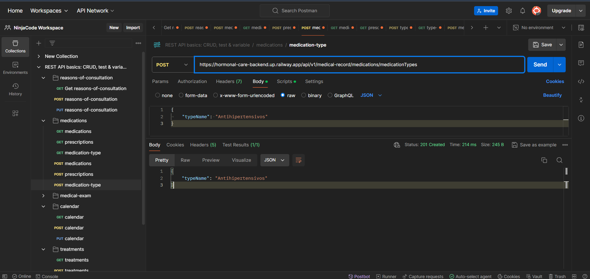
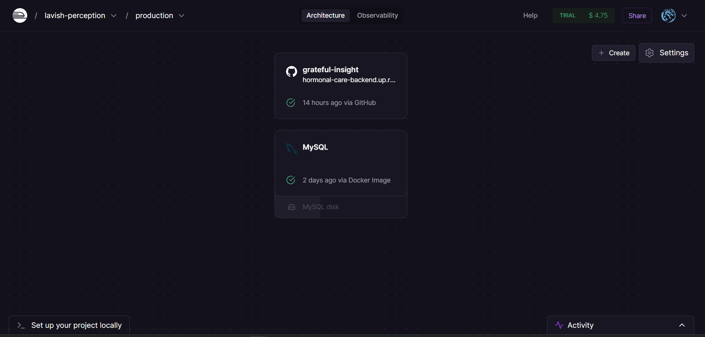
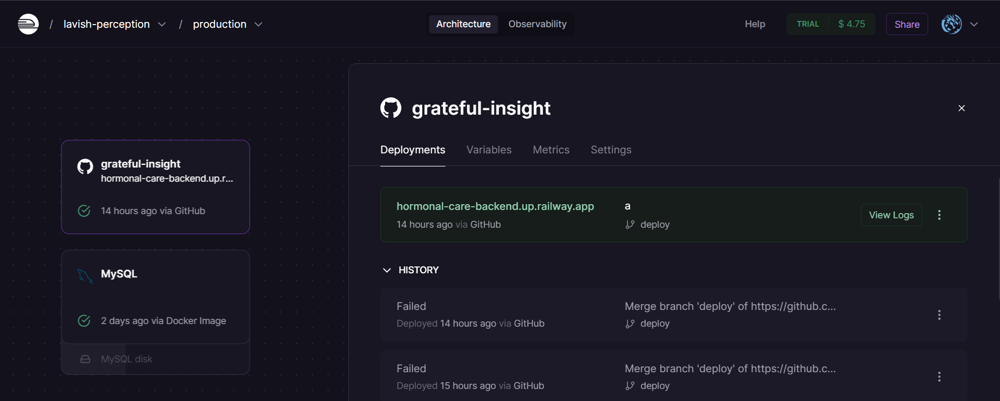
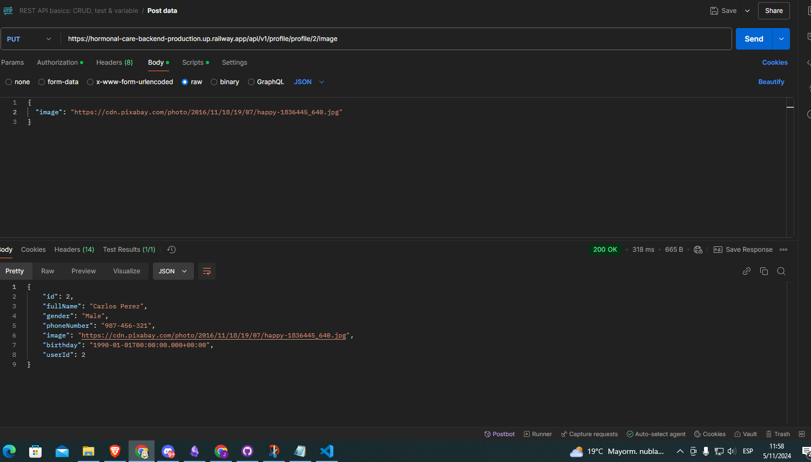

<h1 align="center">Universidad Peruana de Ciencias Aplicadas</h1>

<h2 align="center">Ingeniería de Software</h2>
<h3 align="center">Ciclo 2025-01</h3>

<h1 align="center">1ASI0572 Desarrollo de Soluciones IOT</h1>

<h2 align="center"><strong>NRC:</strong> 2942 </h2>

<strong>Profesor:</strong> Marco Antonio Leon Baca

<h2 align="center"><strong>Informe de TB1</strong> </h2>

<strong>Nombre del startup:</strong> toIOTa

<strong>Nombre del producto:</strong> HormonalCare

<h3 align="center">Team Members:</h3>

| Member                            |    Code    |
| :-------------------------------- | :--------: |
| Claudio Sandro Quispesivana Torres| U202215099 |
| Estefano Sebastian Lostaunau Pereira | U202211742 |
| Luis Sebastian Chinchihualpa Saldarriaga | U202212112 |

<h3 align="center"><strong>Marzo 2025</strong></h3>

Github: https://github.com/upc-pre-202510-1asi0572-2942-toIOTa

## Registro de versiones del informe

| Versión |    Fecha   |    Autor   |    Descripción de la modificación    |
|:-----:|:--------:|:--------:|:--------:|
| TB1  v.1   | 05/04/2025 | toIOTa | Para esta entrega se desarrollaron los capitulos I, II, III, IV|

## Contenido

### [Registro de versiones del informe](#registro-de-versiones-del-informe)

### [Contenido](#contenido)

### [Student Outcome](#student-outcome-1)

### [Objetivos SMART](#objetivos-smart-1)

### [Capítulo I: Presentación](#capítulo-i-presentación)

[1.1. Startup Profile](#11-startup-profile)

[1.1.1. Descripción de la Startup](#111descripción-de-la-startup)

[1.1.2. Perfiles de integrantes del equipo](#112-perfiles-de-integrantes-del-equipo)

[1.2. Solution Profile](#12-solution-profile)

[1.2.1. Antecedentes y problemática](#121--antecedentes-y-problemática)

[1.2.2. Lean UX Process](#122lean-ux-process)

[1.2.2.1. Lean UX Problem Statements](#1221lean-ux-problem-statements)

[1.2.2.2. Lean UX Assumptions](#1222lean-ux-assumptions)

[1.2.2.3. Lean UX Hypothesis Statements](#1223lean-ux-hypothesis-statements)

[1.2.2.4. Lean UX Canvas](#1224lean-ux-canvas)

[1.3. Segmentos objetivo](#13segmentos-objetivo)

### [Capítulo II: Needfinding](#capítulo-ii-needfinding-1)

[2.1. Competidores](#21-competidores)

[2.1.1. Análisis competitivo](#211-análisis-competitivo)

[2.1.2. Estrategias y tácticas frente a competidores](#212---estrategias-y-tácticas-frente-a-competidores)

[2.2. Entrevistas](#22-entrevistas)

[2.2.1. Diseño de entrevistas](#221---diseño-de-entrevistas)

[2.2.2. Registro de entrevistas](#222---registro-de-entrevistas)

[2.2.3. Análisis de entrevistas](#223--análisis-de-entrevistas)

[2.3. Needfinding](#23------needfinding)

[2.3.1. User Personas](#231------user-personas)

[2.3.2. User Task Matrix](#232---user-task-matrix)

[2.3.3. User Journey Mapping](#233---user-journey-mapping)

[2.3.4. Empathy Mapping](#234---empathy-mapping)

[2.3.5. As-is Scenario Mapping](#235---as-is-scenario-mapping)

[2.4. Requirements Specification](#24------requirements-specification)

[2.4.1. To-Be Scenario Mapping](#241-to-be-scenario-mapping)

[2.4.2. User Stories](#242-user-stories)

[2.4.3. Impact Mapping](#243-impact-mapping)

[2.4.4. Product Backlog](#244-product-backlog)

### [CAPÍTULO III: ARCHITECTURE](#capítulo-iii-architecture-1)

[3.1. Product design](#31-product-design)

[3.1.1. Style Guidelines](#311-style-guidelines)

[3.1.1.1. General Style Guidelines](#3111-general-style-guidelines)

[3.1.2. Information Architecture](#312-information-architecture)

[3.1.2.1. Organization Systems](#3121-organization-systems)

[3.1.2.2. Labelling Systems](#3122-labelling-systems)

[3.1.2.3. SEO Tags and Meta Tags](#3123-seo-tags-and-meta-tags)

[3.1.2.4. Searching Systems](#3124-searching-systems)

[3.1.2.5. Navigation Systems](#3125-navigation-systems)

[3.1.3. Landing Page UI Design](#313-landing-page-ui-design)

[3.1.3.1. Landing Page Wireframes](#3131-landing-page-wireframes)

[3.1.3.2. Landing Page Mock-up](#3132-landing-page-mock-up)

[3.1.4. Mobile Applications UX/UI Design](#314-mobile-applications-ux-ui-design)

[3.1.4.1. Mobile Applications Wireframes](#3141-mobile-applications-wireframes)

[3.1.4.2. Mobile Applications Wireflow Diagrams](#3142-mobile-applications-wireflow-diagrams)

[3.1.4.3. Mobile Applications Mock-up](#3143-mobile-applications-mock-up)

[3.1.4.4. Mobile Applications User Flow Diagrams](#3144-mobile-applications-user-flow-diagrams)

[3.1.4.5. Mobile Applications Prototyping](#3145-mobile-applications-prototyping)

[3.2. Architecture Overview](#32-architecture-overview)

[3.2.1. Domain-Driven Software Architecture](#321-domain-driven-software-architecture)

[3.2.1.1. Software Architecture Context Level Diagram](#3211-software-architecture-context-level-diagram)

[3.2.1.2. Software Architecture Container Level Diagram](#3212-software-architecture-container-level-diagram)

[3.2.1.3. Software Architecture Components Diagram](#3213-software-architecture-components-diagram)

[3.2.2. Software Object-Oriented Design](#322-software-object-oriented-design)

[3.2.2.1. Class Diagrams](#3221-class-diagrams)

[3.2.2.2. Class Dictionary](#3222-class-dictionary)

[3.2.2.3. Database Design](#3223-database-design)

[3.2.2.4. Database Diagram](#3224-database-diagram)

### [CAPÍTULO IV: BACKEND PRODUCT IMPLEMENTATION & VALIDATION](#capítulo-iv-backend-product-implementation--validation)

[4.1. Software Configuration Management](#41-software-configuration-management)

[4.1.1. Software Development Environment Configuration](#411-software-development-environment-configuration)

[4.1.2. Source Code Management](#412-source-code-management)

[4.1.3. Source Code Style Guide & Conventions](#413-source-code-style-guide--conventions)

[4.1.4. Software Deployment Configuration](#414-software-deployment-configuration)

[4.2. Software Development & Implementation](#42-software-development--implementation)

[4.2.1. Sprint 1](#421-sprint-1)

[4.2.1.1. Sprint Planning 1](#4211-sprint-planning-1)

[4.2.1.2. Sprint Backlog 1](#4212-sprint-backlog-1)

[4.2.1.3. Development Evidence for Sprint Review](#4213-development-evidence-for-sprint-review)

[4.2.1.4. Testing Suite Evidence for Sprint Review](#4214-testing-suite-evidence-for-sprint-review)

[4.2.1.5. Execution Evidence for Sprint Review](#4215-execution-evidence-for-sprint-review)

[4.2.1.6. Services Documentation Evidence for Sprint Review](#4216-services-documentation-evidence-for-sprint-review)

[4.2.1.7. Software Deployment Evidence for Sprint Review](#4217-software-deployment-evidence-for-sprint-review)

[4.2.1.8. Team Collaboration Insights during Sprint](#4218-team-collaboration-insights-during-sprint)

[4.2.2. Sprint 2](#422-sprint-2)

[4.2.2.1. Sprint Planning 2](#4221-sprint-planning-2)

[4.2.2.2. Sprint Backlog 2](#4222-sprint-backlog-2)

[4.2.2.3. Development Evidence for Sprint Review](#4223-development-evidence-for-sprint-review)

[4.2.2.4. Testing Suite Evidence for Sprint Review](#4224-testing-suite-evidence-for-sprint-review)

[4.2.2.5. Execution Evidence for Sprint Review](#4225-execution-evidence-for-sprint-review)

[4.2.2.6. Services Documentation Evidence for Sprint Review](#4226-services-documentation-evidence-for-sprint-review)

[4.2.2.7. Software Deployment Evidence for Sprint Review](#4227-software-deployment-evidence-for-sprint-review)

[4.2.2.8. Team Collaboration Insights during Sprint](#4228-team-collaboration-insights-during-sprint)

[4.2.3. Sprint 3](#423-sprint-3)

[4.2.3.1. Sprint Planning 3](#4231-sprint-planning-3)

[4.2.3.2. Sprint Backlog 3](#4232-sprint-backlog-3)

[4.2.3.3. Development Evidence for Sprint Review](#4233-development-evidence-for-sprint-review)

[4.2.3.4. Testing Suite Evidence for Sprint Review](#4234-testing-suite-evidence-for-sprint-review)

[4.2.3.5. Execution Evidence for Sprint Review](#4235-execution-evidence-for-sprint-review)

[4.2.3.6. Services Documentation Evidence for Sprint Review](#4236-services-documentation-evidence-for-sprint-review)

[4.2.3.7. Software Deployment Evidence for Sprint Review](#4237-software-deployment-evidence-for-sprint-review)

[4.2.3.8. Team Collaboration Insights during Sprint](#4238-team-collaboration-insights-during-sprint)

[4.2.4.2. Sprint Backlog 4](#4242-sprint-backlog-4)

[4.2.4.3. Development Evidence for Sprint Review](#4243-development-evidence-for-sprint-review)

[4.2.4.4. Testing Suite Evidence for Sprint Review](#4244-testing-suite-evidence-for-sprint-review)

[4.2.4.5. Execution Evidence for Sprint Review](#4245-execution-evidence-for-sprint-review)

[4.2.4.6. Services Documentation Evidence for Sprint Review](#4246-services-documentation-evidence-for-sprint-review)

[4.2.4.7. Software Deployment Evidence for Sprint Review](#4247-software-deployment-evidence-for-sprint-review)

[4.2.4.8. Team Collaboration Insights during Sprint](#4248-team-collaboration-insights-during-sprint)

## [CAPÍTULO V: PRODUCT IMPLEMENTATION & VALIDATION](#capítulo-v-product-implementation--validation)

[5.1. Software Configuration Management](#51-software-configuration-management)

[5.1.1. Software Development Environment Configuration](#511-software-development-environment-configuration)

[5.1.2. Source Code Management](#512-source-code-management)

[5.1.3. Source Code Style Guide & Conventions](#513-source-code-style-guide--conventions)

[5.1.4. Software Deployment Configuration](#514-software-deployment-configuration)

[5.2. Landing Page & Mobile Application Implementation](#52-landing-page--mobile-application-implementation)

[5.2.1. Sprint n](#521-sprint-n)

[5.2.1.1. Sprint Planning n](#5211-sprint-planning-n)

[5.2.1.2. Sprint Backlog n](#5212-sprint-backlog-n)

[5.2.1.3. Development Evidence for Sprint Review](#5213-development-evidence-for-sprint-review)

[5.2.1.4. Testing Suite Evidence for Sprint Review](#5214-testing-suite-evidence-for-sprint-review)

[5.2.1.5. Execution Evidence for Sprint Review](#5215-execution-evidence-for-sprint-review)

[5.2.1.6. Services Documentation Evidence for Sprint Review](#5216-services-documentation-evidence-for-sprint-review)

[5.2.1.7. Software Deployment Evidence for Sprint Review](#5217-software-deployment-evidence-for-sprint-review)

[5.2.1.8. Team Collaboration Insights during Sprint](#5218-team-collaboration-insights-during-sprint)

[5.3. Validation Interviews](#53-validation-interviews)

[5.3.1. Diseño de Entrevistas](#531-diseño-de-entrevistas)

[5.3.2. Registro de Entrevistas](#532-registro-de-entrevistas)

[5.3.3. Evaluaciones según heurísticas](#533-evaluaciones-según-heurísticas)

[5.4. Video About-the-Product](#54-video-about-the-product)

## [Conclusiones](#conclusiones)

[Conclusiones y recomendaciones](#conclusiones-y-recomendaciones)

[Video App Validation](#video-app-validation)

[Video About the product](#video-about-the-product)

[Video About the team](#video-about-the-team)

## [Referencias Bibliográficas](#referencias-bibliográficas-1)

## Student Outcome 

El curso contribuye al cumplimiento del Student Outcome ABET 7:

**ABET – EAC - Student Outcome 7**
**Criterio:** La capacidad de adquirir y aplicar nuevos conocimientos según sea necesario, utilizando estrategias de aprendizaje apropiadas.

En el siguiente cuadro se describe las acciones realizadas y enunciados de conclusiones por parte del grupo, que permiten sustentar el haber alcanzado el logro del ABET 7 – EAC - Student Outcome.

|Criterios específicos|Acciones realizadas|Conclusiones|
| - | - | - |
|7.c1. Actualiza conceptos y conocimientos necesarios para su desarrollo profesional y en especial para su proyecto en soluciones de ingeniería de software|
**Astuyauri Calderon Jherson David**	

TB1:Realicé una investigación exhaustiva sobre la telemedicina y sus normativas, a nivel regional y Nacional. También me encargué de actualizar mis conocimientos sobre las últimas actualizaciones de los software que vamos a utilizar, tendencias en usabilidad y experiencia de usuario (UX) para asegurar que la interfaz de HormonalCare sea intuitiva y fácil de usar, puesto que nuestra aplicación móvil debe ser sencilla para los usuarios. 

TB2: Durante la fase de diseño del proyecto HormonalCare, actualicé mis conocimientos en la creación de arquitecturas de software mediante el uso del modelo C4, una herramienta clave para visualizar los diferentes niveles de abstracción de la arquitectura del sistema. También profundicé en el diseño de bases de datos y la implementación del backend, asegurando que las soluciones propuestas cumplieran con los estándares actuales de la industria y las necesidades específicas del proyecto. 
 
 TP: Trabajé en el desarrollo del frontend de la aplicación móvil HormonalCare usando Flutter, enfocándome en crear una interfaz intuitiva. También me encargué de la conexión entre el frontend y el backend mediante APIs RESTful, asegurando una integración fluida y segura entre ambos sistemas. 
 
TB3: Desarrollé la lista de pacientes del día y el módulo de consulta en Flutter, lo cual implicó el aprendizaje de buenas prácticas para la gestión de listas de datos y el uso de widgets dinámicos en Flutter. Además, optimicé la conexión con el backend, asegurando la correcta consulta y visualización de datos de pacientes, una habilidad fundamental para ofrecer una experiencia de usuario fluida y confiable en aplicaciones de salud.
 
TB4: Mi aporte en esta TB4 fue la implementación de la funcionalidad de *medication* dentro del *medical record*. A lo largo de esta tarea, adquirí nuevos conocimientos sobre cómo gestionar de manera eficiente los datos de medicamentos y cómo optimizar la estructura de la base de datos para asegurar una buena integración con el backend. La implementación me permitió aprender a manejar mejor la información médica de los pacientes, dándome cuenta de la importancia de la precisión y la flexibilidad en el diseño de bases de datos para un sistema de salud.
 
TF: A lo largo de este proyecto, he actualizado mis conocimientos en áreas fundamentales para el desarrollo de aplicaciones de salud. Comencé investigando las normativas de la telemedicina, lo cual me permitió comprender mejor los requisitos legales y las mejores prácticas que aplican en este campo. Además, trabajé en la creación de arquitecturas de software utilizando el modelo C4, lo que me ayudó a estructurar y comprender cómo conectar los diferentes componentes de la aplicación de forma coherente. En el frontend, me concentré en asegurarme de que la interfaz de usuario fuera intuitiva, lo cual se convirtió en uno de los pilares del proyecto. He aprendido mucho sobre la integración del frontend con el backend usando APIs RESTful, lo que me permitió garantizar que los datos se compartieran de manera eficiente entre ambos sistemas, ofreciendo una experiencia fluida al usuario. Al final, mi trabajo en la implementación de la funcionalidad del medication dentro del medical record me permitió profundizar en la gestión de datos médicos y la optimización de bases de datos para su integración con el sistema.   

**Chinchihualpa Saldarriaga Luis Sebastian**	

TB1: En esta fase del proyecto, me enfoqué en liderar la creación del Lean UX Canvas y las hipótesis del proyecto, basándome en el análisis de usuarios y competidores. También participé en la definición de User Personas y el mapeo de User Journeys, lo que me permitió aplicar y actualizar conocimientos clave en diseño centrado en el usuario y la creación de historias de usuario. Estas acciones me han ayudado a fortalecer mis habilidades en la gestión de requisitos y a contribuir de manera efectiva al desarrollo del backlog de producto. 
 
 TB2: Para esta TB2, estuve actualizando mis conocimientos sobre modelado de bases de datos relacionales y no relacionales, así como en el diseño de diagramas de clases para optimizar la estructura del sistema. Esto me permitió profundizar en las mejores prácticas para garantizar un diseño de bases de datos eficiente y adaptable a distintas necesidades de ingeniería de software.
 
TP: Trabajé en el backend del sistema de autenticación de la aplicación HormonalCare utilizando Spring Boot. Mi principal tarea fue implementar el sistema de administración de identidades y accesos (IAM) basado en JWT para asegurar que los usuarios tuvieran un inicio de sesión seguro. Esto incluyó la creación de controladores y servicios para la generación y validación de tokens JWT, así como la protección de las rutas de la API.
  
TB3: En esta fase, trabajé en la implementación del perfil de usuario y un nuevo sistema de autenticación mediante el módulo de Sign-In en Flutter. Aprendí y apliqué técnicas avanzadas de diseño de interfaz de usuario y seguridad en autenticación. Para ello, me actualicé en patrones modernos de UI/UX para garantizar que la experiencia de acceso fuera intuitiva y segura, fortaleciendo mis habilidades en diseño de interfaces móviles.
 
TB4: Mi tarea principal durante esta TB4 fue la edición del perfil de usuario en Flutter, además de desarrollar el sistema de *sign up* para los tipos de usuario, específicamente para médicos y pacientes. En este proceso, profundicé en la creación de interfaces de usuario amigables y funcionales, prestando atención a la seguridad en el registro y validación de los datos. Fue un desafío importante porque tuve que integrar múltiples funcionalidades en Flutter, pero el resultado ha sido muy satisfactorio al ver cómo mejora la experiencia de los usuarios al interactuar con la aplicación.
 
TF: Durante el desarrollo de HormonalCare, actualicé y profundicé mis conocimientos en varias áreas clave del backend. Lideré la creación del Lean UX Canvas y la definición de las User Personas, lo cual me permitió aportar una visión clara de las necesidades de los usuarios. En cuanto al backend, trabajé en la implementación del sistema de autenticación usando JWT para asegurar un inicio de sesión seguro para los usuarios. Esto me permitió aplicar y afianzar mis conocimientos sobre la gestión de identidades y accesos (IAM). Además, me involucré en la implementación del perfil de usuario en el frontend de Flutter, lo que me permitió mejorar mis habilidades en diseño de interfaces y seguridad en la autenticación. También profundicé en el proceso de sign up para diferentes tipos de usuarios (médicos y pacientes), lo cual fue crucial para que la aplicación cumpliera con los requisitos de seguridad y funcionalidad.     
 
**Lostaunau Pereira Estéfano Sebatián**

TB1: Contribuí al proyecto actualizando mis conocimientos en la creación de Hypothesis Statements y User Stories. También participé en la presentación de estas estrategias ante el equipo y los stakeholders, destacando cómo nuestras propuestas se posicionarían en el mercado frente a la competencia. 

TB2: En esta fase del proyecto, participé en la configuración del entorno de desarrollo para la implementación backend, aplicando mis conocimientos actualizados en la administración de código fuente y la configuración de despliegue de software. Además, realicé configuraciones avanzadas para las pruebas de sprint, asegurando que el equipo pudiera realizar revisiones continuas de nuestro progreso. Estas tareas me permitieron no solo aplicar conocimientos previos, sino también adquirir nuevas habilidades en la automatización de despliegues y la gestión del ciclo de vida del software, las cuales son fundamentales para el desarrollo y validación de productos backend. 
 
 TP: Me enfoqué en implementar el sistema de autenticación de usuarios en la aplicación HormonalCare utilizando Flutter. Desarrollé las pantallas de registro (Sign Up) y acceso (Sign In), asegurando una experiencia de usuario fluida e intuitiva. Para la seguridad, me apoyé en la conexión con el backend mediante tokens JWT (JSON Web Tokens), lo que permitió mantener la autenticación de forma segura y eficiente.
 
TB3: Implementé la carga y descarga de archivos PDF en Firebase, donde estudié sobre el manejo de almacenamiento en la nube y la transferencia segura de archivos. Esto me permitió mejorar mi comprensión sobre el uso de Firebase para aplicaciones móviles, optimizando la funcionalidad para que los usuarios puedan gestionar documentos médicos de forma segura.
 
TB4: Mi principal contribución en esta TB4 fue la implementación de la carga de archivos mediante Firebase en el *medical record*. Esto me permitió adentrarme en el uso de Firebase como herramienta para gestionar archivos de manera eficiente en una base de datos en la nube. A lo largo de este proceso, aprendí cómo integrar Firebase con Flutter y cómo manejar de forma segura los documentos médicos, lo que representó un reto interesante y un aprendizaje valioso para mi desarrollo profesional.
 
TF: A lo largo de este proyecto, he adquirido y actualizado mis conocimientos en diversas áreas, tanto en backend como en frontend. Fui responsable de la implementación del sistema de autenticación de usuarios utilizando Flutter y JWT, lo que permitió que los usuarios se autenticaran de manera segura y eficiente. Además, aprendí a integrar el frontend con el backend de manera fluida, utilizando APIs RESTful. También trabajé en la carga y descarga de archivos médicos en Firebase, lo que me permitió explorar nuevas tecnologías para el almacenamiento de documentos en la nube. Este proceso me dio una comprensión más profunda sobre cómo integrar servicios en la nube y gestionar archivos de manera eficiente y segura. Además, mi trabajo en la integración de Firebase con Flutter me ayudó a optimizar la funcionalidad de la aplicación para la gestión de archivos médicos, lo cual es fundamental para garantizar la seguridad y el acceso a la información del paciente.      
 
**Quispesivana Torres Claudio Sandro**

TB1: Contribuí al desarrollo del proyecto desarrollando y aportando ideas para la seccion de Lean UX Problem Statement y User Stories, ademas de reforzar lo aprendido segun la documentacion ofical de Lean UX como metodologia agil la cual busca dar importancia a la experiencia de usuario al crear nuestro producto HormonalCare. 
 
 TB2: Para esta TB2, estuve actualizando mis conocimientos en diseño de interfaces de usuario (UI) y experiencia de usuario (UX), enfocándome en las mejores prácticas para el desarrollo de aplicaciones móviles en Android. Esto incluyó la investigación de nuevas tendencias y herramientas para crear Wireframes interactivos y User Flow Diagrams efectivos.
 
 TP:Desarrollé el módulo de backend encargado de la gestión de citas médicas en HormonalCare, utilizando Spring Boot. Implementé las funcionalidades para que los usuarios puedan agendar, cancelar y consultar sus citas. Además, diseñé un sistema de notificaciones para recordar a los usuarios sobre sus próximas citas y logré integrar estas funcionalidades con el frontend de la aplicación mediante APIs RESTful.
 TB3: Me encargué del desarrollo del calendario en Flutter y realicé correcciones en los endpoints de Spring Boot. Esto me ayudó a profundizar en la configuración de endpoints y la integración con el frontend, asegurando una sincronización adecuada entre el sistema y el calendario del usuario. El trabajo en la arquitectura de backend con Spring Boot me permitió fortalecer mis conocimientos en la creación de servicios escalables y en la estructura de APIs RESTful.
 
TB4: Mi aporte en esta TB4 estuvo enfocado en la mejora del calendario de eventos en Flutter, añadiendo colores para diferenciar los tipos de citas. También implementé las funcionalidades *PUT* y *DELETE* para el manejo de citas médicas, lo que permitió que los usuarios pudieran modificar o eliminar sus citas de manera sencilla. A través de este proceso, adquirí una mayor comprensión de cómo gestionar datos en tiempo real y cómo mejorar la interacción del usuario con la aplicación, lo cual es fundamental para garantizar una experiencia de usuario óptima.
 
TF: En este proyecto, actualicé mis conocimientos sobre el desarrollo de interfaces de usuario (UI) y experiencia de usuario (UX) para aplicaciones móviles, específicamente en Flutter. Participé en la creación del Lean UX Problem Statement y en la formulación de las User Stories, lo que me permitió comprender mejor cómo abordar las necesidades del usuario a través de soluciones ágiles y centradas en el diseño. En el backend, fui responsable de desarrollar el módulo para la gestión de citas médicas, asegurando que los usuarios pudieran agendar, cancelar y consultar sus citas de manera eficiente. Implementé un sistema de notificaciones para recordar a los usuarios sobre sus citas próximas, lo que mejoró la funcionalidad y la usabilidad de la aplicación. Además, trabajé en la mejora del calendario de citas en Flutter, añadiendo colores para diferenciar los tipos de citas y mejorando la interacción con el usuario al permitir que modificaran o eliminaran citas fácilmente.      
| TB1: En resumen, como equipo, hemos actualizado y ampliado nuestros conocimientos en áreas fundamentales para el desarrollo del proyecto HormonalCare. Nos enfocamos en investigar exhaustivamente la telemedicina y sus normativas a nivel regional y nacional, así como en mantenernos al día con las últimas tendencias en usabilidad y experiencia de usuario (UX). Colaboramos en la creación del Lean UX Canvas, la formulación de hipótesis, y la definición de User Personas y User Journeys, aplicando conceptos actualizados de diseño centrado en el usuario. También fortalecimos nuestras habilidades en la redacción de Hypothesis Statements y User Stories, asegurando que nuestras propuestas se alineen estratégicamente con las necesidades del mercado y los usuarios. Estas acciones han sido clave para nuestro desarrollo profesional y para la efectiva contribución al proyecto.  TB2: Como grupo, actualizamos nuestros conocimientos en áreas clave como el diseño de arquitecturas con diagramas de clases y bases de datos, junto con la creación de User Flow Diagrams y Wireframes interactivos para Android. También mejoramos la organización del proyecto mediante la gestión del Product Backlog y Sprint Backlog, y aprendimos a configurar entornos de desarrollo y desplegar servicios web RESTful API con documentación, aplicando mejora continua en todo el proceso.    TP:Cada miembro del equipo actualizó y fortaleció los conceptos clave necesarios para su desarrollo profesional. Los miembros que trabajaron en Flutter profundizaron en sus conocimientos de interfaces móviles y la integración con sistemas backend mediante APIs RESTful, mientras que los miembros encargados del backend en Spring Boot consolidaron su comprensión sobre seguridad y gestión de usuarios con JWT, así como sobre la creación de servicios robustos para la funcionalidad de citas médicas. En conjunto, se ha logrado una arquitectura bien definida y segura para HormonalCare, permitiendo ofrecer una solución de software sólida y efectiva.   TB3: En esta fase, todos los miembros del equipo se enfocaron en actualizar y aplicar sus conocimientos en áreas fundamentales para el desarrollo de una aplicación de salud. Cada integrante utilizó tecnologías como Flutter, Firebase y Spring Boot, adaptando sus habilidades para crear soluciones integradas y funcionales. Este proceso de aprendizaje fue clave para ofrecer una experiencia de usuario intuitiva y funcional en cada módulo del proyecto.   TB4: En resumen, como equipo, nuestra colaboración en esta TB4 nos permitió aplicar nuestros conocimientos en tecnologías como Firebase y Flutter, aprendiendo nuevas metodologías y mejores prácticas en el desarrollo de software. Cada uno de nosotros asumió un desafío específico que contribuyó de manera directa al avance del proyecto. A medida que desarrollábamos nuevas funcionalidades, nos dimos cuenta de lo esencial que es mantenernos actualizados con las herramientas y las mejores prácticas de la industria, lo cual no solo mejoró nuestro proyecto, sino también nuestra capacidad profesional.   TF: En este proyecto, el equipo ha demostrado un excelente nivel de actualización y aplicación de conocimientos en varias áreas críticas para el desarrollo de la aplicación HormonalCare. Cada miembro del equipo ha contribuido al proyecto con sus habilidades y conocimientos renovados, desde el diseño de la arquitectura y la seguridad hasta la implementación de interfaces intuitivas y la gestión eficiente de datos médicos. Hemos trabajado en la integración de sistemas backend y frontend utilizando tecnologías como Spring Boot, Flutter, Firebase y JWT, asegurando que la aplicación sea segura, funcional y fácil de usar. A lo largo de este proceso, no solo hemos aplicado nuestras habilidades técnicas, sino que también hemos actualizado constantemente nuestros conocimientos en diseño centrado en el usuario (UX), arquitectura de software, seguridad y tecnologías emergentes, lo que ha permitido que HormonalCare sea una solución robusta, escalable y alineada con las mejores prácticas de la industria.         |
|7.c2. Reconoce la necesidad del aprendizaje permanente para el desempeño profesional y el desarrollo de proyectos en soluciones de tecnologías de ingeniería de software.|
**Astuyauri Calderon Jherson David** 

TB1: Me dediqué a mejorar mis habilidades técnicas a lo largo del proyecto, como mis habilidades en figma y vertabelo. Además, de aprender sobre herramientas modernas como Docker y metodologías ágiles. Ayudé a integrar buenas prácticas para fomentar la calidad de la primera versión del informe para el desarrollo de HormonalCare.
 
TB2: El desarrollo del backend y la arquitectura en HormonalCare me hizo reconocer que el aprendizaje continuo es esencial para mantenerse actualizado en las tecnologías cambiantes. Implementar el modelo C4 y diseñar bases de datos robustas requiere mantenerse al día con las mejores prácticas y nuevas herramientas, lo que me motivó a seguir actualizando mis conocimientos para mejorar tanto la calidad de las soluciones como mi desempeño profesional. 
 
 TP:Reconocí la importancia del aprendizaje continuo al investigar nuevas herramientas como Swagger y Postman para optimizar la conexión entre el frontend y backend, garantizando un rendimiento eficiente y mejorando la calidad de la aplicación móvil.
 
TB3: La implementación de la lista de pacientes del día me hizo ver la necesidad de profundizar en Flutter y en el manejo de datos en tiempo real. También, investigué sobre optimización de interfaz para aplicaciones de salud, entendiendo la importancia de actualizarme constantemente para ofrecer soluciones seguras y prácticas.
 
TB4: Durante esta TB4, me di cuenta de la importancia de seguir aprendiendo y adaptándome a nuevas tecnologías. La implementación de Firebase y la carga de archivos me permitió profundizar en nuevas herramientas para el desarrollo de aplicaciones móviles, lo que me motivó a seguir investigando y mejorando en el uso de la nube y el manejo de bases de datos. Este tipo de retos son los que me impulsan a continuar desarrollándome profesionalmente.
 
TF: A lo largo del desarrollo del proyecto HormonalCare, me di cuenta de la importancia del aprendizaje continuo en mi desarrollo profesional. Durante este proceso, me actualicé en herramientas como Figma y Vertabelo para mejorar mis habilidades de diseño, y aprendí sobre nuevas tecnologías como Docker para la creación de contenedores, lo que me permitió optimizar el flujo de trabajo del equipo. Además, al trabajar en el backend y en la arquitectura del sistema, me di cuenta de que mantenerse al día con las nuevas tecnologías es clave para seguir ofreciendo soluciones eficientes y escalables. La implementación de nuevas herramientas como Swagger y Postman para la optimización de la comunicación entre frontend y backend me permitió aprender sobre buenas prácticas de API, mejorando la calidad de la aplicación móvil.      
 
**Chinchihualpa Saldarriaga Luis Sebastian**	
 
TB1: Durante esta etapa del proyecto, reconocí la importancia del aprendizaje continuo al explorar nuevas metodologías como Lean UX, que no había utilizado previamente. Investigué y me actualicé en técnicas de mapeo de usuarios y análisis competitivo para asegurar que nuestras decisiones estuvieran fundamentadas en las mejores prácticas actuales. Este proceso de aprendizaje constante no solo enriqueció mi comprensión de la gestión de proyectos en ingeniería de software, sino que también me preparó para enfrentar futuros desafíos con una mentalidad de mejora continua y adaptación a nuevas tecnologías y enfoques.

TB2: Durante esta TB2, trabajé en la creación de diagramas de bases de datos relacionales y no relacionales y en un diagrama de clases. Reconocí la importancia del aprendizaje continuo para poder estar al tanto de las nuevas tecnologías y enfoques, que son esenciales para mantenerme actualizado en el campo del desarrollo de software.
 
 TP:Para poder asegurar la autenticación de los usuarios en HormonalCare, me vi en la necesidad de aprender más sobre la implementación de seguridad basada en tokens JWT. Investigando diversas fuentes y documentación de Spring Boot Security, pude mejorar mi comprensión sobre la validación y creación de tokens. También fue importante aprender sobre técnicas de protección de endpoints en APIs RESTful, lo que fortaleció la seguridad de nuestra aplicación.
 
TB3: La creación de un sistema de autenticación y perfil en Flutter me llevó a estudiar nuevas prácticas de seguridad y tendencias en autenticación móvil. Esta experiencia me mostró la importancia de la actualización constante en temas de seguridad y diseño de interfaces, necesarias para proteger los datos de usuario y mejorar la usabilidad de aplicaciones críticas.
 
TB4: Mi experiencia al trabajar en el sistema de *sign up* y la edición del perfil me permitió comprender lo crucial que es el aprendizaje continuo para poder adaptarse a las nuevas demandas del desarrollo móvil. Aprendí sobre la integración de nuevas funciones en Flutter, lo que me impulsó a investigar más sobre cómo mejorar la seguridad y la experiencia de usuario. Este proceso me ha motivado a seguir aprendiendo para aplicar mejores prácticas en mis futuros proyectos.
 
TF: Durante el desarrollo de HormonalCare, entendí la necesidad de aprender de manera continua para mantenerme actualizado en las últimas tendencias y tecnologías. Investigué sobre Lean UX, JWT para la autenticación de usuarios, y la integración de bases de datos. Todo esto me ayudó a mejorar la seguridad y la calidad de la aplicación. La implementación de JWT en el sistema de autenticación me llevó a profundizar mis conocimientos en seguridad y protección de datos. Además, al trabajar con Flutter, investigué sobre nuevas técnicas de diseño de interfaces móviles, lo que me permitió mejorar la experiencia de usuario y mantener la seguridad de la información personal de los usuarios.
 
**Lostaunau Pereira Estéfano Sebatián**

TB1: Me enfoqué en fortalecer mi desarrollo profesional a través del aprendizaje continuo, lo que me permitió mejorar en la redacción y presentación de documentación técnica. Adapté mis escritos para comunicar con claridad y precisión tanto a audiencias técnicas como no técnicas, asegurando que todos los stakeholders comprendieran los avances y propuestas del proyecto.

TB2: Durante esta entrega, reconocí la necesidad de actualizarme en herramientas de colaboración y documentación de pruebas para Sprints, como parte del proceso de validación del producto backend. Investigando y aplicando nuevas metodologías de revisión de código y estrategias para la integración continua, adquirí conocimientos que no había implementado en proyectos anteriores. Este aprendizaje fue clave para documentar correctamente las pruebas y la evidencia de ejecución de los sprints. A través de este proceso, fortalecí mis habilidades en la validación continua y me aseguré de que el equipo aplicara las mejores prácticas de la industria, lo que me ayudará a enfrentar proyectos futuros con una base técnica más sólida. 

 TP: Durante el desarrollo del sistema de autenticación de la aplicación HormonalCare en Flutter, identifiqué la necesidad de actualizar mis conocimientos sobre estrategias de seguridad móvil. Investigué sobre el uso de JWT y otras tecnologías para asegurar la autenticación, y también estudié mejores prácticas de seguridad en el manejo de credenciales de usuarios, lo que me permitió implementar un sistema de autenticación robusto y seguro.
 
TB3: Al trabajar con la carga y descarga de PDF en Firebase, reconocí la necesidad de actualizarme en la gestión de almacenamiento en la nube. Investigué cómo asegurar la transmisión de archivos y aprendí a integrar Firebase de forma eficiente en Flutter, lo cual fortaleció mis habilidades en manejo de archivos y optimización de datos.
 
TB4: En esta TB4, entendí que el aprendizaje permanente es esencial para seguir desarrollándome como profesional. La implementación de Firebase para la carga de archivos fue una excelente oportunidad para aprender sobre la integración de bases de datos en la nube y cómo mejorar la seguridad en el manejo de datos médicos. Este conocimiento me animó a seguir explorando nuevas tecnologías para mejorar la calidad de mis aplicaciones.
 
TF: Mi enfoque durante el proyecto fue actualizar mis conocimientos en diversas áreas clave, especialmente en el desarrollo seguro de aplicaciones. Me di cuenta de que el aprendizaje continuo es esencial para mantenerme al día con las nuevas herramientas, como JWT para la autenticación y Firebase para la carga de archivos en la nube. La investigación y la aplicación de estas tecnologías me permitió no solo mejorar la seguridad en la autenticación, sino también integrar soluciones de almacenamiento en la nube de manera eficiente. Además, profundicé en herramientas de colaboración y documentación de pruebas, lo que me ayudó a mejorar la calidad del producto y optimizar el proceso de desarrollo, asegurando que todo el equipo estuviera alineado en cada fase del proyecto.      
 
**Quispesivana Torres Claudio Sandro**

TB1: Para esta entrega tuve que recapitular lo aprendido sobre las metodologias agiles, puesto que el seguir con el aprendizaje de esta nos ayudo a tener mejor desarrollada cada una de nuestras User Stories que contribuiran al desarrollo del Product Backlog y Springs, que al final tendra como consecuencia la buena particion y distribucion de trabajos para la elaboracion cualquier proyecto de software, ya sea en este o en un futuros proyectos.

TB2: Para esta TB2, estuve trabajando en User Flow Diagrams y Wireframes interactivos de una app móvil en Android, con el fin de mejorar la experiencia del usuario y asegurar una navegación eficiente dentro de la aplicación.
 
 TP: Para la creación del módulo de citas médicas, fue crucial investigar y aprender sobre patrones de diseño de microservicios y la optimización del manejo de bases de datos en Spring Boot. Además, estudié nuevas técnicas para la gestión eficiente de notificaciones y recordatorios de citas, lo que me permitió ofrecer una solución más escalable y eficiente dentro del backend.
 
TB3: La integración del calendario y la configuración de endpoints en Spring Boot me hizo investigar sobre microservicios y sincronización de datos en tiempo real. Esto reafirmó la importancia del aprendizaje continuo, ya que trabajar en aplicaciones con múltiples componentes me demanda actualizarme en patrones de arquitectura y desarrollo ágil.
 
TB4: Trabajar en la visualización del calendario y las funcionalidades *PUT* y *DELETE* me permitió profundizar en mis conocimientos sobre la gestión de datos en tiempo real y cómo optimizar la interacción de los usuarios con la aplicación. Cada nuevo reto me mostró la importancia de seguir aprendiendo sobre nuevas herramientas y patrones de diseño para mejorar la calidad del software que desarrollo. Este proceso de constante aprendizaje me anima a seguir mejorando mis habilidades profesionales.
 
TF: En esta fase del proyecto, comprendí la importancia de seguir aprendiendo, ya que el entorno tecnológico siempre está en constante evolución. Trabajé en la implementación de microservicios y la optimización de bases de datos en Spring Boot, lo que me motivó a actualizar mis conocimientos en patrones de diseño y prácticas de seguridad. La integración del sistema de citas médicas y el calendario en Flutter me permitió profundizar en la gestión de datos en tiempo real y aprender nuevas metodologías para mejorar la interacción del usuario. Este proceso me mostró que el aprendizaje constante es crucial para adaptarme a las nuevas demandas del desarrollo de software y ofrecer soluciones eficientes.      
| TB1: En conclusion, reconocemos la importancia del aprendizaje permanente para nuestro desempeño profesional y el desarrollo exitoso de proyectos en soluciones de tecnologías de ingeniería de software. A lo largo del proyecto HormonalCare, cada miembro se comprometió a mejorar sus habilidades técnicas y profesionales. Nos dedicamos a profundizar en herramientas y metodologías modernas como Figma, Vertabelo, Docker, y metodologías ágiles, lo que nos permitió integrar buenas prácticas y asegurar la calidad en cada etapa del proyecto. Además, nos enfocamos en mejorar nuestra capacidad para redactar y presentar documentación técnica, adaptando nuestras comunicaciones para que fueran claras y precisas tanto para audiencias técnicas como no técnicas. Este enfoque en el aprendizaje continuo nos ha fortalecido como profesionales y ha sido crucial para la eficiente colaboración y desarrollo del proyecto, sentando una base sólida para futuros desafíos.  TB2: Como grupo, reconocemos la importancia del aprendizaje continuo para mantenernos al día con las tecnologías de software. A lo largo de la TB2, nos enfocamos en mejorar nuestras habilidades en áreas clave como el diseño de arquitecturas de software, el uso de bases de datos relacionales y no relacionales, y el desarrollo de interfaces móviles con Wireframes interactivos. Además, adoptamos nuevas herramientas para la gestión de proyectos con el Product Backlog y el Sprint Backlog, y aprendimos a implementar y documentar servicios web RESTful API, lo que refuerza nuestra capacidad para adaptarnos y mejorar constantemente en un entorno en evolución.    TP: Todo el equipo reconoció la importancia del aprendizaje permanente para el éxito del proyecto y su desarrollo profesional. El avance de la aplicación HormonalCare demandó que cada miembro explorara nuevas herramientas y tecnologías para optimizar la seguridad, la eficiencia del sistema y la experiencia de usuario. Investigaciones sobre JWT, mejores prácticas de seguridad, optimización de bases de datos y diseño de APIs fueron fundamentales para asegurar la calidad de la solución. Este ciclo resaltó cómo el aprendizaje continuo es esencial para mantenerse actualizado y preparado ante los desafíos de un entorno tecnológico en constante evolución.   TB3: Todos reconocemos la importancia del aprendizaje permanente en el desarrollo de software. Cada miembro se actualizó en temas específicos, como el manejo de autenticación segura, gestión de archivos en la nube, y sincronización de datos en tiempo real. Esta fase nos mostró cómo adaptarnos a nuevas tecnologías es esencial para desarrollar soluciones robustas y eficientes en proyectos de ingeniería de software.   TB4: En resumen, como equipo, esta TB4 nos permitió reflexionar sobre la importancia de mantenernos actualizados y aprender de manera constante. Cada uno de nosotros tuvo que investigar y adaptarse a nuevas herramientas y tecnologías, lo que refuerza nuestro compromiso con el aprendizaje continuo. A través de este proceso, hemos mejorado nuestras habilidades en Flutter, Firebase y en la gestión de aplicaciones móviles en general, lo que nos posiciona mejor para afrontar los desafíos futuros en el desarrollo de software.   TF: En el proyecto HormonalCare, el equipo ha demostrado un fuerte compromiso con el aprendizaje continuo, reconociendo la necesidad de actualizar constantemente nuestros conocimientos y habilidades para adaptarnos a las tecnologías cambiantes y mejorar el desempeño profesional. A lo largo del desarrollo, cada miembro del equipo investigó y aplicó nuevas herramientas y tecnologías, como JWT, Firebase, Docker, Postman, Swagger, y Lean UX, que nos permitieron optimizar el diseño, la seguridad, y la experiencia de usuario de la aplicación.        ||

## Objetivos SMART 
|                                                |                    |                   |                               | Specific - Específico                                                                 | Measurable - Medible                                                                               | Ambitious - Ambicioso                                                                                 | Relevant - Relevante                                                                                  | Time-bound - Tiempo Límite                                                |
|--------------------------------------------------|--------------------------|-----------------|----------------------------------|--------------------------------------------------------------------------------------|------------------------------------------------------------------------------------------------------|--------------------------------------------------------------------------------------------------------|--------------------------------------------------------------------------------------------------------|---------------------------------------------------------------------------------------------|
| Nombre del estudiante             |          Descripción del objetivo            |     Fecha de inicio      |          Fecha de cumplimiento o esperada           | ¿Qué se va a lograr? El objetivo indica con especificidad, cuál es el proceso, servicio o producto en cuestión, para qué área es relevante, u otro detalle clave que brinde contexto. | ¿Tiene KPI o métrica clara? El enunciado tiene una meta con indicador (KPI) o métrica clara, que determinará si el objetivo se cumplió. Idealmente, describe el impacto (lo que vamos a lograr) más que el entregable (lo que vamos a hacer). | ¿Es retador y va más allá de sus funciones? El objetivo inspira y reta a pensar acciones para dar el salto que se requiere para el logro, no se lograría sin una estrategia y un foco potentes. | ¿Está alineado a la estrategia? Existe una explicación clara respecto a cómo el objetivo impacta sobre los objetivos estratégicos de la Institución o Laureate Perú. Brinda una noción del alcance del objetivo. | ¿Cuándo se cumplirá? En caso que la expectativa de fecha de cumplimiento sea previa al cierre de ciclo académico, el enunciado contiene de forma explícita la fecha límite para alinear el objetivo. 
| Jherson David Astuyauri Calderon          | Desarrollar la primera versión de la conexión entre la pantalla principal de la aplicación móvil (home) en Flutter y el backend desarrollado en Spring Boot. | 24/08/2024   | 24/10/2024                       | Implementar la primera versión de la aplicación móvil en Flutter, asegurando la conexión entre el frontend y el backend. | Tener una versión funcional de la app con la interfaz de usuario y las APIs del backend integradas y operativas. | Desarrollar e integrar las capas frontend y backend en 2 meses. | Este objetivo es esencial para probar la funcionalidad básica de la app y avanzar hacia el lanzamiento del MVP. | La primera versión debe estar lista en 2 meses. 
| Estefano Sebastian Lostaunau Pereira          | Desarrollar una pantalla de historial médico que permita a los médicos revisar, registrar y ajustar planes de tratamiento para pacientes con enfermedades hormonales, utilizando un máximo de tres pantallas. | 25/08/2024      | 24/10/2024                       | Implementar una pantalla de historial médico optimizada que permita a los médicos realizar las acciones clave de seguimiento en tres pantallas o menos, mejorando la eficiencia del flujo de trabajo. | Reducir a tres o menos el número de pantallas necesarias para completar las acciones clave, y mejorar la satisfacción del usuario en un 25% según encuestas de usabilidad. | Requiere rediseñar la navegación y agrupar funciones esenciales, demandando un enfoque innovador y centrado en el usuario. | Apoya la estrategia de NinjaCode de mejorar la eficiencia médica y aumentar la adopción de la herramienta entre los profesionales de salud. | 
Claudio Sandro Quispesivana Torres         | Implementar la funcionalidad de registro (Sign Up) e inicio de sesión (Log In) en la app móvil HormonalCare.  | 26/08/2024	      | 24/10/2024                       | Desarrollar y desplegar las funcionalidades básicas de registro de usuarios y log in en la aplicación móvil. | Tener el sistema de registro y log in funcional, permitiendo a los usuarios crear cuentas y acceder a la app sin problemas. | Este objetivo implica aprender a manejar la autenticación básica y es clave para el acceso de los usuarios a la app. | Este objetivo es crucial para asegurar que los usuarios puedan comenzar a utilizar la app, lo cual es esencial para cualquier aplicación. | El sistema de registro y log in debe estar completamente implementado y funcional dentro de 2 meses. |
Luis Sebastian Chinchihualpa Saldarriaga        | Realizar el despliegue de la base de datos en un entorno de producción funcional.	  | 01/09/2024	      | 09/09/2024                       | Configurar y desplegar la base de datos en un entorno de producción, asegurando que sea accesible y esté operativa.	| Confirmar que la base de datos esté desplegada y accesible sin errores, con al menos un 99% de disponibilidad.	| Involucra la configuración de servidores y la optimización de la base de datos para producción.	| Es fundamental para que la aplicación esté completamente operativa y accesible para los usuarios finales.	| El despliegue debe estar completado y probado dentro de 1 mes.
|

## Capítulo-I: Presentación
### 1.1. Startup Profile
#### 1.1.1.Descripción de la Startup

NinjaCode es un startup compuesto por estudiantes de la Facultad de Ingeniería y Ciencias de la Universidad Peruana de Ciencias Aplicadas (UPC), dedicados a optimizar los seguimientos médicos. Nuestra visión es abordar los desafíos existentes en el sistema de atención médica peruano, especialmente en el seguimiento de enfermedades hormonales.
En el Perú, el sistema de atención médica para pacientes diagnosticados con enfermedades hormonales enfrenta desafíos significativos. La simplicidad del sistema se ve opacada por su falta de eficiencia, tanto para los médicos como para los pacientes. Esta ineficiencia se agudiza en los centros de salud estatales, donde la demanda supera ampliamente la capacidad de atención. Es en este escenario donde NinjaCode ha intervenido desarrollando soluciones tecnológicas que agilizan los tratamientos y optimizan los recursos disponibles en todas las regiones del Perú.
Nuestro enfoque se centra en la comunicación, seguridad y gestión eficiente de los datos de nuestros usuarios. La aplicación HormonalCare, desarrollada por NinjaCode, proporciona una experiencia de navegación óptima para el seguimiento médico de enfermedades hormonales en el Perú. Con HormonalCare, buscamos revolucionar la forma en que se realizan los seguimientos médicos, brindando una plataforma tecnológica segura, intuitiva y eficiente que permite a los pacientes y profesionales de la salud gestionar y monitorear enfermedades hormonales de manera efectiva.

Nuestra misión es simple pero poderosa: transformar la forma en que se realizan los seguimientos médicos, mejorando la calidad de vida de millones de personas en todo el mundo. Aspiramos a liderar la industria de la salud digital, siendo reconocidos por nuestra innovadora aplicación HormonalCare. Nos esforzamos por establecer estándares de excelencia en seguridad de datos, conectividad y experiencia de usuario en el campo del seguimiento médico de enfermedades hormonales.

Logo del Startup:

Logo del Producto:

#### 1.1.2. Perfiles de integrantes del equipo
|                             |                                                              |
|-----------------------------|--------------------------------------------------------------|
| **JHERSON DAVID ASTUYAURI CALDERON** |                                                     |
| **INGENIERIA DE SOFTWARE**  |                                                              |
| **U202218451**              |                                                              |
| Qué tal, soy Jherson Astuyauri. Tengo 19 años, curso el sexto ciclo de la carrera de Ingeniería de Software. Escogí la carrera porque me interesa la tecnología y sus efectos en el desarrollo de las personas. Actualmente, me gusta el hacking, pero también siento curiosidad por la IA y su evolución. Mis conocimientos técnicos con los que puedo contribuir al equipo son los que he adquirido en los cursos anteriores. Además de desarrollar trabajos en equipo con efectividad, actitud proactiva y responsabilidad | 

|                             |                                                              |
|-----------------------------|--------------------------------------------------------------|
| **CLAUDIO SANDRO QUISPESIVANA TORRES** |                                                     |
| **INGENIERIA DE SOFTWARE**  |                                                              |
| **U202215099**              |                                                              |
| Hola, soy Sandro Quispesivana. Tengo 19 años, actualmente estoy cursando el sexto ciclo de la carrera de Ingeniería de Software. Podría decir que los conocimientos que mejor se me dan son la programación orientada a objetos para muchos tipos de lenguajes, mi agilidad en la creación de base de datos, el uso de herramientas para el desarrollo de FrontEnd como lo puede ser HTML, CSS y un poco de JavaScript, y capaz mi enfoque empresarial de querer nutrir en una gran variedad de mercados y marcar un antes y un después. Las habilidades que me más me representan son la responsabilidad y el ingenio que me nace en problemas serios.| 

|                             |                                                              |
|-----------------------------|--------------------------------------------------------------|
| **LUIS SEBASTIAN CHINCHIHUALPA SALDARRIAGA** |                                                  |
| **INGENIERIA DE SOFTWARE**  |                                                              |
| **U202212112**              |                                                              |
| Soy estudiante de la carrera de Ingeniería de Software en la Universidad Peruana de Ciencias Aplicadas y actualmente estoy cursando el sexto ciclo. Sé programar en C++, Java y un poco de Python. Me considero una persona muy responsable, exigente y trabajadora. En el grupo del proyecto puedo aportar con mis conocimientos adquiridos en los cursos de Especificación y Análisis de Requerimientos, Algoritmos y Estructuras de Datos, Diseño y Patrones de Software y Desarrollo de Aplicaciones Open Source | 

|                             |                                                              |
|-----------------------------|--------------------------------------------------------------|
| **ESTÉFANO SEBASTIÁN LOSTAUNAU PEREIRA** |                                                     |
| **INGENIERIA DE SOFTWARE**  |                                                              |
| **U202211742**              |                                                              |
| Hola, soy Estéfano Lostaunau. Tengo 19 años, actualmente curso el sexto ciclo de la carrera de Ingeniería de Software. Estudié esta carrera por sus diversos enfoques con los que cuenta. Me gusta la programación y se programar en C++, Python y WEB. Mis conocimientos contribuirán al equipo para desarrollar las actividades propuestas. Me considero una persona responsable, colaborativa y perfeccionista.  |

   
### 1.2. Solution Profile
   #### 1.2.1.  Antecedentes y problemática
Las enfermedades hormonales representan una creciente preocupación en el ámbito de la salud pública, impactando a personas de todas las edades y géneros. En la urbe limeña, al igual que en numerosos entornos urbanos, se enfrenta a retos significativos en la atención y seguimiento de pacientes aquejados por estas condiciones médicas. Desde la menopausia hasta el hiperandrogenismo, estas patologías demandan una atención integral, vigilancia constante y ajustes regulares en la medicación para salvaguardar el bienestar de los pacientes. La relevancia epidemiológica de las enfermedades hormonales en el Perú, la escasez de acceso oportuno a la atención especializada debido a las deficiencias del sistema de salud peruano y la escasez de médicos especializados, así como la baja adherencia al tratamiento y el incumplimiento de los objetivos terapéuticos, se suman como factores que dificultan el manejo efectivo de estas enfermedades en la población de Lima.

Los estudios realizados por Farías y Bardales (2021) sobre el conocimiento y adherencia al tratamiento en pacientes con Diabetes Mellitus tipo 2 en el Hospital Reátegui, y por Pocohuanca-Ancco, Villacorta y Hurtado-Roca (2021) sobre la no-adherencia al tratamiento antihipertensivo en pacientes de un hospital del seguro, subrayan la preocupante realidad de la baja adherencia al tratamiento en enfermedades crónicas con tasas de no-adherencia del 40% y 27% respectivamente. Estas cifras evidencian la problemática que enfrentan los médicos endocrinólogos para realizar un seguimiento adecuado a pacientes con enfermedades hormonales, la cual, en muchos casos, es de por vida. Adicionalmente cabe recalcar los largos tiempos de espera, ya que en una encuesta realizada por el INEI (2014), a nivel nacional el promedio de días que los usuarios esperan para obtener una cita es de 17 días. Asimismo en los establecimientos del Ministerio de Salud (MINSA), el promedio de tiempo es de 12 días, en el Seguro Social de Salud (EsSalud) es de 19 días, en Fuerzas Armadas y Policiales es de 21 días y en las clínicas 8 días. Por otro lado El 49,3% de los encuestados identificaron como principal problema la demora en la atención de salud, el 34,4% indicó el maltrato en la atención y el 18,1% la falta de medicamentos en las farmacias de los establecimientos de salud. 

Asimismo, las estadísticas muestran una situación preocupante: solo hay contratados en locales del Minsa unos 42 médicos especialistas para cada 100 mil ciudadanos (Minsa, 2023) y solo hay 10 médicos endocrinólogos por cada medio millón de peruanos (Manrique, 2015), mientras que el porcentaje de población de 15 años a más con obesidad, hipertensión arterial y diabetes mellitus continúa en aumento, alcanzando cifras alarmantes en el año 2020 del 24,6%, 21,7% y 4,5%, respectivamente (INEI, 2020)

En consecuencia, frente a esta problemática, nuestro grupo ha visto la oportunidad de crear una aplicación que permita una gestión eficiente y eficaz de los registros médicos, un seguimiento de los niveles hormonales y una comunicación fluida entre los profesionales de la salud involucrados en el tratamiento de pacientes con enfermedades hormonales. Esta solución tecnológica busca agilizar el proceso de ajuste de tratamientos, reducir los tiempos de espera y de traslado, además de brindar una atención más coordinada, inmediata y personalizada a los pacientes con enfermedades hormonales en la ciudad de Lima. Esta solución se plantea debido a las experiencias positivas del piloto “Teletriaje y Teleurgencias” implementado por Centro Nacional de Telemedicina – CENATE, quienes indican que lograron reducir el tiempo de espera de 4 o 5 horas a 15 minutos, además de la digitalización de las historias clínicas lo cual permite que la evaluación médica sea mucha más ágil (EsSalud, 2022) y gracias a que el acceso a Internet en el Perú ha experimentado un significativo aumento, con un 71.1% de la población conectada en el 2021, lo que sugiere una oportunidad para la implementación de soluciones tecnológicas en el ámbito de la salud (OPS, 2023).

A continuación, se evidencia la utilización del método de las 5W’s y 2H’s para detallar la problemática:

**What:** ¿Cuál es el problema?

El principal problema es el manejo deficiente de las enfermedades hormonales en la ciudad de Lima. Estas condiciones requieren un seguimiento constante, ajustes frecuentes de medicación y una atención especializada. Sin embargo, factores como la falta de acceso oportuno a médicos endocrinólogos, la baja adherencia al tratamiento, los largos tiempos de espera para obtener citas y la escasez de recursos en el sistema de salud dificultan el manejo adecuado de estas enfermedades.

**Why:** ¿Por qué es un problema?

Esta problemática es preocupante porque las enfermedades hormonales, si no se tratan de manera adecuada, pueden provocar complicaciones graves y afectar significativamente la calidad de vida de los pacientes. Según los estudios mencionados, la baja adherencia al tratamiento en enfermedades crónicas como la diabetes mellitus tipo 2 e hipertensión arterial alcanza tasas alarmantes del 40% y 27%, respectivamente. Esto aumenta el riesgo de complicaciones como resistencia a la insulina, dislipidemia, problemas cardiovasculares y renales.

**Who:** ¿Quiénes se ven involucrados en el problema?

Los principales afectados son los pacientes con enfermedades hormonales en la ciudad de Lima, quienes enfrentan dificultades para acceder a una atención médica especializada y un seguimiento adecuado de su condición. También se ven involucrados los profesionales de la salud, especialmente los endocrinólogos, quienes deben lidiar con la escasez de recursos y la falta de herramientas para realizar un seguimiento eficiente y eficaz de sus pacientes.

**Where:** ¿Dónde se produce el problema?

El problema se produce principalmente en la ciudad de Lima y, en general, en el ámbito urbano peruano. Según las estadísticas citadas, la situación es preocupante en los establecimientos del Ministerio de Salud (MINSA) y del Seguro Social de Salud (EsSalud), donde los tiempos de espera para obtener una cita médica son considerables.

**When:** ¿Cuándo se convierte en un problema?

Esta problemática se convierte en un problema crítico cuando los pacientes no reciben un diagnóstico oportuno, un tratamiento adecuado y un seguimiento continuo de su enfermedad hormonal. Esto puede ocurrir desde el mismo momento en que se manifiestan los primeros síntomas, pero se agrava con el tiempo debido a la falta de atención médica especializada y la baja adherencia al tratamiento.

**How:** ¿Cómo puede ayudar esta aplicación a abordar esta problemática?

La aplicación propuesta busca abordar esta problemática de varias maneras:

   1. Facilitando el acceso a médicos endocrinólogos y reduciendo los tiempos de espera mediante la implementación de videoconsultas y la gestión eficiente de citas médicas.

   2. Permitiendo un seguimiento continuo de los niveles hormonales, síntomas y medicación de los pacientes, lo que ayudará a los médicos a realizar ajustes oportunos en el tratamiento.

   3. Brindando información personalizada y educación sobre las enfermedades hormonales, lo que puede mejorar la adherencia al tratamiento y el empoderamiento de los pacientes.

   4. Facilitando la comunicación entre pacientes y profesionales de la salud, lo que mejorará la coordinación y la calidad de la atención.

**How much:** ¿Cuál sería el impacto al implementar esta aplicación?

La implementación de esta aplicación podría tener un impacto significativo en el manejo de las enfermedades hormonales en la ciudad de Lima y, potencialmente, en todo el Perú. Algunas de las consecuencias positivas incluyen:

   1. Mejor acceso a la atención médica especializada y reducción de los tiempos de espera, lo que permitiría un diagnóstico y tratamiento más oportunos.

   2. Mayor adherencia al tratamiento gracias al seguimiento continuo, la educación y el empoderamiento de los pacientes, lo que disminuiría el riesgo de complicaciones.

   3. Optimización de los recursos del sistema de salud al facilitar la coordinación entre profesionales y reducir la necesidad de desplazamientos físicos.

   4. Mejora en la calidad de vida de los pacientes con enfermedades hormonales al recibir una atención más personalizada y eficiente.

   5. Reducción de los costos asociados a las complicaciones y hospitalizaciones derivadas del mal manejo de estas enfermedades.

#### 1.2.2.	Lean UX Process.
   ##### 1.2.2.1.	Lean UX Problem Statements.
   
En Lima, Perú, la gestión de enfermedades hormonales enfrenta desafíos significativos, principalmente debido a la falta de acceso a servicios especializados y la baja adherencia al tratamiento. Actualmente, los pacientes se encuentran con barreras tecnológicas y económicas que dificultan su acceso a un diagnóstico oportuno y a un tratamiento adecuado. A pesar de la existencia de algunas soluciones en el mercado, estas no logran abordar de manera efectiva las necesidades de la población, dejando un vacío en la atención personalizada y en el seguimiento continuo de los pacientes.

Hormonal Care ha sido diseñado con el propósito de enfrentar estos desafíos. Nuestro objetivo es facilitar el acceso equitativo a servicios especializados, mejorar la adherencia al tratamiento y promover el autocuidado entre los pacientes con enfermedades hormonales. Sin embargo, reconocemos que aún no hemos alcanzado completamente estos objetivos.

Identificamos una oportunidad clave para diferenciarnos en el mercado mediante la optimización de Hormonal Care para superar las barreras tecnológicas, económicas y sociales. A diferencia de otras soluciones, nuestro enfoque se centra en la mejora del seguimiento médico a través de tecnologías accesibles y fáciles de usar.

No obstante, debemos operar dentro de ciertas restricciones. Estas incluyen la limitación de recursos financieros para el desarrollo continuo de la plataforma, las barreras regulatorias en el sector salud en Perú, y la necesidad de garantizar que la tecnología utilizada sea accesible para la población objetivo, que en muchos casos tiene un acceso limitado a dispositivos avanzados.

Por lo tanto, nuestro desafío principal es optimizar Hormonal Care para superar estas limitaciones, aprovechando la oportunidad de posicionarnos como una solución líder en la gestión de enfermedades hormonales en Lima, Perú. Nos enfocamos en mejorar el acceso a la atención médica especializada, aumentar la adherencia al tratamiento, y reducir las complicaciones y los costos de salud asociados, todo mientras navegamos por las restricciones mencionadas.

   ##### 1.2.2.2.	Lean UX Assumptions.

Features:

1. Comunicación y consulta de datos: Plataforma que permite la comunicación bidireccional entre médicos y pacientes, así como el acceso a datos médicos y la carga de información relevante.
2. Monitoreo en historial clínico: Funcionalidad que permite llevar un registro detallado del historial médico de los pacientes, incluyendo tratamientos previos, resultados de pruebas y mediciones relevantes.
3. Reuniones médicas virtuales: Posibilidad de realizar consultas médicas en línea mediante videoconferencias, facilitando el seguimiento de tratamientos y la comunicación entre médico y paciente.
4. Gestión de pacientes: Herramientas que permiten asignar pacientes a médicos específicos, organizar citas y seguimientos, y compartir información de manera segura entre profesionales de la salud.
5. Análisis estadístico y de datos: Funcionalidad para generar análisis estadísticos detallados sobre el progreso de los pacientes, facilitando la toma de decisiones clínicas basadas en evidencia.

Business Outcomes:

1. Incremento de la eficiencia en la atención médica: Reducción de los tiempos de espera y traslados para pacientes y médicos, optimizando la gestión de recursos y aumentando la productividad de las consultas.
2. Mejora en la calidad de la atención: Facilitación del seguimiento y tratamiento de enfermedades hormonales, lo que conduce a una atención más efectiva y personalizada para cada paciente.
3. Aumento de la satisfacción del cliente: Mejora en la experiencia del usuario al ofrecer una plataforma intuitiva y eficaz, lo que se traduce en una mayor satisfacción tanto para médicos como para pacientes.

Users:

1. Médicos endocrinólogos: Profesionales de la salud especializados en el tratamiento de trastornos hormonales, quienes utilizan la plataforma para monitorear y gestionar el tratamiento de sus pacientes.
2. Pacientes: Personas que requieren tratamiento médico hormonal, que utilizan la plataforma para acceder a consultas médicas virtuales, cargar información relevante y seguir el progreso de su tratamiento.

User Outcomes & Benefits:

1. Mayor accesibilidad a la atención médica: Posibilidad de recibir atención médica especializada sin necesidad de desplazarse a un centro de salud, lo que facilita el acceso a la atención en áreas remotas o con limitaciones de movilidad.
2. Seguimiento personalizado del tratamiento: Mejora en el seguimiento y control de enfermedades hormonales, gracias al monitoreo continuo y al acceso a información detallada sobre el historial clínico y el progreso del tratamiento.
3. Experiencia de usuario mejorada: Simplificación de procesos, reducción de tiempos de espera y mayor comodidad en la comunicación con el médico, lo que mejora la experiencia global del usuario y aumenta su satisfacción con el servicio ofrecido.

Business Assumptions:
1.	Creemos que nuestros usuarios necesitan agilizar su forma de llevar tratamientos médicos hormonales a través de la telemedicina puesto que esta ha demostrado ser rentable en cuanto a costos de servicios y que ha permitido la disminución de los gastos de traslado y tiempo que tienen los pacientes.
2.	Podemos resolver estas necesidades con una plataforma que permita la comunicación y consulta de datos en la cual se pueda llevar el monitoreo en un historial clínico y el acceso a una reunión medica sin la necesidad de pactar una cita presencial, lo cual agilizaría el seguimiento y tratamiento de enfermedades hormonales.
3.	Nuestros clientes iniciales serán médicos especializados en endocrinología quienes desean llevar un mejor control y que el tratamiento de sus pacientes sea lo más estable y eficaz posible. Lo que permitirá una mejora en cuanto a agilización en tiempos de monitoreo tanto para ellos como sus pacientes.
4.	El valor más importante que un cliente quiere de nuestro servicio es la simplicidad y efectividad, puesto que los pacientes y los médicos necesitan de una comunicación constante y organizada, sin complicaciones durante el manejo de la plataforma, otorgando una mejor experiencia de usuario.
5.	El cliente también va a obtener diversos beneficios adicionales como la organización que la plataforma da al momento del que el paciente ingrese sus controles de su respectiva enfermedad, el poder asignar pacientes a algún miembro de su red contactos y que la información del historial médico sea compartida de manera inmediata, y el poder subir los resutados de los exámenes de control, que hará el propio paciente en un laboratorio que se le fue asignado por su médico, y que enviará para que el médico pueda analizarlas.

6.	Vamos a obtener la mayoría de nuestros clientes mediante los periodos de prueba que ofrece nuestra plataforma en la cual los médicos podrán experimentar con los beneficios antes de comprometerse al pago de una suscripción.

7.	Vamos a obtener ingresos mediante la suscripción que pagarán los médicos especializados en endocrinología quienes desean establecer una mejor relación en el tratamiento de sus pacientes agilizando los tiempos de cada control que se requiera y llevando un historial clínico del paciente que siempre estará a la disposición del médico encargado.

8.	Nuestra competencia principal en el mercado serán aplicaciones de los propios centros de salud que han desarrollado para no depender de una herramienta externa para el tratamiento de enfermedades tales como Teleatiendo, que es la plataforma de Essalud, que gestiona la solicitud, registro y consulta de datos sobre los servicios de telemedicina y monitoreo.

9.	Vamos a tener ventaja frente a nuestra competencia debido a la experiencia intuitiva de navegación que se ofrece tanto a pacientes como a médicos y la disponibilidad de un control detallado de la evoluación de la enfermedad hormonal del paciente. La experiencia de usuario acompañada de una buena gestión del historial médico marca una importante diferencia en cuanto a nuestros competidores.

10.	El mayor riesgo del servicio es la perdida de la escalabilidad si se experimenta un aumento repentino en el número de usuarios que accedan a la plataforma de manera simultánea en un corto periodo de tiempo.

11.	Lo resolveremos realizando una cuidadosa planificación y gestión de la capacidad de nuestros servidores y recursos informáticos, lo que nos permitirá ajustar dinámicamente la capacidad del sistema según la demanda.

12.	Otras suposiciones podrían incluir que los médicos y pacientes estarán dispuestos a adoptar tecnología nueva y confiar en la telemedicina como una alternativa viable y segura para el seguimiento y tratamiento de enfermedades hormonales. O también que no surgirán barreras regulatorias o legales significativas que limiten la operación de nuestro servicio de telemedicina, como restricciones en la teleconsulta o requisitos adicionales de certificación médica para la atención a distancia.

User Assumptions:

1.	¿Quien es el usuario?

Los médicos endocrinólogos son los principales son nuestros principales usuarios quienes se suscriben a nuestro servicio. Los pacientes también serán usuarios, pero no pagan una suscripción, contarán con su propia interfaz.

2.	¿Dónde encaja nuestro producto en su trabajo o vida?

Según Castillo (2023), en áreas rurales o remotas donde la disponibilidad de servicios médicos especializados es limitada, la telemedicina ofrece la oportunidad de acceder a expertos sin la necesidad de realizar largos desplazamientos. En el sistema tradicional, los pacientes a menudo enfrentan largos tiempos de espera, a veces semanas o meses, para obtener una cita con un médico especialista, como un endocrinólogo. En este contexto, HormonalCare surge como una solución que permite a los médicos agilizar el tratamiento de sus pacientes sin requerir la presencia física, facilitando así la atención médica remota. Esto permite que los pacientes realicen sus rutinas médicas de forma autónoma, con la supervisión del médico correspondiente.

3.	¿Qué problemas soluciona nuestro producto?

 En primer lugar, facilita el acceso a la atención médica especializada en endocrinología, especialmente en áreas rurales o remotas donde la disponibilidad de servicios médicos especializados es limitada. Además, agiliza el seguimiento y tratamiento de enfermedades hormonales al permitir a los médicos monitorear de manera remota el progreso de sus pacientes sin la necesidad de citas presenciales. Esto optimiza el tiempo de los médicos al proporcionarles una plataforma organizada y eficiente para llevar el historial clínico de sus pacientes, lo que permite una mejor gestión y seguimiento de su tratamiento. Por último, mejora la experiencia del paciente al eliminar la necesidad de largos desplazamientos y tiempos de espera para obtener una consulta con un endocrinólogo, ofreciendo una alternativa conveniente y accesible a la atención médica tradicional.

4.	¿Cuándo y cómo es nuestro producto usado?

Nuestro servicio se utiliza cuando el paciente encuentra el espacio y el tiempo adecuados para concertar una reunión con su médico y llevar a cabo un autodiagnóstico cargando las pruebas de forma organizada en la plataforma. Durante esta sesión, el paciente es monitoreado por el médico a través de una videollamada. Dependiendo de los datos proporcionados por el paciente, HormonalCare genera un análisis estadístico detallado que permite al médico examinar con mayor precisión el comportamiento y los estímulos que experimenta el paciente durante el período de seguimiento autónomo. Estos datos se almacenan en el historial clínico del paciente, al cual solo el médico asignado tiene acceso, así como cualquier colega a quien pueda delegar el seguimiento.

5.	¿Cuáles son las funcionalidades más importantes?

Las estadísticas que respaldan el tratamiento médico y la gestión de datos de los exámenes de laboratorio ordenados por el médico responsable son fundamentales. Además, la capacidad de recuperación y transferencia de datos de manera eficiente es crucial en situaciones donde un médico decide delegar la responsabilidad de un paciente a uno de sus colegas.

6.	¿Cómo debe verse nuestro producto y como debe comportarse?

Nuestro producto debe ser simple y eficaz, de modo que tanto pacientes como médicos se sientan cómodos al utilizar todas sus funcionalidades. De esta manera, buscamos asegurar que la experiencia del usuario sea lo más confortable posible durante la navegación por la aplicación.

   ##### 1.2.2.3.	Lean UX Hypothesis Statements. 

1. Creemos que, al desarrollar una aplicación que permita una gestión eficiente y eficaz de los registros médicos, un seguimiento de los niveles hormonales y una comunicación fluida entre los profesionales de la salud involucrados en el tratamiento de pacientes con enfermedades hormonales en Lima, podremos reducir significativamente los tiempos de espera para obtener atención médica especializada. Sabremos que hemos tenido éxito, cuando observemos una disminución sustancial en los tiempos de espera reportados por los usuarios de nuestra aplicación en comparación con los datos previos a su implementación.

2. Creemos que. al digitalizar los registros médicos y facilitar una comunicación inmediata entre los profesionales de la salud, podremos mejorar la eficiencia en el proceso de atención médica de pacientes con enfermedades hormonales en Lima, reduciendo así la carga de trabajo y optimizando los recursos disponibles. Sabremos que hemos tenido éxito, cuando observemos una mejora en la eficiencia del proceso de atención médica para pacientes con enfermedades hormonales, medida a través de la reducción de quejas relacionadas con tiempos de espera y la optimización del flujo de trabajo de los profesionales de la salud.

3. Creemos que, al ofrecer una herramienta tecnológica que facilite el ajuste de tratamientos, reduzca los tiempos de traslado y mejore la coordinación entre profesionales de la salud, lograremos incrementar la adherencia al tratamiento y el cumplimiento de los objetivos terapéuticos por parte de los pacientes con enfermedades hormonales en Lima. Sabremos que hemos tenido éxito, cuando observemos un aumento notable en la adherencia al tratamiento y el cumplimiento de los objetivos terapéuticos por parte de los pacientes que utilicen nuestra aplicación en comparación con aquellos que no lo hacen.

4. Creemos que, al ofrecer una plataforma que permita una gestión centralizada de los registros médicos y una coordinación más efectiva entre los diferentes especialistas involucrados en el tratamiento de enfermedades hormonales, podremos mejorar la calidad de vida de los pacientes al garantizar una atención más integral y personalizada. Sabremos que hemos tenido éxito, cuando observemos una mejora en la percepción de la calidad de vida de los pacientes con enfermedades hormonales, evaluada a través de encuestas de satisfacción y testimonios positivos que reflejen una experiencia de atención médica más satisfactoria y efectiva.

   ##### 1.2.2.4.	Lean UX Canvas.

[https://miro.com/app/board/uXjVKZP_3i8=/?share_link_id=815368354305](https://miro.com/app/board/uXjVKZP_3i8=/?share_link_id=815368354305)

### 1.3.	Segmentos objetivo.

**Pacientes con enfermedades hormonales en Lima:** 

Este grupo enfrenta numerosos obstáculos en el manejo de sus condiciones médicas. A pesar de la creciente prevalencia de enfermedades como obesidad, hipertensión y diabetes mellitus, se ven afectados por la falta de acceso oportuno a médicos endocrinólogos, la escasez de recursos en el sistema de salud y las dificultades para realizar un seguimiento adecuado. Muchos experimentan largos tiempos de espera, baja adherencia al tratamiento y falta de atención personalizada, lo que puede provocar complicaciones graves y afectar su calidad de vida. Anhelan soluciones que les brinden una atención más eficiente, coordinada e inmediata, así como herramientas para monitorear sus niveles hormonales y síntomas de manera constante.

**Profesionales de la salud (endocrinólogos):**

Los médicos endocrinólogos en Lima se enfrentan a desafíos significativos en el manejo de pacientes con enfermedades hormonales. Con una preocupante escasez de especialistas en esta área y una alta demanda, su labor se ve obstaculizada por la sobrecarga de trabajo, la falta de herramientas para un seguimiento eficaz y las dificultades para coordinar ajustes oportunos en los tratamientos. Necesitan soluciones innovadoras que optimicen su tiempo, faciliten el monitoreo remoto de pacientes, mejoren la comunicación con otros profesionales de la salud involucrados y les permitan brindar una atención más personalizada y coordinada.

## Capítulo-II: Needfinding

### 2.1. Competidores

Algunos de los competidores a los que HormonalCare podría enfrentarse son:

- MyTherapy: Esta aplicación permite a los usuarios realizar un seguimiento de su medicación y recordatorios de citas médicas. También ofrece funciones de seguimiento de síntomas y permite crear informes que pueden compartirse con los médicos.

- Cara Care: Es una aplicación diseñada para el seguimiento y tratamiento del acné hormonal. Utiliza inteligencia artificial para analizar fotografías de la piel y proporcionar recomendaciones personalizadas de tratamiento.

- iClinic: Una aplicación de gestión médica que permite a los pacientes llevar un registro de sus consultas médicas, medicamentos, resultados de laboratorio y síntomas. Puede ser útil para el seguimiento de enfermedades hormonales mediante el registro de síntomas y medicamentos recetados.

#### 2.1.1. **Análisis competitivo**

<table><tr><th colspan="6" valign="top"><b>Competitive Analysis Landscape</b></th><th colspan="1"></th><th colspan="1"></th></tr>
<tr><td colspan="3" valign="top">¿Por qué llevar a cabo este análisis?  </td><td colspan="3" valign="top">Este análisis se lleva a cabo para poder investigar, analizar y comparar el comportamiento de los competidores directos o indirectos en el mercado.</td><td colspan="1"></td><td colspan="1"></td></tr>
<tr><td colspan="2" valign="top"><b>Nombre</b></td><td colspan="1" valign="top"><b>HormonalCare</b></td><td colspan="1" valign="top"><b>MyTherapy</b></td><td colspan="1" valign="top"><b>Cara Care</b></td><td colspan="1" valign="top"><b>iClinic</b></td><td colspan="1"></td><td colspan="1"></td></tr>

<tr><td colspan="1" rowspan="4" valign="top"><b>Perfil</b></td><td colspan="1" rowspan="2" valign="top"><b>Overview</b></td><td colspan="1" rowspan="2" valign="top">Plataforma tecnológica sólida y centrada en el paciente para el seguimiento médico de enfermedades hormonales en el Perú. Con funciones que van desde el acceso a especialistas hasta el seguimiento continuo, la educación y la comunicación mejorada.</td><td colspan="1" rowspan="2" valign="top">Aplicación integral diseñada para ayudar a las personas a gestionar su salud y bienestar de manera efectiva, facilitando el seguimiento de la medicación, el registro de síntomas y estados de ánimo, y la comunicación con los profesionales médicos.</td><td colspan="1" rowspan="2" valign="top">Aplicación integral diseñada para ayudar a las personas a gestionar y mejorar las condiciones de la piel, ofreciendo seguimiento de síntomas, asesoramiento personalizado, educación sobre la piel y comunicación con profesionales de la salud para un cuidado óptimo de la piel.</td><td colspan="1" rowspan="2" valign="top">Aplicación integral diseñada para mejorar la eficiencia y la calidad de la atención médica al ofrecer funciones de gestión de pacientes, programación de citas, historiales clínicos electrónicos, facturación y comunicación segura entre profesionales de la salud y pacientes.</td><td colspan="1"></td><td colspan="1"></td></tr>
<tr><td colspan="1"></td><td colspan="1"></td></tr>
<tr><td colspan="1" rowspan="2" valign="top"><b>Ventaja competitiva ¿Qué valor ofrece a los clientes?</b></td><td colspan="1" rowspan="2" valign="top">
Acceso conveniente a especialistas, seguimiento personalizado, educación, comunicación efectiva y mejora de la calidad de vida para los pacientes con enfermedades hormonales.

</td><td colspan="1" rowspan="2" valign="top">Un conjunto integral de herramientas que pueden mejorar la calidad de vida de los usuarios al facilitar la gestión de su salud y el seguimiento de su tratamiento médico.</td><td colspan="1" rowspan="2" valign="top">Enfoque personalizado, seguimiento integral, educación y recursos, comunicación con profesionales de la salud y enfoque en el bienestar integral.</td><td colspan="1" rowspan="2" valign="top">Gestión de consultorios médicos, que mejora la eficiencia operativa, la experiencia del paciente, el acceso a la información, la seguridad de datos y la adaptabilidad a las necesidades del cliente.</td><td colspan="1"></td><td colspan="1"></td></tr>
<tr><td colspan="1"></td><td colspan="1"></td></tr>
<tr><td colspan="1" rowspan="2" valign="top"><b>Perfil de Marketing</b></td><td colspan="1" valign="top"><b>Mercado objetivo</b></td><td colspan="1" valign="top">Pacientes con enfermedades hormonales que buscan una mejor gestión de su salud y profesionales de la salud especializados en endocrinología que desean mejorar la atención que brindan a sus pacientes.</td><td colspan="1" valign="top">Personas que enfrentan desafíos específicos en la gestión de su salud y medicación, así como en los profesionales de la salud que buscan mejorar la adherencia del paciente y la eficacia del tratamiento.</td><td colspan="1" valign="top">Desde aquellos que ya experimentan afecciones dermatológicas hasta aquellos interesados en el cuidado preventivo y el bienestar integral de la piel.</td><td colspan="1" valign="top">abarca tanto el sector público como el privado de la atención médica, y está dirigido a profesionales y establecimientos que deseen mejorar la gestión de sus consultorios médicos, la calidad de la atención al paciente y la eficiencia operativa.</td><td colspan="1"></td><td colspan="1"></td></tr>
<tr><td colspan="1" valign="top"><b>Estrategias de Marketing</b></td><td colspan="1" valign="top">Crear contenido educativo, utilizar redes sociales para promocionar la aplicación, colaborar con influencers en el campo de la salud y asistir a eventos médicos, conferencias y ferias comerciales relacionadas con la endocrinología.</td><td colspan="1" valign="top">Utilización de plataformas de publicidad en línea como Google Ads, Facebook Ads, etc. Colaboración con influencers y profesionales de la salud en redes sociales y colaboración con organizaciones de salud.</td><td colspan="1" valign="top">Utilizar plataformas como Facebook e instagram para promocionar la aplicación, trabajar con influencers y expertos en cuidado de la piel para aumentar la visibilidad de la aplicación y utilizar anuncios pagados en redes sociales y sitios web relacionados con la salud y el bienestar.</td><td colspan="1" valign="top">Utilización de plataformas de publicidad en línea como Google Ads, Facebook Ads, etc. Colaboración con influencers y profesionales de la salud en redes sociales y colaboración con organizaciones de salud.</td><td colspan="1"></td><td colspan="1"></td></tr>
<tr><td colspan="1" rowspan="3" valign="top"><b>Perfil de producto</b></td><td colspan="1" valign="top"><b>Productos y Servicios</b></td><td colspan="1" valign="top">Ofrece una aplicación diseñada para mejorar la gestión de enfermedades hormonales, facilitando el acceso a especialistas, ofreciendo seguimiento personalizado de la salud, proporcionando educación y recursos, gestionando citas médicas y facilitando la comunicación segura entre pacientes y profesionales de la salud.</td><td colspan="1" valign="top">Ofrece una suscripción premium que desbloquea características adicionales, como la capacidad de agregar recordatorios ilimitados, personalizar recordatorios con mensajes de voz y acceder a análisis avanzados de datos de salud.</td><td colspan="1" valign="top">Ofrece una combinación de tecnología móvil, seguimiento de síntomas y tratamiento, asesoramiento personalizado, comunicación con profesionales de la salud y educación sobre la piel para ayudar a las personas a gestionar y mejorar las condiciones de la piel de manera efectiva.</td><td colspan="1" valign="top">Ofrece una gama de productos y servicios diseñados para ayudar a los profesionales de la salud a gestionar de manera eficiente sus consultorios médicos, mejorar la atención al paciente y cumplir con las regulaciones de privacidad y seguridad de datos en el sector de la atención médica.</td><td colspan="1"></td><td colspan="1"></td></tr>
<tr><td colspan="1" valign="top"><b>Precios y Costos</b></td><td colspan="1" valign="top">Ofrece una suscripción mensual que brinda a los usuarios acceso a contenido exclusivo, funciones avanzadas y una experiencia sin publicidad a $8.95 USD al mes.</td><td colspan="1" valign="top">Ofrece una suscripción premium a $10 USD al mes, con posibles descuentos si se opta por planes trimestrales o anuales.</td><td colspan="1" valign="top">Ofrece una suscripción premium a $10 USD al mes, con posibles descuentos si se opta por planes trimestrales o anuales.</td><td colspan="1" valign="top">Los precios de suscripción mensual suelen oscilar entre $50 y $300 por usuario, dependiendo de las funcionalidades incluidas y el nivel de soporte ofrecido. Algunos proveedores también ofrecen descuentos por volumen para consultorios médicos con múltiples usuarios.</td><td colspan="1"></td><td colspan="1"></td></tr>
<tr><td colspan="1" valign="top"><b>Canales de distribución</b></td><td colspan="1" valign="top">
- Página web

- Aplicaciones móviles en dispositivos iOS y Android.
</td><td colspan="1" valign="top">
- Página web

- Aplicaciones móviles en dispositivos iOS y Android.
</td><td colspan="1" valign="top">
- Página web

- Aplicaciones móviles en dispositivos iOS y Android.
</td><td colspan="1" valign="top">
- Página web

- Aplicaciones móviles en dispositivos iOS y Android.
</td><td colspan="1"></td><td colspan="1"></td></tr>
<tr><td colspan="1" rowspan="4" valign="top"><b>Análisis FODA</b></td><td colspan="1" valign="top"><b>Fortalezas</b></td><td colspan="1" valign="top">
- Acceso rápido a médicos a través de video consultas.

- Plataforma tecnológica segura y eficiente

- Seguimiento continuo de los niveles hormonales y síntomas de los pacientes.
</td><td colspan="1" valign="top">
- Interfaz intuitiva y fácil de usar 

- Funcionalidades avanzadas como recordatorios personalizables.

- Disponibilidad en múltiples plataformas móviles

- Integración con dispositivos y aplicaciones de salud.
</td><td colspan="1" valign="top">
- La capacidad de proporcionar recomendaciones y consejos personalizados basados en la información del usuario 

- Comunicación con profesionales de la salud

- Enfoque en el bienestar integral

- Educación y recursos
</td><td colspan="1" valign="top">
- Ofrece un conjunto completo de herramientas para la gestión de consultorios médicos, que incluye programación de citas, gestión de pacientes, historiales clínicos electrónicos y facturación Interfaz intuitiva

- Seguridad y cumplimiento normativo

- Soporte técnico y formación:
</td><td colspan="1"></td><td colspan="1"></td></tr>
<tr><td colspan="1" valign="top"><b>Debilidades</b></td><td colspan="1" valign="top">
- Dependencia de la conectividad a internet

- Posible resistencia por parte de algunos pacientes a adoptar tecnologías de salud digital.

- Limitaciones en la disponibilidad de especialistas para consultas presenciales.
</td><td colspan="1" valign="top">
- Dependencia de la tecnología móvil

- Algunas características avanzadas pueden requerir una suscripción premium

- La competencia en el mercado de aplicaciones de salud y bienestar. 
</td><td colspan="1" valign="top">
- La aplicación móvil depende en gran medida de la tecnología

- Competencia en el mercado.

- Requerimiento de datos personales

- Necesidad de actualizaciones constantes
</td><td colspan="1" valign="top">
- Competencia en el mercado

- Dependiendo de las características y el alcance del plan de suscripción, los costos pueden ser prohibitivos para algunos consultorios médicos

- Adaptabilidad a mercados específicos
</td><td colspan="1"></td><td colspan="1"></td></tr>
<tr><td colspan="1" valign="top"><b>Oportunidades</b></td><td colspan="1" valign="top">
 

Potencial para expandir la aplicación a otras regiones o países.

Colaboraciones con organizaciones de salud pública para llegar a más pacientes.
</td><td colspan="1" valign="top">
- El crecimiento continuo del mercado de salud digital 

- La posibilidad de colaboraciones estratégicas con proveedores de atención médica

- El desarrollo de nuevas características y servicios innovadores.
</td><td colspan="1" valign="top">
- Expansión a nuevos mercados

- Colaboraciones estratégicas.

- La integración con tecnologías emergentes, como inteligencia artificial o realidad aumentada.

- Investigación y desarrollo continuos
</td><td colspan="1" valign="top">
- Crecimiento del mercado de salud digital

- Innovación tecnológica

- Expansión geográfica
</td><td colspan="1"></td><td colspan="1"></td></tr>
<tr><td colspan="1" valign="top"><b>Amenazas</b></td><td colspan="1" valign="top">
- Competencia de otras aplicaciones de salud digital que ofrecen servicios similares.

- Posible falta de confianza por parte de algunos pacientes en la seguridad y privacidad de los datos médicos en línea.
</td><td colspan="1" valign="top">
- La preocupación por la privacidad de los datos de salud y la seguridad de la información puede afectar la confianza de los usuarios en la aplicación.

- La competencia de otras aplicaciones de salud y bienestar
</td><td colspan="1" valign="top">
- Competencia de otras plataformas de suscripción

- Problemas legales de derechos de autor

- Limitaciones de catálogo

- Cambios en las preferencias de los usuarios
</td><td colspan="1" valign="top">
- Cambios en las regulaciones y políticas gubernamentales en el sector de la salud 

- Las amenazas de seguridad cibernética

- Competidores emergentes
</td><td colspan="1"></td><td colspan="1"></td></tr>
</table>

#### 2.1.2.   **Estrategias y tácticas frente a competidores.**

A continuación, vamos a incluir las estrategias y tácticas preliminares que nuestro startup implementará para afrontar a nuestros competidores, de modo que aplicaremos lo siguiente:

- Diseñar una interfaz de usuario intuitiva y amigable, superando la competencia en términos de facilidad de uso y experiencia del usuario.
- Implementar un sistema de seguimiento y análisis de datos avanzado, permitiendo una optimización proactiva de los tratamientos y diferenciándonos por nuestro enfoque basado en la evidencia.
- Brindar un servicio al cliente excepcional, ofreciendo soporte técnico y asesoramiento médico personalizado, destacándonos como una solución integral y confiable.
- Establecer políticas de precios flexibles y competitivas, garantizando una mayor accesibilidad a nuestra solución y capturando diferentes segmentos de mercado.
- Ofrecer un acceso fácil y rápido a la información médica personal, permitiendo a los pacientes monitorear y comprender mejor su condición de salud a través de nuestra aplicación.
- Proporcionar herramientas interactivas para el autocuidado y la gestión de la salud, como recordatorios de medicación, seguimiento de síntomas y consejos de estilo de vida saludable
- Incorporar funciones de telemedicina y consulta en línea, permitiendo a los pacientes acceder a atención médica inmediata y sin barreras geográficas desde la comodidad de sus hogares.
- Garantizar la privacidad y seguridad de los datos del paciente, estableciendo altos estándares de protección de la información personal y médica dentro de la aplicación.

### 2.2. Entrevistas.
#### 2.2.1.   Diseño de entrevistas.

El diseño de entrevistas es una parte fundamental de nuestro enfoque para comprender a fondo las necesidades, expectativas y desafíos de nuestros usuarios, tanto pacientes como médicos endocrinólogos. A través de entrevistas bien estructuradas, buscamos obtener información directa y valiosa que nos permita validar nuestras hipótesis, descubrir nuevas perspectivas y adaptar el desarrollo de la aplicación para que realmente satisfaga las demandas del mundo real. Estas entrevistas están diseñadas para explorar tanto aspectos funcionales como emocionales, capturando experiencias personales y opiniones que serán esenciales para guiar las decisiones de diseño y desarrollo en las etapas posteriores del proyecto.

**Para los médicos especialistas:**
1.	¿Cuál es su especialidad médica y cuántos años lleva ejerciéndola?
2.	¿Ejerce su práctica médica en el sector privado o público?
3.	¿Cómo calificaría la satisfacción de los pacientes en los centros de salud tradicionales estatales y cómo cree que una aplicación podría mejorar esta experiencia?
4.	¿Cuáles considera que son las enfermedades más frecuentes en su área de especialización?
5.	¿Cuáles son las mayores dificultades que enfrenta al hacer seguimiento a sus pacientes con enfermedades hormonales?
6.	¿Qué porcentaje de sus pacientes cumple con el tratamiento prescrito y alcanza los objetivos planteados en la evaluación médica?
7.	¿Con qué frecuencia realiza el seguimiento de sus pacientes y si considera que es indispensable realizarlo de manera presencial o puede ser a distancia a través de tecnologías de comunicación?
8.	¿Cuán frecuente es para usted modificar el tratamiento de sus pacientes en función de los resultados de seguimiento, como análisis de laboratorio, peso y síntomas variados?
9.	¿Consideraría que es importante una aplicación para el seguimiento y tratamiento de enfermedades hormonales?
10.	¿Qué ventajas cree que podría ofrecerle a usted y a sus pacientes la utilización de una aplicación para el seguimiento y tratamiento de enfermedades hormonales?
11.	¿Cuáles son las condiciones básicas que deberían cumplirse para que pueda darse una atención efectiva a través de una aplicación?
12.	¿Qué funcionalidades le gustaría que tuviera la aplicación por enfermedad a tratar?, ¿cuáles crees que deberían ser las principales?
13.	¿Cree que la implementación de esta aplicación podría aumentar su cartera de pacientes y la demanda de sus servicios?

Preguntas complementarias:
*	¿Cuál es su nombre?
*	¿Cuántos años tiene?
*	¿En qué localidad labora? 
*	¿Cuál es su estado civil?
*	¿Cuál es su rango salarial aproximado?
*	¿Cuál sería la frase con la que te sientes más identificado?
*	En una escala del 1 al 10, ¿hasta qué punto te sientes motivado por recompensas, reconocimientos o beneficios materiales en tu vida personal o profesional?
*	En una escala del 1 al 10, ¿hasta qué punto sientes que el miedo o la preocupación por ciertas consecuencias te impulsan a tomar decisiones o actuar de cierta manera?
*	En una escala del 1 al 10, ¿hasta qué punto te sientes motivado por alcanzar metas, superar desafíos o destacar en tus actividades?
*	En una escala del 1 al 10, ¿hasta qué punto te sientes motivado por aprender, desarrollarte personal o profesionalmente, y buscar nuevas experiencias?
*	En una escala del 1 al 10, ¿hasta qué punto te sientes motivado por demostrar fortaleza física, mental o emocional, y superar obstáculos?
*	En una escala del 1 al 10, ¿hasta qué punto te sientes motivado por interactuar con otras personas, establecer conexiones sociales y formar parte de grupos o comunidades?
*	¿Qué dispositivos tecnológicos usa más en su cargo como médico?
*	¿Qué sistema operativo usa más en su cargo como médico?
*	¿Cuál es su navegador web favorito?
*	¿Cuáles son las marcas de los dispositivos, artículos o softwares que te ayudan en tu labor en tu día a día?

**Para los pacientes:**
1. ¿Qué enfermedad hormonal padeces y cuánto tiempo llevas siendo diagnosticado/a con ella?
2. ¿Cuáles son las principales dificultades que enfrentas en el seguimiento y tratamiento de tu enfermedad hormonal?
3. ¿Con qué frecuencia visitas a tu médico endocrinólogo para seguimiento y ajuste de tratamiento?
4. ¿Te resulta complicado cumplir con el tratamiento médico prescrito? ¿Qué factores influyen en tu adherencia al tratamiento?
5. ¿Qué aspectos de tu tratamiento o seguimiento médico te gustaría que fueran más fáciles o convenientes?
6. ¿Has tenido alguna experiencia negativa o frustrante en la atención médica relacionada con tu enfermedad hormonal? ¿Qué mejorarías de esa experiencia?
7. ¿Utilizarías una aplicación móvil para llevar un registro de tu historial médico, resultados de análisis hormonales y comunicarte con tu médico?
8. ¿Qué características consideras más importantes en una aplicación diseñada para el seguimiento y tratamiento de enfermedades hormonales?
9. ¿Cómo preferirías recibir recordatorios o alertas sobre tu medicación y citas médicas?
10. ¿Qué información te gustaría poder compartir con tu médico a través de una aplicación para facilitar tu seguimiento y tratamiento?
11. ¿Te sentirías más seguro/a con la posibilidad de comunicarte con tu médico de forma remota a través de una aplicación?
12. ¿Consideras que una aplicación podría mejorar tu calidad de vida y control sobre tu enfermedad hormonal?

Preguntas complementarias:
*	¿Cuál es su nombre?
*	¿Cuántos años tiene?
*	¿En qué localidad vive? 
*	¿Cuál es su estado civil?
*	¿Cuál es su rango salarial aproximado?
*	¿Cuál sería la frase con la que te sientes más identificado?
*	En una escala del 1 al 10, ¿hasta qué punto te sientes motivado por recompensas, reconocimientos o beneficios materiales en tu vida personal o profesional?
*	En una escala del 1 al 10, ¿hasta qué punto sientes que el miedo o la preocupación por ciertas consecuencias te impulsan a tomar decisiones o actuar de cierta manera?
*	En una escala del 1 al 10, ¿hasta qué punto te sientes motivado por alcanzar metas, superar desafíos o destacar en tus actividades?
*	En una escala del 1 al 10, ¿hasta qué punto te sientes motivado por aprender, desarrollarte personal o profesionalmente, y buscar nuevas experiencias?
*	En una escala del 1 al 10, ¿hasta qué punto te sientes motivado por demostrar fortaleza física, mental o emocional, y superar obstáculos?
*	En una escala del 1 al 10, ¿hasta qué punto te sientes motivado por interactuar con otras personas, establecer conexiones sociales y formar parte de grupos o comunidades?
*	¿Qué dispositivos tecnológicos usa más?
*	¿Qué sistema operativo usa más?
*	¿Cuál es su navegador web favorito?
*	¿Cuáles son las marcas de los dispositivos, artículos o softwares que te ayudan en tu labor en tu día a día?

#### 2.2.2.   Registro de entrevistas.
##### >Segmento de usuario – Médicos endocrinólogos.

***Médico 1:***
| Datos del médico: | Entrevista |
|---|---|
|  
Nombres:  Luis Hernán
 
Apellidos: Chinchihualpa Montes
 
 Edad: 53 años
 
 Localidad: La Molina 
 
 Timing: 0 
 
 Duración: 4:59 
 
 Link: [https://upcedupe-my.sharepoint.com/:v:/g/personal/u202211742_upc_edu_pe/EUllch4GompOqxssrbxIvcoBUD8-Mf3YKlc-FjtRF528dA?e=FGGt36&nav=eyJyZWZlcnJhbEluZm8iOnsicmVmZXJyYWxBcHAiOiJTdHJlYW1XZWJBcHAiLCJyZWZlcnJhbFZpZXciOiJTaGFyZURpYWxvZy1MaW5rIiwicmVmZXJyYWxBcHBQbGF0Zm9ybSI6IldlYiIsInJlZmVycmFsTW9kZSI6InZpZXcifX0%3D]
|  |
| Resumen:
Luis Chinchihualpa proporciona una visión detallada de sus opiniones sobre la atención endocrinológica actual y la telemedicina. Destaca los desafíos presentes en la atención endocrinológica, como los largos tiempos de espera y la escasez de médicos, resaltando la importancia de mejorar la accesibilidad y la eficiencia del servicio. En cuanto a la telemedicina, considera que una aplicación ideal debería ser fácil de usar y ofrecer información clara sobre la patología y el tratamiento, así como permitir el registro de datos del paciente y facilitar el seguimiento del progreso. Destaca el potencial de la telemedicina para mejorar la calidad de vida de los pacientes con enfermedades endocrinas. Además, se menciona que Luis utiliza macOS como sistema operativo, Google Chrome como navegador web y un iPhone como dispositivo móvil, mostrando familiaridad con el ecosistema de productos de Apple. También se destaca su experiencia con programas propios de Essalud y Minsa para la gestión de pacientes.
 | 

| **Fila 2** |
***Médico 2:***
| Datos del médico: | Entrevista |
|---|---|
|  
Nombres:  Ricardo 
 
Apellidos: Durand
 
 Edad: 48 años
 
 Localidad: Surco
 
 Timing: 4:59 
 
 Duración: 4:59 
 
 Link: [https://upcedupe-my.sharepoint.com/:v:/g/personal/u202211742_upc_edu_pe/EUllch4GompOqxssrbxIvcoBUD8-Mf3YKlc-FjtRF528dA?e=FGGt36&nav=eyJyZWZlcnJhbEluZm8iOnsicmVmZXJyYWxBcHAiOiJTdHJlYW1XZWJBcHAiLCJyZWZlcnJhbFZpZXciOiJTaGFyZURpYWxvZy1MaW5rIiwicmVmZXJyYWxBcHBQbGF0Zm9ybSI6IldlYiIsInJlZmVycmFsTW9kZSI6InZpZXcifX0%3D]
|  |
| Resumen:
Ricardo Durand, endocrinólogo con 3 años de experiencia en el sector privado, destaca la alta satisfacción de los pacientes debido a la rapidez de atención en comparación con el sector público. Sugiere el desarrollo de una aplicación para facilitar el control y la comunicación con el médico, especialmente en el manejo de la diabetes, que constituye el 95% de sus consultas y enfrenta dificultades en el control glucémico. 
Propone un seguimiento remoto para reducir la necesidad de citas presenciales, especialmente efectivo para pacientes estables, mientras que los recién diagnosticados podrían requerir visitas mensuales. Recomienda que la aplicación sea fácil de usar para una experiencia eficaz tanto para pacientes como para médicos.

 | 

| Resumen |
***Médico 3:***
| Datos del médico: | Entrevista |
|---|---|
|  
Nombres:  Roxana 
 
Apellidos: Podésta
 
 Edad: 38 años
 
 Localidad: La Victoria 
 
 Timing: 9.58 
 
 Duración: 5:00 
 
 Link: [https://upcedupe-my.sharepoint.com/:v:/g/personal/u202211742_upc_edu_pe/EUllch4GompOqxssrbxIvcoBUD8-Mf3YKlc-FjtRF528dA?e=FGGt36&nav=eyJyZWZlcnJhbEluZm8iOnsicmVmZXJyYWxBcHAiOiJTdHJlYW1XZWJBcHAiLCJyZWZlcnJhbFZpZXciOiJTaGFyZURpYWxvZy1MaW5rIiwicmVmZXJyYWxBcHBQbGF0Zm9ybSI6IldlYiIsInJlZmVycmFsTW9kZSI6InZpZXcifX0%3D]
|  |
| Resumen:
Roxana Podesta, endocrinóloga con 5 años de experiencia, describe las dificultades en la atención actual: largos tiempos de espera (4-5 meses) y baja adherencia al tratamiento. La telemedicina, mediante una aplicación, podría mejorar la accesibilidad, el seguimiento y la satisfacción del paciente. Las enfermedades más comunes son diabetes, resistencia a la insulina, obesidad, problemas de tiroides y dislipidemias. La falta de seguimiento adecuado y los largos tiempos de espera impactan negativamente en la salud del paciente. Se propone una aplicación que facilite la comunicación, el registro de datos, el seguimiento y la organización de citas. Esta herramienta optimizaría el tiempo del médico y la atención al paciente, especialmente para aquellos que requieren un seguimiento más estrecho. Además, se menciona que la doctora utiliza iOS como sistema operativo, Google Chrome como navegador web y un iPhone como dispositivo móvil. También se destaca su experiencia con programas propios de Essalud y Minsa para la gestión de pacientes.
 | 

 | 

##### >Segmento de usuario – Pacientes con enfermedades hormonales.

***Paciente 1:***
| Datos del paciente: | Entrevista |
|---|---|
|  
Nombres:  Joaquin 
 
Apellidos: Benavides
 
 Edad: 20 años
 
 Localidad: San Miguel 
 
 Timing: 14:58 
 
 Duración: 4:52 
 
 Link: [https://upcedupe-my.sharepoint.com/:v:/g/personal/u202211742_upc_edu_pe/EUllch4GompOqxssrbxIvcoBUD8-Mf3YKlc-FjtRF528dA?e=FGGt36&nav=eyJyZWZlcnJhbEluZm8iOnsicmVmZXJyYWxBcHAiOiJTdHJlYW1XZWJBcHAiLCJyZWZlcnJhbFZpZXciOiJTaGFyZURpYWxvZy1MaW5rIiwicmVmZXJyYWxBcHBQbGF0Zm9ybSI6IldlYiIsInJlZmVycmFsTW9kZSI6InZpZXcifX0%3D]
|  |
| Resumen:
Joaquín Benavides ha enfrentado desafíos en el seguimiento de su tratamiento para el hipotiroidismo debido a la burocracia en los servicios de salud y las largas esperas para consultas médicas. A pesar de visitar a su endocrinólogo cada tres meses, ha tenido dificultades al explicar sus síntomas a médicos poco familiarizados con su condición, lo que ha retrasado el tratamiento adecuado y afectado su adherencia al mismo. Para mejorar su experiencia, Joaquín estaría interesado en una aplicación móvil que le ayude a recordar tomar su medicación diaria, proporcione información sobre el hipotiroidismo y facilite la comunicación directa con su médico para consultas o ajustes en el tratamiento. Considera esencial que esta aplicación ofrezca características como recordatorios de medicación personalizables, acceso fácil a información relevante y una vía segura de comunicación con su médico.

 | 

***Paciente 2:***
| Datos del paciente: | Entrevista |
|---|---|
|  
Nombres:  Arnhol Alfredo 
 
Apellidos: Castrejón Calderon
 
 Edad: 19 años.
 
 Localidad: La Victoria 
 
 Timing: 19:50 
 
 Duración: 4:52 
 
 Link: [https://upcedupe-my.sharepoint.com/:v:/g/personal/u202211742_upc_edu_pe/EUllch4GompOqxssrbxIvcoBUD8-Mf3YKlc-FjtRF528dA?e=FGGt36&nav=eyJyZWZlcnJhbEluZm8iOnsicmVmZXJyYWxBcHAiOiJTdHJlYW1XZWJBcHAiLCJyZWZlcnJhbFZpZXciOiJTaGFyZURpYWxvZy1MaW5rIiwicmVmZXJyYWxBcHBQbGF0Zm9ybSI6IldlYiIsInJlZmVycmFsTW9kZSI6InZpZXcifX0%3D]
|  |
| Resumen:
El paciente Anrhol que presenta hipotiroidismo, indica que una de las principales desventajas que enfrenta en su tratamiento hormonal sería el seguimiento de sus controles, las fechas en las que tiene citas médicas y el horario para consumir su medicación. Además, expresa que va cada tres meses a una cita médica, donde se revisa los síntomas y el estado del tratamiento. 

Por otro lado, comenta que le gustaría tener acceso a una comunicación directa con el médico para consultarle algunos problemas que puedan surgir, ya que una experiencia frustrante en el proceso de su tratamiento fue la larga espera para lograr atenderse. Entonces, nuestro entrevistado comenta que utilizaría una aplicación sencilla y muy segura donde pueda comunicarse directamente con el médico de forma remota para comentarle sus necesidades, ver sus análisis, agendar las fechas para citas médicas y establecer un horario para consumir las medicinas con recordatorios a través de notificaciones directas desde la aplicación o como mensaje de texto por algún medio de preferencia. 

 Asimismo, el paciente nos comparte por medio de la encuesta que utiliza más Tablet, sistema operativo Android, software como spacedesk y otras aplicaciones para tomar notas. También, que utiliza Samsung y el navegador de Chrome. Luego, escribe que esta más motivado por desarrollarse y cumplir sus metas que el tener miedo de tomar decisiones.

 | 

***Paciente 3:***
| Datos del paciente: | Entrevista |
|---|---|
|  
Nombres: Sebastian  
 
Apellidos: Chacayan
 
 Edad: 20
 
 Localidad: Surco 
 
 Timing: 24.42 
  
 Duración: 4:10 
 
 Link: [https://upcedupe-my.sharepoint.com/:v:/g/personal/u202212112_upc_edu_pe/EZcAvGxH5d1DjTjYl8yHYjgBzB9foMkuORSMWEQZgMr8sA?] e=0M1zbd&nav=eyJyZWZlcnJhbEluZm8iOnsicmVmZXJyYWxBcHAiOiJTdHJlYW1XZWJBcHAiLCJyZWZlcnJhbFZpZXciOiJTaGFyZURpYWxvZy1MaW5rIiwicmVmZXJyYWxBcHBQbGF0Zm9ybSI6IldlYiIsInJlZmVycmFsTW9kZSI6InZpZXcifX0%3D 
|   |
| Resumen:
 El entrevistado es una joven con hipertiroidismo diagnosticado hace aproximadamente 2 años. Enfrenta desafíos con los cambios constantes en sus niveles hormonales, que afectan su estado de ánimo y energía, y la dificultad de ajustar la medicación para controlar síntomas como ansiedad y fatiga. Visita a su endocrinólogo cada 3 meses. A veces le resulta complicado cumplir con el tratamiento debido a efectos secundarios y la interferencia de la rutina diaria. Le gustaría un sistema de recordatorios más efectivo y acceso a recursos educativos sobre su enfermedad. Ha tenido experiencias frustrantes con largos tiempos de espera y comunicación limitada con su médico. Utilizaría una aplicación móvil para llevar un registro médico y comunicarse con su médico, destacando la importancia de una interfaz fácil de usar, recordatorios personalizables y comunicación segura. Prefiere recibir notificaciones en su teléfono móvil y compartir información relevante con su médico a través de la aplicación. Se sentiría más seguro con la posibilidad de comunicarse remotamente con su médico y cree que una aplicación mejoraría significativamente su calidad de vida y control sobre su enfermedad hormonal.

| 

#### 2.2.3.  Análisis de entrevistas.
##### >Segmento de usuario – Pacientes con enfermedades hormonales.
1)	De la pregunta, "¿Qué enfermedad hormonal padeces y cuánto tiempo llevas siendo diagnosticado/a con ella?" se puede concluir que:

El 100% de los pacientes entrevistados padecen una enfermedad hormonal, con un 66.7% diagnosticado con hipotiroidismo y el restante 33.3% con hipertiroidismo. En cuanto al tiempo desde el diagnóstico, dos pacientes (66.7%) han sido diagnosticados hace aproximadamente 5 años, mientras que el tercero (33.3%) fue diagnosticado hace aproximadamente 2 años. Esto sugiere una prevalencia significativa de hipotiroidismo en la muestra, con una duración promedio del diagnóstico en torno a los 5 años.

2)	De la pregunta, "¿Cuáles son las principales dificultades que enfrentas en el seguimiento y tratamiento de tu enfermedad hormonal?" se puede concluir que:

El 100% de los pacientes reportan dificultades en el seguimiento y tratamiento de su enfermedad hormonal. La mayoría de ellos (66.7%) mencionan la necesidad constante de ajustar la dosis de medicación para mantener los niveles hormonales estables, debido a la lentitud de los servicios de salud en la programación de citas. Además, un paciente (33.3%) destaca las dificultades para seguir los controles y recordar tomar la medicación, mientras que otro (33.3%) menciona los cambios constantes en los niveles hormonales, que afectan su estado de ánimo y energía, así como la dificultad para ajustar la medicación y controlar los síntomas como la ansiedad y la fatiga. 

3)	De la pregunta, "¿Con qué frecuencia visitas a tu médico endocrinólogo para seguimiento y ajuste de tratamiento?" se puede concluir que:

El 100% de los pacientes entrevistados visitan a su médico endocrinólogo con una frecuencia de cada 3 meses para seguimiento y ajuste de tratamiento. Esto indica una consistencia en la atención médica programada, lo que sugiere una práctica estándar en el manejo de la enfermedad hormonal en la muestra analizada.

4)	De la pregunta, "¿Te resulta complicado cumplir con el tratamiento médico prescrito? ¿Qué factores influyen en tu adherencia al tratamiento?" se puede concluir que:

El 66.7% de los pacientes mencionan dificultades para cumplir con el tratamiento médico prescrito. Uno de los factores principales es la disponibilidad y los altos costos de la medicación, así como la dificultad para obtenerla debido a la falta de facilitación por parte de los hospitales. Además, otro paciente (33.3%) señala los efectos secundarios de la medicación, como la pérdida de apetito o problemas para conciliar el sueño, así como la interferencia de la rutina diaria en los horarios de medicación. 

5)	De la pregunta, "¿Qué aspectos de tu tratamiento o seguimiento médico te gustaría que fueran más fáciles o convenientes?" se puede concluir que:

El 100% de los pacientes expresan deseos de que el seguimiento médico y el tratamiento sean más fáciles y convenientes. Un aspecto comúnmente mencionado es la necesidad de una aplicación que facilite la adherencia al tratamiento, proporcionando recordatorios sobre la medicación y ofreciendo información útil sobre la enfermedad. También destacan la importancia de facilitar el contacto con el médico y obtener resultados de manera más rápida y accesible. Además, expresan el deseo de acceder a recursos educativos sobre su enfermedad y opciones de tratamiento. Esto indica una demanda clara de soluciones tecnológicas que mejoren la experiencia del paciente y simplifiquen la gestión de la enfermedad hormonal.

6)	De la pregunta, "¿Has tenido alguna experiencia negativa o frustrante en la atención médica relacionada con tu enfermedad hormonal? ¿Qué mejorarías de esa experiencia?" se puede concluir que:

El 66.7% de los pacientes reportan haber experimentado frustraciones en la atención médica relacionada con su enfermedad hormonal, principalmente debido a los largos tiempos de espera para las citas médicas. Además, los pacientes mencionan la dificultad para comunicarse con su médico entre visitas como un aspecto negativo de su experiencia.

7)	De la pregunta, "¿Utilizarías una aplicación móvil para llevar un registro de tu historial médico, resultados de análisis hormonales y comunicarte con tu médico?" se puede concluir que:

El 100% de los pacientes están dispuestos a utilizar una aplicación móvil para llevar un registro de su historial médico, resultados de análisis hormonales y comunicarse con su médico. Esto sugiere un interés generalizado en herramientas tecnológicas que faciliten la gestión de su enfermedad hormonal y mejoren la comunicación con los profesionales de la salud. 

8)	De la pregunta, "¿Qué características consideras más importantes en una aplicación diseñada para el seguimiento y tratamiento de enfermedades hormonales?" se puede concluir que:

El 100% de los pacientes destacan la importancia de ciertas características clave en una aplicación diseñada para el seguimiento y tratamiento de enfermedades hormonales. Esto incluye la necesidad de recordatorios para la medicación, acceso fácil a información sobre la patología que afecta al paciente y la capacidad de comunicarse de manera segura con el médico. Además, mencionan la importancia de la facilidad de uso, la seguridad de los datos personales y la disponibilidad de recordatorios para tomar la medicación. 

9)	De la pregunta, "¿Cómo preferirías recibir recordatorios o alertas sobre tu medicación y citas médicas?" se puede concluir que:

El 100% de los pacientes expresan preferencia por recibir recordatorios o alertas sobre su medicación y citas médicas a través de notificaciones push en su teléfono móvil. Destacan la importancia de la personalización, mencionando la posibilidad de ajustar la frecuencia y el contenido de los recordatorios según sus necesidades individuales. Esto resalta la conveniencia que ofrecen las notificaciones para mejorar la adherencia al tratamiento y la puntualidad en las citas médicas.

10)	De la pregunta, "¿Qué información te gustaría poder compartir con tu médico a través de una aplicación para facilitar tu seguimiento y tratamiento?" se puede concluir que:

El 100% de los pacientes desean poder compartir información relevante con su médico a través de una aplicación para facilitar su seguimiento y tratamiento. Esto incluye síntomas, cambios en el peso, efectos secundarios de la medicación y cualquier otra información que pueda ayudar al médico a comprender mejor su situación. 

11)	De la pregunta, "¿Te sentirías más seguro/a con la posibilidad de comunicarte con tu médico de forma remota a través de una aplicación?" se puede concluir que:

El 100% de los pacientes expresan sentirse más seguros con la posibilidad de comunicarse con su médico de forma remota a través de una aplicación. Destacan la conveniencia y rapidez que esto proporcionaría para abordar preocupaciones, recibir asesoramiento rápido y hacer preguntas sobre su tratamiento.

12)	De la pregunta, "¿Consideras que una aplicación podría mejorar tu calidad de vida y control sobre tu enfermedad hormonal?" se puede concluir que:

El 100% de los pacientes consideran que una aplicación podría mejorar significativamente su calidad de vida y control sobre su enfermedad hormonal. Destacan que una aplicación bien diseñada podría ofrecer un mejor control sobre la enfermedad, una comunicación rápida con el equipo médico y herramientas para gestionar el tratamiento de manera más efectiva.

Finalmente, se realizó una encuesta de Formulario de Google para la obtención de datos extra sobre nuestro segmento pacientes:

Resultados de las respuesta de los pacientes: https://docs.google.com/spreadsheets/d/18ymG7icz4uSKDMLTZHZjehKpsIX3hhprjjFXo9H5tQ8/edit?usp=sharing

##### >Segmento de usuario – Médicos endocrinólogos.
Conclusión:
1)	De la pregunta "¿Cuál es su especialidad médica y cuántos años lleva ejerciéndola?" podemos concluir que: 

La especialidad médica más común entre las respuestas es Endocrinología, representando el 100% de las respuestas. Respecto a la experiencia laboral, se observa una variedad en los años de ejercicio, con un promedio de 5.3 años y una desviación estándar de aproximadamente 2.1 años. La respuesta más común es 8 años de experiencia, seguida por 5 años y luego 3 años.

2)	De la pregunta "¿Ejerce su práctica médica en el sector privado o público?" podemos concluir que:

Existe una diversidad en las modalidades de ejercicio médico entre los entrevistados. El 66.7% ejerce en ambos sectores (tanto público como privado), mientras que el 33.3% ejerce únicamente en el sector privado. Esto sugiere una preferencia hacia la diversificación de la práctica médica entre los sectores público y privado, posiblemente influenciada por consideraciones financieras y de accesibilidad para los pacientes.

3)	De la pregunta "¿Cómo calificaría la satisfacción de los pacientes en los centros de salud tradicionales estatales y cómo cree que una aplicación podría mejorar esta experiencia?" podemos concluir que:

Se puede observar que existe una percepción generalizada de insatisfacción entre los pacientes respecto a los servicios ofrecidos en el sector público. El 66.7% de los médicos entrevistados destacan problemas como largos tiempos de espera para citas, infraestructura limitada y disponibilidad reducida de medicamentos. Sin embargo, el 33.3% considera que la experiencia en el sector privado es más satisfactoria, atribuyéndolo a la rapidez de la consulta. Todos los médicos coinciden en que una aplicación podría mejorar la experiencia del paciente, con un enfoque en agilizar los tiempos de espera para citas y mejorar la comunicación entre médico y paciente, lo que podría potencialmente aumentar la adherencia al tratamiento y el seguimiento del mismo.

4)	De la pregunta "¿Cuáles considera que son las enfermedades más frecuentes en su área de especialización?" podemos concluir que:

De acuerdo con las respuestas de los médicos entrevistados, se puede observar que hay un consenso en cuanto a las enfermedades más frecuentes en el área de endocrinología. El 100% de los médicos mencionan la diabetes como una de las principales patologías, con porcentajes específicos del 95% y un énfasis generalizado en su importancia. Además, trastornos relacionados con el peso, como la obesidad y el sobrepeso, son destacados por todos los médicos, con el 66.7% mencionando específicamente la obesidad como un factor de riesgo para la diabetes. Otras enfermedades endocrinas comunes incluyen trastornos de la glándula tiroides, resistencia a la insulina, síndrome de ovario poliquístico, así como dislipidemias. La prevalencia de ciertas condiciones, como el síndrome de ovario poliquístico, parece variar entre el sector público y privado, siendo más frecuente en el último, según el 33.3% de los médicos entrevistados. 

5)	De la pregunta "¿Cuáles son las mayores dificultades que enfrenta al hacer seguimiento a sus pacientes con enfermedades hormonales?" podemos concluir que:

El 66.7% de los médicos identifican largos tiempos de espera para conseguir una cita con un endocrinólogo, que puede variar entre 1 y 4 meses, debido a la escasez de especialistas, especialmente en el sector privado. Esto resalta la importancia de abordar la accesibilidad a la atención médica especializada en endocrinología. Además, el 33.3% de los médicos menciona dificultades en el control continuo de la enfermedad, especialmente con respecto al ajuste de la dosificación de insulina, lo que destaca la necesidad de soluciones alternativas para garantizar un seguimiento efectivo de los pacientes.

6)	De la pregunta "¿Qué porcentaje de sus pacientes cumple con el tratamiento prescrito y alcanza los objetivos planteados en la evaluación médica?" podemos concluir que:

Existe una marcada diferencia en el cumplimiento del tratamiento entre el sector público y privado. En el sector público, solo el 10-15% de los pacientes cumplen con el tratamiento, lo que refleja una lucha diaria y se atribuye en parte a la limitada rapidez en el contacto médico-paciente. Por otro lado, en el sector privado, el 90% de los pacientes cumplen con el tratamiento, principalmente porque lo están pagando de su propio bolsillo. En cuanto a los objetivos relacionados con la diabetes, el 70% de los pacientes en el sector privado los alcanzan, mientras que en el sector público este porcentaje tiende a ser más bajo. Además, en general, entre el 60-70% de los pacientes cumplen con sus objetivos, lo que sugiere que el cumplimiento del tratamiento puede verse influenciado por diversos factores, incluyendo el acceso y la capacidad de pago.

7)	De la pregunta "¿Con qué frecuencia realiza el seguimiento de sus pacientes y si considera que es indispensable realizarlo de manera presencial o puede ser a distancia a través de tecnologías de comunicación?" podemos concluir que:

Según los médicos entrevistados, el 66.7% considera que la tecnología puede agilizar el seguimiento de pacientes con enfermedades hormonales, permitiendo una comunicación más rápida y eficiente. El 33.3% menciona la posibilidad de utilizar teleconsulta y exámenes de laboratorio facilitados por el paciente, especialmente para enfermedades estables como la diabetes. Además, sugieren variar la frecuencia de seguimiento según la condición del paciente, con intervalos más cortos para nuevos casos. Esto sugiere una adaptación hacia un enfoque más flexible y tecnológico en el seguimiento de pacientes hormonales.

8)	De la pregunta "¿Cuán frecuente es para usted modificar el tratamiento de sus pacientes en función de los resultados de seguimiento, como análisis de laboratorio, peso y síntomas variados?" podemos concluir que:

La frecuencia de modificación del tratamiento varía según el estado del paciente y la estabilidad de su condición médica. En casos de pacientes nuevos o recién diagnosticados, la frecuencia de ajustes en el tratamiento tiende a ser más alta, con modificaciones mensuales e incluso diarias en algunos casos. Por otro lado, para pacientes con condiciones estables y regímenes de tratamiento establecidos, la frecuencia de modificación es menor, con controles regulares que pueden espaciarse a intervalos de tres o cuatro meses. Esta variabilidad en la frecuencia de modificación del tratamiento refleja la necesidad de una atención médica personalizada y adaptable a las necesidades cambiantes de los pacientes en función de su estado de salud y respuesta al tratamiento.

9)	De la pregunta "¿Consideraría que es importante una aplicación para el seguimiento y tratamiento de enfermedades hormonales?" podemos concluir que:

Se destaca la importancia de una aplicación para el seguimiento y tratamiento de enfermedades hormonales, especialmente en el contexto actual de la telemedicina, que se ha vuelto más común debido a la pandemia de COVID-19. La implementación de una aplicación podría agilizar el contacto entre médicos y pacientes, permitiendo alcanzar los objetivos terapéuticos de manera más rápida y mejorando la salud en general. Además, se señala que una aplicación sería especialmente útil para pacientes que requieren un seguimiento más cercano, como aquellos que utilizan insulina, ya que el tratamiento con esta hormona es dinámico y requiere ajustes frecuentes. La disponibilidad de una base de datos de pacientes con sus respectivas patologías y seguimientos actualizaría sería fundamental para garantizar un control adecuado, especialmente en entornos de atención médica pública.

10)	De la pregunta "¿Qué ventajas cree que podría ofrecerle a usted y a sus pacientes la utilización de una aplicación para el seguimiento y tratamiento de enfermedades hormonales?" podemos concluir que:

La utilización de una aplicación para el seguimiento y tratamiento de enfermedades hormonales ofrecería ventajas significativas tanto para los pacientes como para los médicos. Para los pacientes, implicaría menos costos y tiempo de movilización, además de permitirles continuar con su rutina diaria sin interrupciones. Esto aumentaría la accesibilidad al tratamiento. Para los médicos, la aplicación proporcionaría la capacidad de atender a más pacientes de manera más eficiente, lo que tendría un impacto económico positivo. Además, permitiría una modificación más rápida del tratamiento y una mejor gestión de la atención. En resumen, la aplicación mejoraría la adherencia al tratamiento, la calidad de la atención y reduciría los tiempos de espera para los pacientes, mientras que para los médicos facilitaría la organización y gestión de la atención médica.

11)	De la pregunta "¿Cuáles son las condiciones básicas que deberían cumplirse para que pueda darse una atención efectiva a través de una aplicación?" podemos concluir que:

Se destacan varias condiciones básicas que deben cumplirse para que la atención a través de una aplicación sea efectiva. En primer lugar, la aplicación debe ser accesible, intuitiva y fácil de usar, especialmente para pacientes de edad avanzada. Esto incluye características como botones grandes y visibles, así como una interfaz clara y sencilla. Además, la aplicación debe ser rápida y compatible con diferentes sistemas operativos, asegurando una conectividad adecuada incluso en áreas con condiciones climáticas adversas. También es crucial que la aplicación proporcione información clara y concisa sobre la patología del paciente, sus objetivos de tratamiento y el plan terapéutico utilizado. Por último, la aplicación debe contar con características como notificaciones y alertas para facilitar la comunicación entre el médico y el paciente, garantizando así una atención efectiva y oportuna.

12)	De la pregunta "¿Qué funcionalidades le gustaría que tuviera la aplicación por enfermedad a tratar?, ¿cuáles crees que deberían ser las principales?" podemos concluir que:

Las funcionalidades deseadas para una aplicación de seguimiento y tratamiento de enfermedades hormonales varían entre los médicos, pero hay algunas características principales que destacan. En primer lugar, la capacidad de registrar y monitorear datos relevantes para cada condición, como niveles de glucosa, parámetros de laboratorio y síntomas, es fundamental. Esto incluye la generación de informes y gráficos para una mejor visualización del progreso del paciente. Además, la aplicación debe permitir establecer objetivos claros y enviar recordatorios de medicación para mejorar la adherencia al tratamiento. También es importante que la aplicación facilite la exportación de datos para compartir información con otros profesionales de la salud y garantizar una atención coordinada. Por último, características específicas para cada enfermedad, como la generación de tablas basadas en resultados de laboratorio para el hipertiroidismo o la capacidad de registrar diferentes parámetros para pacientes diabéticos, son deseables para una atención personalizada y efectiva.

13)	De la pregunta "¿Cree que la implementación de esta aplicación podría aumentar su cartera de pacientes y la demanda de sus servicios?" podemos concluir que:

La implementación de esta aplicación podría tener un impacto positivo tanto en la cartera de pacientes como en la demanda de servicios. En primer lugar, facilitaría una comunicación más eficiente y una mejor gestión de los pacientes, lo que podría resultar en una mayor satisfacción y fidelidad por parte de estos. Esto podría conducir indirectamente a un aumento en la cartera de pacientes, ya que fortalecería la relación médico-paciente y evitaría la pérdida de clientes. Además, al mejorar la eficiencia en el seguimiento y tratamiento de enfermedades crónicas, como la diabetes, la aplicación podría liberar tiempo para que los médicos atiendan a nuevos pacientes, aumentando así la demanda de servicios médicos. En el sector estatal, donde la demanda ya supera la oferta, la implementación de la aplicación podría mejorar el seguimiento de los pacientes crónicos y liberar citas para nuevos pacientes, lo que haría que los servicios fueran más accesibles y, en última instancia, aumentaría la demanda de atención médica.

Finalmente, se realizó una encuesta de Formulario de Google para la obtención de datos extra sobre nuestro segmento médico:

Resultados de las respuestas de los médicos: https://docs.google.com/spreadsheets/d/1AG_PKOa8czbNz00sYfzPndJZ8FENAuJ3JxAp0Lld1-Y/edit?usp=sharing

### 2.3.      Needfinding.
#### 2.3.1.      User Personas.
La creación de User Personas es una práctica fundamental para comprender las necesidades, motivaciones y comportamientos de los usuarios. Un User Persona es una representación ficticia de un usuario típico de un producto o servicio, basada en datos reales de investigación de usuarios. Para esta ocasión se tomo en cuenta las respuestas que se dieron en la encuesta de Google Formularios, las respuestas que se dieron de durante la entrevista, tanto reacciones y la forma de expresarse de cada entrevistado, y el análisis de entrevista de cada segmento.

**Segmento paciente:**

Enlace User Persona Paciente: https://drive.google.com/file/d/1BVOK0Y27CCRhW_B7TyWO5fIP3flDIwbG/view?usp=sharing

**Segmento médico:**

Enlace User Persona Médico: https://drive.google.com/file/d/1XPcrQL0Lfm-PvvzwE2hlTeC6D1LPRmwk/view?usp=sharing

### 2.3.2.   **User Task Matrix.** 

La User Task Matrix es una herramienta que permite identificar y analizar las tareas clave que los usuarios realizan en un proyecto, así como la frecuencia e importancia de estas tareas para cada usuario específico. Este cuadro ayuda a entender mejor las necesidades y prioridades de los diferentes usuarios, lo que facilita la toma de decisiones y la optimización de las funciones del proyecto para mejorar la experiencia de todos los involucrados.

|**Task Matrix**|**Dr. Luis Chinchihualpa  Frecuencia    Importancia**|**Dr. Ricardo Durand  Frecuencia    Importancia**|**Dra. Roxana  Frecuencia    Importancia**|
**Joaquin Benavides**

 **Frecuencia    Importancia**
|**Arnold Castrejón  Frecuencia    Importancia**|**Alicia Garrido  Frecuencia    Importancia**||
| :-: | :-: | :-: | :-: | :-: | :-: | :-: | :- |
|**Registrar información médica personal.**|A veces Alta|A veces Alta|A veces Alta|A veces Alta|A veces Alta|A veces Alta||
|**Realizar seguimiento de la enfermedad hormonal.**|Siempre Alta|Siempre Alta|Siempre Alta|Siempre Alta|Siempre Alta|Siempre Alta||
|**Acceder a información médica personal.**|A veces Alta|A veces Alta|A veces Alta|A veces Media|A veces Media|A veces Media||
|**Analizar resultados de seguimiento.**|Siempre Media|Siempre Media|Siempre Media|Siempre Media|Siempre Media|Siempre Media||
|**Educarse sobre la enfermedad hormonal.**|Siempre Alta|Siempre Alta|Siempre Alta|Siempre Media|Siempre Alta|Siempre Alta||
|**Discutir el plan de tratamiento.**|Siempre Alta|Siempre Alta|Siempre Alta|Siempre Alta|Siempre Alta|Siempre Alta||
|**Evaluar la efectividad del tratamiento.**|A veces Alta|Siempre Alta|Siempre Alta|A veces Baja|Siempre Media|Siempre Media||
|**Planificar citas de seguimiento.**|A veces Alta|A veces Alta|A veces Alta|A veces Media|A veces Alta|A veces Alta||
|**Manejar efectos secundarios del tratamiento.**|Siempre Alta|Siempre Alta|Siempre Alta|Siempre Media|Siempre Alta|Siempre Alta||
|**Compartir preocupaciones y cambios en la salud.**|A veces Alta|A veces Alta|A veces Alta|A veces Media|A veces Alta|A veces Alta||

#### 2.3.3.   User Journey Mapping.

El User Journey Mapping es una herramienta esencial en nuestro proyecto que nos permite visualizar y entender el recorrido completo de nuestros usuarios, tanto médicos como pacientes, dentro de la aplicación. A través de este mapeo, desglosamos cada interacción y experiencia, desde el primer contacto hasta la consecución de sus objetivos. Esta visión nos ayuda a identificar puntos críticos para mejorar, garantizando que la aplicación sea intuitiva, eficiente y que responda a las necesidades emocionales y funcionales de ambos tipos de usuarios.

**User persona: Paciente**

Este User Journey Map sigue el viaje de un paciente que busca mejorar la gestión de su tratamiento hormonal a través de una aplicación especializada. Desde el descubrimiento de la aplicación hasta el seguimiento remoto de su progreso, exploraremos las experiencias, expectativas y desafíos que enfrenta el paciente a lo largo de su viaje para una atención médica más efectiva y personalizada.

https://upcedupe-my.sharepoint.com/:i:/g/personal/u202218451_upc_edu_pe/EUt6YmBmmqBJhEAYMyU2sPoBD9v3z6-n6IC-Brbiz4juBA?e=3t796F

**User persona: Médico**

Este User Journey Map sigue el viaje de un médico endocrinólogo que integra una aplicación de gestión de tratamientos hormonales en su práctica clínica. Desde la evaluación y la integración de la aplicación hasta el seguimiento remoto del progreso del paciente, exploraremos cómo esta herramienta mejora la coordinación, la eficiencia y la calidad de la atención médica para pacientes con enfermedades hormonales.

https://upcedupe-my.sharepoint.com/:i:/g/personal/u202218451_upc_edu_pe/ETzIplWry45GpxiDIa5cCrkB4mnJmWMK7207a6WB_jAnnA?e=0eRKCh

#### 2.3.4.   Empathy Mapping.

El Empathy Mapping es una herramienta clave en nuestro proyecto que nos permite profundizar en la comprensión de nuestros usuarios, tanto pacientes como médicos, desde una perspectiva más emocional y cognitiva. A través de este mapeo, capturamos las percepciones, sentimientos, pensamientos y preocupaciones que experimentan al interactuar con nuestra aplicación. Esta visión nos ayuda a empatizar con ellos, identificando necesidades no evidentes y posibles frustraciones. Al integrar esta empatía en el proceso de diseño, buscamos crear una aplicación que no solo sea funcional, sino que también resuene emocionalmente con nuestros usuarios, asegurando una experiencia de uso más completa y satisfactoria.

**Paciente:**

El Empathy Map del paciente nos permite adentrarnos en el mundo emocional y cognitivo de aquellos que utilizan la aplicación para gestionar su tratamiento hormonal. Exploramos lo que el paciente piensa, siente, ve, dice, escucha y hace en relación con su tratamiento y el uso de la aplicación. Al comprender sus preocupaciones, frustraciones, deseos y motivaciones, podemos diseñar una experiencia que no solo aborde sus necesidades funcionales, sino que también brinde apoyo emocional en un proceso que, a menudo, es desafiante y cargado de incertidumbre.

**Médico:**

El Empathy Map del médico endocrinólogo nos ayuda a capturar las percepciones y emociones que experimentan los profesionales de la salud al integrar la aplicación en su práctica clínica. A través de este mapeo, identificamos lo que los médicos piensan y sienten en relación con la gestión de tratamientos hormonales, sus expectativas sobre la tecnología, y cómo estos factores influyen en su interacción con la aplicación. Esta comprensión nos permite desarrollar una herramienta que no solo sea eficiente y precisa, sino que también respalde al médico en su misión de ofrecer la mejor atención posible, aliviando sus posibles frustraciones y facilitando su flujo de trabajo.

#### 2.3.5.   As-is Scenario Mapping.

El **As Is scenario mapping** es una herramienta que analiza y documenta el estado actual de un proceso para identificar fortalezas y áreas de mejora. En nuestro proyecto, este mapeo implicó definir objetivos, identificar stakeholders y recopilar datos clave sobre el proceso de atención médica. A través de una lluvia de ideas, cada miembro del equipo identificó aspectos relevantes, que se discutieron y se plasmaron en el mapa. Este gráfico refleja el estado actual del proceso para el User Persona: **Paciente**.

**User Persona: Paciente**

**User Persona: Médico**

https://miro.com/app/board/uXjVKaoDitI=/

### 2.4.      Requirements specification.

### 2.4.1. To-Be Scenario Mapping.

To-Be Scenario Mapping es una técnica que ayuda a visualizar el futuro ideal de un proceso al identificar y planificar mejoras. Permite mapear cómo se resolverán los problemas actuales y cómo se implementarán nuevas soluciones para optimizar la eficiencia y la experiencia de los usuarios.

Nuestro equipo, durante el proceso de elaboración del mapa "To Be" involucró la generación de ideas y propuestas de mejora mediante una lluvia de ideas individual. Se identificaron soluciones potenciales para abordar los desafíos y problemas identificados en el mapa "As Is". Luego, se definieron las fases del proceso como columnas en el mapa "To Be" y se representaron las mejoras propuestas para cada fase. Estas mejoras incluyeron la implementación de soluciones tecnológicas para agilizar la gestión de citas, mejorar el acceso a la información del paciente y facilitar la comunicación entre médicos y pacientes.

**User Persona: Paciente**

**User Persona: Médico**

https://miro.com/app/board/uXjVKaoDitI=/

### 2.4.2. User Stories.
En la siguiente tabla, se presentan las User Stories junto con sus criterios de aceptación correspondientes para nuestro proyecto "HormonalCare". Las User Stories representan las funcionalidades clave que se desean implementar en la aplicación para mejorar la experiencia de los usuarios, tanto pacientes como médicos endocrinólogos. 

|
**Epic / Story** 

**ID**
|**Título**|**Descripción**|**Criterios de Aceptación**|**Relacionado con (Story ID/ Epic ID)**|
| - | - | - | - | - |
|Epic001.|Gestión de Suscripciones.|**Como usuario interesado en acceder a servicios premium, quiero poder suscribirme fácilmente para tener acceso a funciones adicionales y mejorar mi experiencia en la plataforma.**|**-**|US17, US32 y US38.|
|Epic002 |Gestión de horarios y calendarios |**Como usuario quiero tener la capacidad de organizar y gestionar mis horarios donde se incluyan las citas médicas programadas y los horarios de medicación en un calendario integrado para optimizar mi planificación diaria y asegurarme de no perder ninguna tarea del calendario.**|**-**|US08, US27, US41 y US43.|
|Epic003|Gestión de citas médicas.|**Como usuario, quiero poder programar y gestionar citas médicas de manera sencilla para garantizar una atención oportuna y eficiente.**|**-**|US09, US14, US18, US25, US31, US37 Y US44.|
|Epic004|Gestión de exámenes.|**Como usuario quiero poder gestionar mis exámenes para obtener un tratamiento personalizado eficiente.**|**-**|US15, US24.|
|Epic005|Gestión de la historia clínica exámenes médicos|Como usuario deseo gestionar la historia clínica de un paciente para observar los antecedentes y ajustar el proceso.|**-**|US29, US45, US47, US48, US49 & US50.|
|Epic006|Gestión de comunicación médica – paciente.|Como usuario, quiero poder comunicarme de manera segura y efectiva para hacer preguntas, obtener asesoramiento y recibir seguimiento.|**-**|US06, US21, US30 y US39.|
|Epic007|Gestión de notificaciones.|Como usuario de la plataforma, quiero recibir notificaciones relevantes y personalizadas sobre citas, recordatorios de medicación y actualizaciones importantes para mantenerme informado y organizado en todo momento|**.**|US07, US22, US42 y US46.|
|Epic008|Gestión de medicación y tratamiento.|
**Como paciente con un régimen de medicación, quiero recibir recordatorios y seguimiento de dosis para asegurarme de tomar mis medicamentos según lo prescrito y mantenerme en buen estado de salud.**

|**-**|US19, US20 y US23.|
|Epic 009|Gestión de la landing page|**Como visitante interesado en el proyecto, quiero encontrar información clara y atractiva sobre los servicios ofrecidos en la landing page para comprender rápidamente los beneficios y funcionalidades que ofrece la plataforma.**|**-**|US01, US02, US03, US04, US05.|
|Epic 010|Registro de usuarios|**Como nuevo usuario, quiero poder registrarme de manera rápida y sencilla para acceder a todas las funciones y servicios de la plataforma y comenzar a beneficiarme de sus características.**|**-**|US10, US11, US12, US13 y US16.|
|Epic 011|Gestión de perfiles de usuario|**Como usuario registrado, quiero tener la capacidad de personalizar mi perfil y ajustar mis preferencias para adaptar la experiencia de la plataforma a mis necesidades individuales.**|**-**|US26, US28 y US40.|
|Epic 012|Gestión de búsquedas y filtros|**Como usuario de información específica, quiero contar con herramientas de búsqueda avanzadas y filtros para encontrar rápidamente la información relevante dentro de la plataforma y mejorar mi experiencia de usuario.**|**-**|US33, US34, US35 y US36.|
|US01 |
Visualización del Header.

|Como como visitante deseo observar un header con varias secciones para conocer más sobre el producto.|
**Escenario 1:** Un visitante explora el header.

**Dado que** el visitante visita la landing page.

**Cuando** el visitante observa las secciones disponibles en el header.

**Entonces** el visitante encuentra fácilmente información relevante para su interés profesional.

**Escenario 2:** Un visitante hace clic en una sección del header.

**Dado que** el visitante endocrinólogo observa la landing page

**Cuando** el visitante hace clic en una sección específica del header.

**Entonces** el visitante es redirigido a la página correspondiente con más detalles sobre esa sección.
|Epic009|
|
US02

|Información sobre Planes o Suscripciones.|Como como visitante deseo observar una sección con información de los planes o suscripciones de la app para elegir el que mejor se ajusta a mi situación.|
**Escenario 1:** Un visitante considera las opciones de suscripción.

**Dado que** el visitante está interesado en suscribirse a "HormonalCare".

**Cuando** el visitante explora la sección de planes o suscripciones.

**Entonces** el visitante comprende claramente las características y beneficios de cada opción disponible.

**Escenario 2:** Un visitante solicita más información sobre un plan específico.

**Dado que** el visitante está interesado en un plan de suscripción.

**Cuando** el visitante solicita más detalles sobre ese plan específico.

**Entonces** el sistema proporciona información detallada sobre las características y beneficios de ese plan.
|Epic009|
|US03|Visualización del footer en la landing page.|Como visitante, quiero acceder rápidamente a información relevante sobre la aplicación para informarme o revisar información adicional.|
**Escenario 1:** Un visitante busca información adicional.

**Dado que** un visitante quiere encontrar información sobre la aplicación.

**Cuando** revisa el footer de la landing page.

**Entonces** encuentra enlaces rápidos hacia secciones como "Acerca de Nosotros", "Contacto" y "Planes de Suscripción".

**Escenario 2:** Un visitante busca acceso rápido a las redes sociales o recursos adicionales.

**Dado que** el visitante desea acceder a las redes sociales o recursos adicionales relacionados con la app.

**Cuando** busca en el footer de la landing page.

**Entonces** el visitante encuentra enlaces directos a las redes sociales de la aplicación y recursos como blogs o artículos relacionados.
|Epic009|
|US04|Conocer la misión y visión de la aplicación|Como visitante deseo conocer más sobre la misión, visión y valores de la empresa detrás de la aplicación.|
Escenario 1: Un visitante busca información sobre la empresa.

Dado que el visitante está interesado en conocer más sobre la empresa detrás de la aplicación.

Cuando navega hacia la sección "Acerca de Nosotros".

Entonces el visitante encuentra una descripción clara de la misión, visión y valores de la empresa.

Escenario 2: Un usuario busca entender la historia y el equipo detrás de la aplicación.

Dado que el visitante desea conocer la historia y el equipo detrás de la aplicación.

Cuando el visitante explora la sección "Acerca de Nosotros".

Entonces el visitante encuentra una breve historia de la empresa y una presentación del equipo clave involucrado en el desarrollo y mantenimiento de la aplicación.
|Epic009|
|US05|Comunicación directa con el equipo de soporte|Como visitante de la aplicación, deseo poder comunicarme directamente con el equipo de soporte para solucionar problemas técnicos o comentarios sobre la plataforma.|
Escenario 1: Un visitante busca asistencia o tiene preguntas sobre la aplicación.

Dado que el visitante necesita asistencia o tiene preguntas sobre la aplicación.

Cuando el visitante busca la sección "Contáctanos".

Entonces el visitante encuentra múltiples canales de comunicación, como un formulario de contacto, dirección de correo electrónico y números de teléfono, para ponerse en contacto con el equipo de soporte.

Escenario 2: Un visitante tiene un problema técnico y necesita ayuda inmediata.

Dado que el visitante experimenta un problema técnico mientras utiliza la aplicación.

Cuando el visitante accede a la sección "Contáctanos".

Entonces el visitante encuentra información clara sobre cómo reportar problemas técnicos urgentes y recibe una respuesta rápida y efectiva del equipo de soporte.
|Epic009|
|US06|Integración de Twilio para comunicación por chat entre pacientes y doctores.|Como desarrollador, necesito integrar Twilio en nuestra aplicación médica para permitir la comunicación por chat entre pacientes y doctores.|
**Escenario 1:** Iniciar chat entre paciente y doctor.

**Dado que** un paciente desea comunicarse con su doctor a través de chat en la aplicación.

**Cuando** el paciente inicia un chat con el doctor seleccionado.

**Entonces** la aplicación utiliza Twilio para establecer una conexión de chat en tiempo real entre el paciente y el doctor.

**Escenario 2:** Enviar mensaje en el chat.

**Dado que** un paciente y un doctor están en una conversación de chat a través de la aplicación.

**Cuando** el paciente o el doctor envía un mensaje.

**Entonces** la aplicación utiliza Twilio para enviar el mensaje al destinatario en tiempo real.
|Epic006|
|US07|Integración de Twilio para notificaciones en la aplicación médica.|Como desarrollador, necesito integrar Twilio en nuestra aplicación médica para enviar notificaciones importantes a pacientes y doctores.|
**Escenario 1:** Enviar notificación de cita programada.

**Dado que** un paciente tiene una cita médica programada en la aplicación.

**Cuando** llega la hora de la cita.

**Entonces** la aplicación utiliza Twilio para enviar una notificación de recordatorio al paciente.

**Escenario 2:** Enviar notificación de cambio de horario de cita.

**Dado que** se ha producido un cambio en la hora de una cita médica programada.

**Cuando** se actualiza la hora de la cita.

**Entonces** la aplicación utiliza Twilio para enviar una notificación al paciente sobre el cambio de horario.
|Epic007|
|US08|Integración de Google Calendar para visualizar citas médicas y medicamentos.|Como desarrollador, necesito integrar Google Calendar en nuestra aplicación médica para permitir que los usuarios visualicen sus citas médicas programadas y los horarios de medicación.|
**Escenario 1:** Visualizar citas médicas en Google Calendar.

**Dado que** un paciente desea ver sus citas médicas programadas en la aplicación.

**Cuando** accede a la función de calendario dentro de la aplicación.

**Entonces** la aplicación utiliza la API de Google Calendar para mostrar las citas médicas del paciente en su calendario personalizado.

**Escenario 2:** Visualizar horarios de medicación en Google Calendar.

**Dado que** un paciente desea ver los horarios de medicación programados en la aplicación.

**Cuando** accede a la sección de horarios de medicación dentro de la aplicación.

**Entonces** la aplicación utiliza la API de Google Calendar para mostrar los horarios de medicación junto con los medicamentos correspondientes en su calendario personalizado.
|Epic002|
|US09|Integración de Google Meet para citas médicas virtuales|Como desarrollador, necesito integrar Google Meet en nuestra aplicación médica para permitir citas médicas virtuales entre pacientes y doctores.|
**Escenario 1:** Programar cita médica virtual.

**Dado que** un paciente desea programar una cita médica virtual en la aplicación.

**Cuando** selecciona un horario disponible y elige la opción de cita médica virtual.

**Entonces** la aplicación genera automáticamente un enlace de Google Meet para la reunión.

**Escenario 2:** Unirse a la reunión virtual de Google Meet.

**Dado que** ha llegado el momento de una cita médica virtual programada.

**Cuando** el paciente o el doctor accede a la cita médica en la aplicación.

**Entonces** la aplicación utiliza el enlace de Google Meet para iniciar automáticamente la reunión virtual.
|Epic003|
|US10|Registro de usuario.|Como usuario de "HormonalCare" quiero poder registrarme en la aplicación para guardar mi cuenta en la plataforma.|
**Escenario 1:** Registro exitoso.

**Dado que** un visitante desea registrarse en "HormonalCare".

**Cuando** proporciona la información necesaria para el registro.

**Entonces** el sistema crea una nueva cuenta de usuario y envía un mensaje de confirmación.

**Escenario 2:** Registro fallido por correo electrónico inválido.

**Dado que** un visitante intenta registrarse con un correo electrónico inválido.

**Cuando** proporciona la información necesaria para el registro.

**Entonces** el sistema muestra un mensaje de error indicando que el correo electrónico es inválido.
|Epic010|
|US11|Inicio de sesión con cuenta de HormonalCare|Como usuario de "HormonalCare" quiero iniciar sesión con mi cuenta registrada para acceder a mis configuraciones de forma rápida y segura.|
**Escenario 1:** Inicio de sesión con una cuenta registrada.

**Dado que** un usuario registrado elige iniciar sesión con su cuenta creada.

**Cuando** el usuario autentica correctamente su correo y contraseña.

**Entonces** el sistema le concede acceso a su cuenta de "HormonalCare".

**Escenario 2:** Inicio de sesión fallido por contraseña incorrecta.

**Dado que** un usuario registrado elige iniciar sesión.

**Cuando** el usuario ingresa una contraseña incorrecta.

**Entonces** el sistema muestra un mensaje de error y no completa el inicio de sesión.
|Epic010|
|US12|Selección de Rol|Como usuario de "HormonalCare" deseo poder elegir el rol de paciente o médico para utilizar la app según mis necesidades.|
**Escenario 1:** Un usuario elige su rol como paciente.

**Dado que** el usuario está registrando sus preferencias iniciales en la aplicación.

**Cuando** elige el rol de "paciente".

**Entonces** el sistema personaliza la interfaz y las opciones disponibles según el rol de paciente.

**Escenario 2:** Un usuario elige su rol como médico.

**Dado que** el usuario está registrando sus preferencias iniciales en la aplicación.

**Cuando** elige el rol de "médico".

**Entonces** el sistema personaliza la interfaz y las opciones disponibles según el rol de médico.
|Epic010|
|US13|Recuperación de contraseña|Como usuario de "HormonalCare" quiero recuperar mi contraseña para mantener mi cuenta.|
**Escenario 1:** Usuario restablece su contraseña.

**Dado que** un usuario ha olvidado su contraseña.

**Cuando** el usuario ingresa la dirección de correo electrónico asociada a su cuenta.

**Y** el usuario solicita restablecer la contraseña.

**Entonces** el sistema envía un correo electrónico con un enlace válido para restablecer la contraseña.

**Escenario 2:** El usuario confirma su nueva contraseña.

**Dado que** el usuario ha recibido un correo electrónico para restablecer la contraseña.

**Cuando** el usuario hace clic en el enlace proporcionado.

**Entonces** el usuario es redirigido a una página segura donde puede ingresar y confirmar una nueva contraseña.
|Epic010|
|US14|Agendar cita con médico endocrinólogo para usuarios nuevos.|Como paciente quiero poder agendar una cita con un médico endocrinólogo adecuado para recibir tratamiento de mi enfermedad hormonal de manera remota.|
**Escenario 1:** Un paciente busca agendar una cita con un médico.

**Dado que** un paciente necesita agendar una cita con un médico endocrinólogo.

**Cuando** selecciona la opción para ver los médicos disponibles.

**Entonces** es dirigido a la lista de médicos donde puede revisar perfiles basados en calificación, especialidad y costo.

**Escenario 2:** Agendar cita con el médico elegido.

**Dado que** un paciente elige un médico adecuado para su necesidad de tratamiento hormonal.

**Cuando** selecciona el botón para agendar una cita en el perfil del médico.

**Entonces** es redirigido a los horarios disponibles del médico para seleccionar un turno conveniente para su primer consulta.

**Escenario 3:** Pago de la cita programada.

**Dado que** el paciente ha seleccionado un horario de cita con el médico adecuado.

**Cuando** procede a confirmar el horario y realizar el pago.

**Entonces** se le dirige a la página de métodos de pago para elegir entre tarjeta, Yape o Plin.
|Epic003|
|US15|Subir resultados de exámenes médicos de laboratorio por parte del paciente.|Como paciente quiero poder cargar mis resultados de laboratorio para que mi médico pueda revisarlos y recetar el tratamiento adecuado para mi enfermedad hormonal.|
**Escenario 1:** Paciente carga resultados de exámenes médicos.

**Dado que** un paciente ha realizado exámenes médicos por prescripción de su médico tratante.

**Cuando** accede a la opción para subir los resultados de los exámenes.

**Entonces** se muestra una ventana donde puede seleccionar y cargar los archivos de sus exámenes hormonales.

**Escenario 2:** Confirmación del envío de resultados.

**Dado que** el paciente ha seleccionado los archivos de sus exámenes y está listo para enviarlos.

**Cuando** hace clic en el botón de enviar.

**Entonces** los resultados son enviados de manera segura al médico para su revisión y tratamiento.
|Epic004|
|**US16**|Registro de usuario con código proporcionado por médico.|Como paciente quiero poder registrarme usando un código proporcionado por mi médico para que pueda gestionar mi tratamiento de manera remota.|
**Escenario 1:** Registro como paciente.

**Dado que** un usuario desea registrarse en HormonalCare como paciente.

**Cuando** acceda a la pantalla de registro.

**Y** seleccione la opción de registro con código de médico.

**Entonces** podrá ingresar el código proporcionado.

**Escenario 2:** Ingreso de código de médico.

**Dado que** un usuario está registrándose y posee un código de médico.

**Cuando** indique que viene de parte de algún médico.

**Y** ingrese el código correspondiente.

**Entonces** el sistema validará el código para configurar la cuenta del paciente según el médico.
|Epic010|
|**US17**|Cambio de plan de suscripción como médico.|Como médico quiero poder modificar mi plan de suscripción para mejorar mis servicios a los pacientes.|
**Escenario 1:** Acceso a la opción de cambio de plan.

**Dado que** el médico está en su perfil de usuario.

**Cuando** busque la sección de ajuste de plan.

**Entonces** podrá seleccionar la opción para cambiar su plan actual.

**Escenario 2:** Selección y modificación de plan.

**Dado que** el médico está revisando las opciones de plan disponibles.

**Cuando** elija actualizar su plan de suscripción.

**Entonces** se presentarán las diferentes opciones de plan para que el médico seleccione la más adecuada.

**Escenario 3:** Cancelación de suscripción.

**Dado que** el médico ha decidido cancelar su suscripción actual.

**Cuando** confirme la cancelación desde la opción correspondiente.

**Entonces** se procederá según la confirmación del médico.
|Epic001|
|**US18**|Transferencia de paciente y programación de citas entre médicos.|Como médico quiero poder transferir pacientes entre colegas y organizar sus citas de manera eficiente.|
**Escenario 1:** Búsqueda y asignación de colega.

**Dado que** el médico necesita transferir un paciente a un colega.

**Cuando** utilice la función de búsqueda para encontrar al colega.

**Entonces** podrá visualizar y seleccionar al colega adecuado para la transferencia.

**Escenario 2:** Comunicación y transferencia de paciente.

**Dado que** el médico ha seleccionado al colega para la transferencia de un paciente.

**Cuando** inicie la comunicación con el colega para informar sobre la transferencia.

**Entonces** se podrán organizar las citas del paciente con el colega seleccionado sin requerir pago previo.
|Epic003|
|**US19**|Visualización detallada de información de pacientes como médico.|Como médico deseo tener acceso a información detallada de mis pacientes para un seguimiento efectivo de su tratamiento.|
**Escenario 1:** Revisión de información resumida de pacientes.

**Dado que** el médico desea acceder a la información general de sus pacientes.

**Cuando** inicie sesión y acceda a su lista de pacientes.

**Entonces** podrá visualizar un resumen de la información relevante de cada paciente.

**Escenario 2:** Detalle de información específica de paciente.

**Dado que** el médico necesita revisar detalles específicos de un paciente.

**Cuando** seleccione un paciente de la lista.

**Entonces** podrá acceder a toda la información detallada disponible sobre dicho paciente.
|Epic008|
|**US20**|Visualización de lista de pacientes programados para el día como médico.|Como médico deseo ver la lista de pacientes programados para el día para organizar eficientemente mis citas médicas.|
**Escenario 1:** Revisión de pacientes del día.

**Dado que** el médico desea revisar los pacientes agendados para el día.

**Cuando** acceda a la sección correspondiente en la plataforma.

**Entonces** podrá visualizar una lista completa y clara de todos los pacientes programados, con detalles relevantes como nombre, tipo de atención y hora de la cita.

**Escenario 2:** Búsqueda de paciente específico.

**Dado que** el médico está organizando su día de trabajo.

**Cuando** utilice la función de búsqueda para encontrar a un paciente específico.

**Entonces** podrá ubicar rápidamente al paciente dentro de la lista programada para ese día.
|Epic008|
|**US21**|Comunicación directa con el paciente.|Como médico quiero comunicarme de manera directa con los pacientes para resolver consultas y proporcionar orientación médica.|
**Escenario 1:** Acceso al chat con el paciente.

**Dado que** un médico necesita resolver consultas de manera eficiente.

**Cuando** accede a la función de comunicación directa disponible en la plataforma.

**Entonces** puede seleccionar al paciente con quien desea comunicarse y comenzar la conversación.

**Escenario 2:** Recepción de notificaciones de mensajes del paciente.

**Dado que** un médico está interactuando con un paciente a través de la función de comunicación directa.

**Cuando** el paciente responde a la consulta o plantea nuevas preguntas.

**Entonces** el médico recibe una notificación para responder y mantener una conversación fluida hasta resolver todas las consultas.

**Escenario 3:** Archivo de conversaciones con pacientes.

**Dado que** un médico ha finalizado la comunicación con un paciente.

**Cuando** la consulta se ha resuelto satisfactoriamente.

**Entonces** el médico puede cerrar la conversación y archivarla para futuras referencias si es necesario.
|Epic006|
|**US22**|Notificaciones de citas para médicos.|Como médico deseo recibir notificaciones sobre citas programadas para prepararme adecuadamente.|
**Escenario 1:** Acceso a las preferencias de notificación.

**Dado que** un médico desea estar informado sobre sus citas programadas.

**Cuando** accede a la configuración de su cuenta en la plataforma.

**Entonces** encuentra una sección dedicada a las preferencias de notificación.

**Escenario 2:** Configuración de preferencias de notificación.

**Dado que** un médico está configurando sus preferencias de notificación.

**Cuando** elige recibir notificaciones de citas.

**Entonces** puede seleccionar el método de notificación preferido (correo electrónico, mensaje de texto, notificación en la aplicación).

**Escenario 3:** Recepción de notificaciones de citas.

**Dado que** un médico ha configurado sus preferencias para recibir alertas sobre citas.

**Cuando** se programan nuevas citas para el médico en la plataforma.

**Entonces** recibe notificaciones inmediatas sobre las citas programadas mediante el método seleccionado.

**Escenario 4:** Revisión de detalles de notificación de citas.

**Dado que** un médico ha recibido una notificación sobre una cita programada.

**Cuando** revisa la notificación recibida.

**Entonces** la información incluye detalles relevantes como fecha, hora y datos del paciente para facilitar la preparación necesaria.
|Epic007|
|**US23**|Visualización de medicación del paciente.|Como médico deseo ver la medicación actual de cada paciente para evaluar y ajustar las recetas médicas según sea necesario.|
**Escenario 1:** Visualización de la medicación actual del paciente.

**Dado que** un médico necesita revisar la medicación prescrita a un paciente.

**Cuando** accede al perfil del paciente.

**Entonces** encuentra una sección dedicada a la medicación actual del paciente.

**Escenario 2:** Detalle de la lista de medicamentos del paciente.

**Dado que** un médico está revisando la medicación de un paciente.

**Cuando** selecciona la sección de medicación en el perfil del paciente.

**Entonces** se muestra una lista completa de todos los medicamentos prescritos, incluyendo nombre, dosis, frecuencia y duración del tratamiento.

**Escenario 3:** Ajuste de la medicación del paciente.

**Dado que** un médico necesita modificar la receta médica de un paciente.

**Cuando** identifica la necesidad de ajustar la medicación.

**Entonces** puede realizar los cambios necesarios directamente desde el perfil del paciente.
|Epic008|
|**US24**|Visualización de exámenes a evaluar.|Como médico deseo revisar los resultados de los exámenes médicos realizados por cada paciente para personalizar su tratamiento.|
**Escenario 1:** Visualización de exámenes pendientes de evaluación.

**Dado que** un médico necesita personalizar el tratamiento basándose en los resultados de los exámenes médicos.

**Cuando** accede al perfil del paciente.

**Entonces** encuentra una sección dedicada a los resultados de los exámenes médicos.

**Escenario 2:** Revisión detallada de los resultados de los exámenes.

**Dado que** un médico está examinando los resultados de los exámenes de un paciente.

**Cuando** selecciona la sección de resultados de exámenes en el perfil del paciente.

**Entonces** se muestra una lista completa de todos los exámenes realizados, junto con los resultados obtenidos para cada uno.
|Epic004|
|**US25**|Agendar cita con el paciente.|Como médico deseo programar citas médicas con mis pacientes existentes para continuar su tratamiento de manera efectiva.|
**Escenario 1:** Selección de agendar una cita siguiente.

**Dado que** un médico necesita programar una cita de seguimiento con un paciente.

**Cuando** accede al perfil del paciente.

**Entonces** puede seleccionar la opción para agendar una cita siguiente.

**Escenario 2:** Programación de la cita siguiente.

**Dado que** un médico ha seleccionado agendar una cita de seguimiento con un paciente.

**Cuando** elige la fecha y hora adecuadas para la cita médica.

**Entonces** puede reservar la cita dentro de su horario disponible para ambos.
|Epic003|
|**US26**|Edición de Perfil por parte del Médico.|Como médico, quiero poder acceder y editar mi perfil en la plataforma para mantener actualizada mi información profesional.|
**Escenario 1:** Acceso al Perfil.

**Dado que** soy un médico registrado.

**Cuando** inicio sesión en la plataforma.

**Entonces** debo poder acceder a mi perfil médico.

**Escenario 2:** Edición del Perfil.

**Dado que** estoy en mi perfil médico.

**Cuando** deseo realizar cambios en mi información profesional (por ejemplo, especialidad, información de contacto, foto de perfil).

**Entonces** debo poder editar los campos necesarios y guardar los cambios de manera exitosa.
|**Epic 011**|
|**US27**|Visualización y Gestión de Horario por parte del Médico.|Como médico, quiero poder ver mi horario con eventos programados y tener la capacidad de crear nuevos eventos según sea necesario, para organizar eficientemente mis actividades diarias y administrar mi agenda profesional de manera efectiva.|
**Escenario 1:** Visualización del Horario.

**Dado que** soy un médico registrado.

**Cuando** accedo a la página principal de la plataforma.

**Entonces** debo poder ver claramente mi horario con los eventos médicos programados para cada día.  **Escenario 2:** Creación de Nuevo Evento.

**Dado que** estoy visualizando mi horario.

**Cuando** deseo agregar un nuevo evento (como una cita médica, reunión o procedimiento).

**Entonces** debo tener la opción de crear un nuevo evento, especificando la fecha, hora, tipo de evento y detalles relevantes.
|**Epic 002**|
|**US28**|Búsqueda y Visualización de Perfiles de Otros Médicos por parte del Médico.|Como médico, quiero poder buscar a otro médico en la plataforma desde la página principal, para visualizar su perfil con sus datos personales y tener la capacidad de enviar mensajes y asignar pacientes según sea necesario.|
**Escenario 1:** Búsqueda de Médico.

**Dado que** soy un médico registrado y me encuentro en la página principal.

**Cuando** utilizo el buscador para buscar a otro médico por nombre, especialidad u otros criterios.

**Entonces** debo poder encontrar y seleccionar el perfil del médico deseado.  **Escenario 2:** Visualización, Mensaje y Asignación.

**Dado que** he seleccionado el perfil de otro médico.

**Cuando** accedo al perfil, quiero ver información detallada como nombre, apellido, eMail, Nº Colegio, títulos y disponibilidad de citas.

**Entonces** debo poder visualizar todos estos datos de manera clara y organizada.

**Y** quiero tener la opción de enviar un mensaje al médico desde la plataforma y la capacidad de asignar pacientes específicos a ese médico si tengo la autorización correspondiente.
|**Epic011**|
|**US29**|Ver el historial médico de un paciente.|Como médico deseo ver el historial médico de mi paciente para garantizar un tratamiento óptimo.|
**Escenario 1:**  Un médico accede al historial clínico de un paciente.

**Dado que** un médico necesita revisar el historial médico de un paciente para proporcionar un tratamiento óptimo.

**Cuando** accede a la sección de historial médico del paciente en el sistema.

**Entonces** se muestra de manera clara y organizada la información relevante, como diagnósticos previos, tratamientos anteriores, alergias, resultados de exámenes médicos, medicaciones recetadas, entre otros.

**Escenario 2:** El médico observa información específica del historial de un paciente.

**Dado que** un médico está revisando el historial médico del paciente.

**Cuando** necesita información específica, como resultados de exámenes o tratamientos anteriores.

**Entonces** puede acceder a detalles adicionales haciendo clic en los elementos pertinentes del historial médico.
|**Epic005**|
|**US30**|Acceso al Chat desde el Perfil de Otro Médico por parte del Médico.|Como médico, cuando estoy visualizando el perfil de otro médico en la plataforma, quiero tener la capacidad de iniciar un chat directo con ese médico para enviarle mensajes de forma rápida y directa.|
**Escenario 1:** Acceso al Chat desde el Perfil.

**Dado que** soy un médico y estoy visualizando el perfil de otro médico.

**Cuando** deseo comunicarme con ese médico de manera privada.

**Entonces** debo tener la opción clara y accesible para iniciar un chat directo desde el perfil del médico.

**Escenario 2:** Interacción en el Chat Directo.

**Dado que** he iniciado un chat directo con otro médico desde su perfil.

**Cuando** envío un mensaje.

**Entonces** el médico destinatario debe recibir el mensaje de manera inmediata y poder responder en tiempo real.
|**Epic006**|
|**US31**|Asignación de Paciente a Otro Médico con Programación de Cita por parte del Médico.|Como médico, cuando estoy visualizando el perfil de otro médico en la plataforma y deseo asignarle un paciente, quiero tener la capacidad de seleccionar al paciente deseado y luego ver los horarios disponibles del médico para programar una cita con el paciente asignado.|
**Escenario 1:** Selección de Paciente.

**Dado que** soy un médico y estoy en el perfil de otro médico.

**Cuando** decido asignarle un paciente al médico seleccionado.

**Entonces** debo poder elegir al paciente deseado desde una lista de pacientes disponibles.

**Escenario 2:** Programación de Cita con Horarios Disponibles.

**Dado que** he seleccionado al paciente para asignar al médico.

**Cuando** busco los horarios disponibles del médico para programar una cita con el paciente.

**Entonces** debo poder ver los horarios disponibles del médico según el mes seleccionado.

**Y** también debo tener la capacidad de seleccionar y confirmar un horario específico para la cita con el paciente asignado.** 
|**Epic003**|
|**US32**|Cancelación de Plan de Suscripción desde el Perfil por parte del Médico.|Como médico, cuando estoy en mi perfil en la plataforma, quiero tener la capacidad de gestionar mi plan de suscripción, para cancelar la suscripción si así lo deseo.|
**Escenario 1:** Acceso a la Gestión de Suscripción.

**Dado que** soy un médico y estoy en mi perfil en la plataforma.

**Cuando** quiero gestionar mi plan de suscripción.

**Entonces** debo tener la opción clara y visible para acceder a la sección de gestión de suscripción.  **Escenario 2:** Cancelación de Suscripción.

**Dado que** he accedido a la sección de gestión de suscripción.

**Cuando** decido cancelar mi suscripción.

**Entonces** debo poder seleccionar la opción de cancelar mi suscripción.
|**Epic001**|
|**US33**|Buscador de colegas médicos.|Como médico quiero buscar a mis colegas gestionar un seguimiento conjunto de los pacientes.|
**Escenario 1:** Un médico busca correctamente a su colega.

**Dado que** el médico se encuentra en su página principal.

**Cuando** el medico acceda al buscador 

**Y** coloca un correo de un colega

**Entonces** el sistema muestra la información de su colega.

**Escenario 2:** Un médico busca a su colega con un valor inválido.

**Dado que** el médico se encuentra en su página principal.

**Cuando** el medico acceda al buscador 

**Y** coloca el nombre o la especialidad de algún colega

**Entonces** el sistema muestra un mensaje de error indicando que solo es posible buscar por correo.

|**Epic012**|
|**US34**|Visualizar médicos disponibles|Como paciente quiero poder visualizar a los médicos disponibles con campos como especialidad, subespecialidad, tarifa, recomendaciones, nombre y foto para tratar mi enfermedad hormonal|
**Escenario 1:** Paciente nuevo desea buscar un médico

**Dado que** soy un paciente recientemente registrado en la aplicación y no tengo la referencia de un médico y me encuentro en la pestaña principal de la aplicación

**Cuando** hago clic sobre Médicos disponibles

**Entonces** se despliega la interfaz de los médicos disponibles en los que se pueda visualizar todos los médicos disponibles en la plataforma y pueda previsualizar campos como especialidad, subespecialidad, tarifa, recomendaciones, nombre y foto
|**Epic012** |
|**US35**|Filtrar médicos disponibles|Como paciente nuevo en la aplicación quiero poder visualizar a todos los médicos disponibles y poder filtrarlos por campos como su sexo, subespecialidad, recomendaciones, experiencia y rango de tarifas para tomar elegir al mejor doctor de acuerdo con mis preferencias.|
**Escenario 1:** Paciente nuevo desea filtrar y buscar los médicos disponibles

**Dado que** soy un paciente recientemente registrado en la aplicación y no tengo la referencia de un médico y me encuentro visualizando a los médicos disponibles

**Cuando** hago clic sobre los campos de filtro y búsqueda del campo lateral

**Entonces** el sistema ordena, filtra o elige los médicos que cumplan con los filtros ingresados por el usuario con el fin de que pueda tomar la elección que este desee
|**Epic012**|
|**US36**|Selección de médico disponible|Como paciente nuevo quiero poder ver el perfil del médico elegido con campos como su nombre completo, sus años de experiencia, títulos adjuntos e información profesional como su formación de pregrado, postgrado, número de colegio médico, registro nacional de especialista y la tarifa estándar para informarme sobre las bondades de su servicio.|
**Escenario 1:** Paciente nuevo que elige al doctor con el que llevará el tratamiento

**Dado que** soy un paciente recientemente registrado en la aplicación y ya escogí al médico luego de filtrarlo

**Cuando** hago clic sobre su nombre

**Entonces** el sistema muestra el perfil del médico con campos como nombre completo, sus años de experiencia, títulos adjuntos e información profesional como su formación de pregrado, postgrado, número de colegio médico, registro nacional de especialista y la tarifa estándar
|Epic012|
|**US37**|Agendar cita con el médico especialista|Como paciente nuevo quiero ver y elegir el horario disponible del médico para poder agendar mi cita|
**Escenario 1:** Paciente nuevo que elige el horario disponible en el que tendrá su cita

**Dado que** soy un paciente recientemente registrado en la aplicación y ya escogí al médico luego de filtrarlo

**Cuando** hago clic sobre el botón de agendar cita

**Entonces** el sistema muestra despliega una interfaz en la que figura con un calendario los horarios más próximos en los que el médico estará disponible para agendar una cita 
|Epic003|
|**US38**|Pago de cita|Como paciente quiero poder seleccionar el método de pago como tarjeta de débito/crédito, Yape o Plin para poder pagar y agendar mi cita |
**Escenario 1:** Paciente nuevo que escogió el horario disponible en el que tendrá su cita y quiere hacer el pago con tarjeta de débito/crédito.

**Dado que** soy un paciente recientemente registrado en la aplicación

**Y** ya escogí al médico luego de filtrarlo

**Y** ya escogí el horario

**Y** quiero proceder a hacer el pago

**Cuando** hago clic sobre el botón sobre el botón “Confirmar horario y hacer pago”

**Y** escojo el método de pago tarjeta de débito/crédito 

**Y** completo los campos como número de la tarjeta, fecha de expiración, CVV, nombre y apellido, eMail y número de cuotas.

**Entonces** el sistema muestra una pantalla de Pago exitoso.

**Y** se agenda la cita en el calendario del paciente, así como en el calendario del médico.

**Escenario 2:** Paciente nuevo que escogió el horario disponible en el que tendrá su cita y quiere hacer el pago con Yape o Plin

**Dado que** soy un paciente recientemente registrado en la aplicación

**Y** ya escogí al médico luego de filtrarlo

**Y** ya escogí el horario

**Y** quiero proceder a hacer el pago

**Cuando** hago clic sobre el botón sobre el botón “Confirmar horario y hacer pago”

**Y** escojo el método de pago Yape o Plin

**Y** escaneo el código QR

**Entonces** el sistema muestra una pantalla de Pago exitoso.

**Y** se agenda la cita en el calendario del paciente, así como en el calendario del médico.
|Epic001|
|
**US39**

|Comunicación entre el paciente y el médico especialista|Como paciente, quiero poder comunicarme con mi doctor a través de un chat para poder hacer preguntas sobre mi enfermedad hormonal y su tratamiento|
Escenario 1: Paciente quiere comunicarse con el medico por alguna consulta medica

**Dado que** el paciente tiene una pregunta sobre su enfermedad hormonal,

**Cuando** inicia un chat con su médico en la aplicación,

**Y** envía un mensaje con su pregunta,

**Entonces** el médico recibe el mensaje y le responde dentro de las 24 horas.

|Epic006|
|**US40**|
Paciente accede a su perfil de usuario

|
Como paciente, quiero poder ver y editar mi perfil médico en la aplicación, para poder acceder a mi información médica de forma segura y cómoda.

|
Escenario 1: Paciente entra a su perfil de usuario para ver su informacion.

**Dado que** un paciente necesita ver su información médica,

**Cuando** inicia sesión en la aplicación,

**Y** accede a su interfaz de perfil de usuario

**Entonces** la aplicación muestra su nombre completo, correo, contraseña, foto, etc.

Escenario 2: El paciente quiere cambiar su información

**Dado que** un paciente necesita cambiar su información personal,

**Cuando** el paciente se encuentra en su perfil de usuario

**Y** presiona el boton de editar

**Entonces** la aplicación le muestra una interfaz donde cambiar el valor de su nombre, apellido, correo o contraseña.

**Y** puedo visualizar en mi calendario los medicamentes que debo tomar junto con la hora y dosis.
|Epic011|
|**US41**|Ver calendario paciente.|Como paciente, quiero poder ver mi calendario para revisar mis citas programadas y los medicamentes que debo tomar a qué hora.|
Escenario 1: Paciente quiere ver sus citas programadas

**Dado que** soy un paciente registrado en la aplicación

**Y** he programado una cita con un médico que he escogido hace tiempo

**Y** quiero poder ver cuando es la cita

**Cuando** estoy dentro de la aplicación, presiono el icono de calendario

**Entonces** puedo ver claramente todas mis citas programadas con el endocrinólogo, incluyendo la fecha, hora y motivo de cada cita.

Escenario 2: Paciente quiere revisar el horario de su medicación

Dado que soy un paciente con medicación activa 

Y quiero revisar cuando debo tomar mi medicación

Cuando estoy en el interfaz del calendario

Entonces hago clic y filtro para solo ver los medicamentos que debo tomar en el calendario. 
|Epic002|| :- | :- | :- | :- | :- |
|US42|Ver recordatorios de hoy.|
Como paciente, quiero poder visualizar todos los recordatorios programados para el día de hoy, para estár al tanto de mis compromisos médicos y de salud.

|
Escenario 1: Ver citas médicas programadas para hoy

Dado que soy un paciente con citas médicas que desea ver los recordatorios de medicamentos para el día de hoy,

Cuando accedo a la sección de recordatorios en la aplicación,

Entonces debo ver una lista clara y ordenada de todas las citas médicas programadas para hoy, incluyendo la hora de cada cita y el nombre del médico.

Escenario 2: Ver recordatorio de medicamentos para hoy

Dado que soy un paciente con recordatorios de medicamentos para el día de hoy,

Cuando accedo a la sección de recordatorios en la aplicación,

Entonces debo ver una lista clara y ordenada de todos los medicamentos que debo tomar hoy, incluyendo la hora específica para cada dosis si es relevante, así como el nombre del medicamento y cualquier instrucción adicional asociada.
|Epic007|| :- | :- | :- | :- | :- |
|US43|Ver próximas citas.|Como paciente, quiero poder visualizar mis próximas citas médicas programadas, para poder estar preparado y organizado para mis consultas.|
Escenario 1: Ver mis próximas citas programadas

Dado que soy un paciente que desea visualizar sus próximas citas programadas en la aplicación

Cuando le de click a la opción de “Tu próxima cita”

Entonces podré observar todas mis próximas citas con el día, la hora exacta y el nombre del médico que me citó.

Escenario 2: Regresar a mis citas programadas para hoy

Dado que terminé de ver todas mis próximas citas programadas

Cuando le de click al botón de “Atrás”

Entonces regresaré a la visualización de mis recordatorios para el día de hoy
|Epic003|
|US44|Enlace de videoconferencias|Como médico quiero poder acceder a la videollamada programada para poder atender a mi paciente.|
Escenario 1: Acceder a la videollamada para la cita

Dado que soy un médico endocrinólogo registrado en la aplicación

Y me encuentro en la pestaña principal de la aplicación.

Cuando presione el ícono de videollamada junto a los tados de un paciente en específico dentro de la hora programada para cita y dentro de la sección Pacientes de hoy

Entonces el sistema debe abrir un link vinculado a Google Meet  en el que pueda acceder a la videollamada con mi paciente
|Epic003|
|US45|Subir mis exámenes|Como paciente, quiero poder subir mis resultados de exámenes médicos en la aplicación de manera segura y sencilla para que mi médico pueda acceder a ellos y revisarlos cuando sea necesario.|
Escenario 1: Visualizar lista de exámenes pendientes

Dado que soy un paciente registrado en la aplicación

Y deseo visualizar que examenes medicos tengo pendientes para subir

Cuando le de click al botón de “Sube tus exámenes”

Entonces podré observar una lista de los exámenes médico que tengo pendiente 

Escenario 2: Subir examen médico

Dado que deseo subir los resultados de un examen médico

Y me encuentro dentro de la opción de “Sube tus exámenes”

Cuando me dirige al examen que deseo subir dandole click al recuadro de “subir”

Entonces debo poder seleccionar el archivo de mi examen desde mi dispositivo local y cargarlo con éxito en la aplicación

Escenario 3: Verificar carga exitosa del examen médico

Dado que he subido un examen médico a la aplicación

Cuando me dirige a la opción de “subir examen” nuevamente

Entonces el examen que acabo de subir estará tachado.

|Epic005|
|US46|Ver notificaciones|Como paciente, quiero poder recibir notificaciones sobre mensajes enviados por mi médico, para mantenerme informado sobre cualquier comunicación relevante relacionada con mi atención médica.|
Escenario 1: Recibir notificación de nuevo mensaje de médico

Dado que soy un paciente registrado en la aplicación

Cuando un nuevo mensaje es enviado por mi médico a través de la aplicación,

Entonces debo recibir una notificación clara y visible en la página web indicando que tengo un nuevo mensaje

Escenario 2: Acceder a notificación de mensaje de médico

Dado que soy un paciente y he recibido una notificación sobre un nuevo mensaje de mi médico,

Cuando accedo a la sección de mensajes en la aplicación

Entonces debo poder ver una lista de todos los mensajes recibidos junto a otras notificaciones como recordatorios de mis citas y pastillas.

|Epic007|
|US47|Visualización de la Historia Clínica del paciente por parte del médico|Como médico quiero poder visualizar una historia clínica con campos como datos del paciente, motivo de consulta, antecedentes, exámenes médicos, reportes externos y diagnósticos y tratamiento, vinculada al paciente para poder tener un registro del paciente y brindar una mejor atención|
Escenario 1: Médico quiere visualizar los datos médicos del paciente.

Dado que un médico endocrinólogo registrado en la aplicación se encuentra en su página principal

Cuando haga clic en ver la Historia clínica de uno de mis pacientes de mi cartera dentro de la pestaña principal.

Entonces el sistema mostrará los datos clínicos principales del paciente en el panel izquierdo de la interfaz.

Escenario 2: Médico quiere visualizar los antecedentes, razón de consulta, exámenes médicos,reportes externos y diagnósticos y tratamientos.

Dado que un médico endocrinólogo registrado en la aplicación se encuentra en su página principal

Cuando haga clic en ver la Historia clínica de uno de mis pacientes de mi cartera dentro de la pestaña principal.

Entonces el sistema mostrará los antecedentes, razón de consulta, exámenes médicos,reportes externos y diagnósticos y tratamientos del paciente en los distintos paneles derechos de la interfaz.
|Epic005|
|US48|Ingreso de información y edición de la historia clínica del paciente por parte del médico|Como médico quiero poder ingresar y editar la información de la historia clínica de mi paciente para poder tener la información actualizada de la historia clínica.|
Escenario 1: Médico quiere editar la razón de consulta de la historia clínica.

Dado que un médico endocrinólogo registrado en la aplicación se encuentra en la historia clínica del paciente

Cuando haga clic en la pestaña “Razón de consulta” en el panel derecho.

Y haga clic en el botón editar

Entonces el sistema le permitirá editar la información exitente o ingresar nueva información del campo en cuestión y de la sintomatología.

Escenario 2: Médico quiere editar los antecedentes de la historia clínica.

Dado que un médico endocrinólogo registrado en la aplicación se encuentra en la historia clínica del paciente

Cuando haga clic en la pestaña “Antecedentes” en el panel derecho.

Y haga clic en el botón editar

Entonces el sistema le permitirá editar la información exitente o ingresar nueva información en los campos de Antecedentes personales y antecedentes familiares.

Escenario 3: Médico quiere editar la sección de exámenes físicos de la historia clínica.

Dado que un médico endocrinólogo registrado en la aplicación se encuentra en la historia clínica del paciente

Cuando haga clic en la pestaña “Exámenes medicos” en el panel derecho.

Y haga clic en el botón editar de la sección “Examen físico”

Entonces el sistema le permitirá editar la información exitente o ingresar nueva información.

|Epic005|
|US49|Diagnóstico y tratamiento|Como médico quiero poder añadir Diagnósticos y tratamiento a mi paciente para tener un registro detallado de su evolución.|
Escenario 1: Médico quiere añadir un nuevo tratamiento y medicación a su paciente.

Dado que un médico endocrinólogo registrado en la aplicación se encuentra en la historia clínica del paciente

Cuando haga clic en la pestaña “Diagnósticos y tratamiento” en el panel derecho.

Y haga clic en el botón “Añadir” de la sección Tratamiento y medicación.

Entonces el sistema abrirá una pestaña que le permitirá añadir información sobre el tratamiento y poder añadir medicación con campos como el nombre del medicamento, cantidad, concentración y frecuecia en horas.

Escenario 2: Médico quiere añadir un nuevo Diagnóstico a su paciente

Dado que un médico endocrinólogo registrado en la aplicación se encuentra en la historia clínica del paciente

Cuando haga clic en la pestaña “Diagnósticos y tratamiento” en el panel derecho.

Y haga clic en el botón “Añadir” de la sección Diagnóstico

Entonces el sistema abrirá una pestaña que le permitirá añadir información sobre el nuevo Diagnóstico.
|Epic005|
|US50|Añadir medicación|Como médico quiero poder añadir una receta médica vinculada a la medicación para facilitar al paciente la obtención del medicamento.|
Escenario 1: Médico quiere añadir una receta médica para su paciente

Dado que un médico endocrinólogo registrado en la aplicación se encuentra en la historia clínica del paciente

Cuando haga clic en la pestaña “Añadir tratamiento y medicación”

Y haga clic en el botón “Añadir receta médica” 

Entonces el sistema abrirá una pestaña que le permitirá subir un archivo con la receta médica firmada por el paciente

Y le llegará una notifiación al paciente para que pueda descargarla y adquirir el medicamento.

|Epic005|| :- | :- | :- | :- | :- |
|US51|Gestión de Medicamentos|Como desarrollador, necesito implementar el endpoint de medicamentos, para permitir que los usuarios gestionen sus registros de medicación.|
Escenario 1: Agregar un nuevo medicamento

Dado que un usuario desea agregar un nuevo medicamento a su historial médico,

Cuando envía una solicitud POST con la información del medicamento al endpoint /medications,

Entonces el sistema guarda el nuevo medicamento en la base de datos y devuelve una respuesta de éxito.

Escenario 2: Obtener lista de medicamentos

Dado que un usuario desea ver su lista de medicamentos actuales,

Cuando envía una solicitud GET al endpoint /medications,

Entonces el sistema devuelve una lista de todos los medicamentos registrados en el historial médico del usuario.

Escenario 3: Actualizar información de un medicamento

Dado que un usuario desea actualizar la información de un medicamento existente,

Cuando envía una solicitud PUT con los datos actualizados al endpoint /medications/{medicationId},

Entonces el sistema actualiza la información del medicamento correspondiente en la base de datos y confirma la actualización con una respuesta de éxito.

Escenario 4: Eliminar un medicamento

Dado que un usuario desea eliminar un medicamento de su historial médico,

Cuando envía una solicitud DELETE al endpoint /medications/{medicationId},

Entonces el sistema elimina el medicamento correspondiente de la base de datos y devuelve una respuesta de éxito.
|Epic005|
|US52|Gestión de Inscripciones|Como desarrollador, necesito implementar el endpoint de inscripciones, para permitir que los usuarios gestionen sus inscripciones médicas.|
Escenario 1: Crear una nueva inscripción

Dado que un usuario desea crear una nueva inscripción médica,

Cuando envía una solicitud POST con los datos de la inscripción al endpoint /inscriptions,

Entonces el sistema guarda la nueva inscripción en la base de datos y confirma la operación con una respuesta de éxito.

Escenario 2: Obtener lista de inscripciones

Dado que un usuario desea ver su lista de inscripciones médicas,

Cuando envía una solicitud GET al endpoint /inscriptions,

Entonces el sistema devuelve una lista de todas las inscripciones médicas registradas para el usuario.

Escenario 3: Actualizar una inscripción

Dado que un usuario desea actualizar una inscripción médica existente,

Cuando envía una solicitud PUT con los datos actualizados al endpoint /inscriptions/{inscriptionId},

Entonces el sistema actualiza la inscripción correspondiente en la base de datos y devuelve una respuesta de éxito.

Escenario 4: Eliminar una inscripción

Dado que un usuario desea eliminar una inscripción médica,

Cuando envía una solicitud DELETE al endpoint /inscriptions/{inscriptionId},

Entonces el sistema elimina la inscripción correspondiente de la base de datos y confirma la eliminación con una respuesta de éxito.
|Epic005|
|US53|Gestión de Tipos de Medicamentos|Como desarrollador, necesito implementar el endpoint de tipos de medicamentos, para permitir que los usuarios gestionen los tipos de medicamentos disponibles.|
Escenario 1: Agregar un nuevo tipo de medicamento

Dado que un usuario desea agregar un nuevo tipo de medicamento,

Cuando envía una solicitud POST con la información del tipo de medicamento al endpoint /medicationTypes,

Entonces el sistema guarda el nuevo tipo de medicamento en la base de datos y confirma la operación con una respuesta de éxito.

Escenario 2: Obtener lista de tipos de medicamentos

Dado que un usuario desea ver la lista de tipos de medicamentos disponibles,

Cuando envía una solicitud GET al endpoint /medicationTypes,

Entonces el sistema devuelve una lista de todos los tipos de medicamentos registrados.

Escenario 3: Actualizar un tipo de medicamento

Dado que un usuario desea actualizar un tipo de medicamento existente,

Cuando envía una solicitud PUT con los datos actualizados al endpoint /medicationTypes/{medicationTypeId},

Entonces el sistema actualiza la información del tipo de medicamento en la base de datos y devuelve una respuesta de éxito.

Escenario 4: Eliminar un tipo de medicamento

Dado que un usuario desea eliminar un tipo de medicamento,

Cuando envía una solicitud DELETE al endpoint /medicationTypes/{medicationTypeId},

Entonces el sistema elimina el tipo de medicamento correspondiente de la base de datos y confirma la eliminación con una respuesta de éxito.
|Epic005|
|US54|Gestión de Razones de Consulta|Como desarrollador, necesito implementar el endpoint de razones de consulta, para permitir que los usuarios gestionen las razones de sus consultas médicas.|
Escenario 1: Crear una nueva razón de consulta

Dado que un usuario desea agregar una nueva razón de consulta,

Cuando envía una solicitud POST con la información de la razón de consulta al endpoint /reasonOfConsultation,

Entonces el sistema guarda la nueva razón de consulta en la base de datos y confirma la operación con una respuesta de éxito.

Escenario 2: Obtener lista de razones de consulta

Dado que un usuario desea ver la lista de razones de consulta disponibles,

Cuando envía una solicitud GET al endpoint /reasonOfConsultation,

Entonces el sistema devuelve una lista de todas las razones de consulta registradas.

Escenario 3: Actualizar una razón de consulta

Dado que un usuario desea actualizar una razón de consulta existente,

Cuando envía una solicitud PUT con los datos actualizados al endpoint /reasonOfConsultation/{reasonId},

Entonces el sistema actualiza la información de la razón de consulta en la base de datos y devuelve una respuesta de éxito.

Escenario 4: Eliminar una razón de consulta

Dado que un usuario desea eliminar una razón de consulta,

Cuando envía una solicitud DELETE al endpoint /reasonOfConsultation/{reasonId},

Entonces el sistema elimina la razón de consulta correspondiente de la base de datos y confirma la eliminación con una respuesta de éxito.
|Epic005|
|US55|Gestión de Tratamientos|Como desarrollador, necesito implementar el endpoint de tratamientos, para permitir que los usuarios gestionen sus tratamientos médicos.|
Escenario 1: Agregar un nuevo tratamiento

Dado que un usuario desea agregar un nuevo tratamiento a su historial médico,

Cuando envía una solicitud POST con la información del tratamiento al endpoint /treatments,

Entonces el sistema guarda el nuevo tratamiento en la base de datos y confirma la operación con una respuesta de éxito.

Escenario 2: Obtener lista de tratamientos

Dado que un usuario desea ver su lista de tratamientos actuales,

Cuando envía una solicitud GET al endpoint /treatments,

Entonces el sistema devuelve una lista de todos los tratamientos registrados en el historial médico del usuario.

Escenario 3: Actualizar un tratamiento

Dado que un usuario desea actualizar la información de un tratamiento existente,

Cuando envía una solicitud PUT con los datos actualizados al endpoint /treatments/{treatmentId},

Entonces el sistema actualiza la información del tratamiento correspondiente en la base de datos y devuelve una respuesta de éxito.

Escenario 4: Eliminar un tratamiento

Dado que un usuario desea eliminar un tratamiento de su historial médico,

Cuando envía una solicitud DELETE al endpoint /treatments/{treatmentId},

Entonces el sistema elimina el tratamiento correspondiente de la base de datos y confirma la eliminación con una respuesta de éxito.
|Epic005|
|US56|Gestión de Perfiles|Como desarrollador, necesito implementar el endpoint de perfiles, para permitir que los usuarios gestionen la información de los perfiles de pacientes y doctores.|Escenario 1: Crear un nuevo perfil de paciente
Dado que un usuario desea agregar un nuevo perfil de paciente,

Cuando envía una solicitud POST con la información del paciente al endpoint /profiles/patient,

Entonces el sistema guarda el nuevo perfil de paciente en la base de datos y confirma la operación con una respuesta de éxito.
 Escenario 2: Crear un nuevo perfil de doctor
Dado que un usuario desea agregar un nuevo perfil de doctor,

Cuando envía una solicitud POST con la información del doctor al endpoint /profiles/doctor,

Entonces el sistema guarda el nuevo perfil de doctor en la base de datos y confirma la operación con una respuesta de éxito.
 Escenario 3: Obtener lista de perfiles de pacientes
Dado que un usuario desea ver la lista de perfiles de pacientes,

Cuando envía una solicitud GET al endpoint /profiles/patient,

Entonces el sistema devuelve una lista de todos los perfiles de pacientes registrados.
 Escenario 4: Obtener lista de perfiles de doctores
Dado que un usuario desea ver la lista de perfiles de doctores,

Cuando envía una solicitud GET al endpoint /profiles/doctor,

Entonces el sistema devuelve una lista de todos los perfiles de doctores registrados.
 Escenario 5: Actualizar un perfil de paciente
Dado que un usuario desea actualizar un perfil de paciente existente,

Cuando envía una solicitud PUT con los datos actualizados al endpoint /profiles/patient/{patientId},

Entonces el sistema actualiza la información del perfil de paciente en la base de datos y devuelve una respuesta de éxito.
Dado que un usuario desea actualizar un perfil de doctor existente,

Cuando envía una solicitud PUT con los datos actualizados al endpoint /profiles/doctor/{doctorId}

Entonces el sistema actualiza la información del perfil de doctor en la base de datos y devuelve una respuesta de éxito.
 Escenario 7: Eliminar un perfil de paciente
Dado que un usuario desea eliminar un perfil de paciente,

Cuando envía una solicitud DELETE al endpoint /profiles/patient/{patientId},

Entonces el sistema elimina el perfil de paciente correspondiente de la base de datos y confirma la eliminación con una respuesta de éxito.
Escenario 8: Eliminar un perfil de doctor
Dado que un usuario desea eliminar un perfil de doctor,

Cuando envía una solicitud DELETE al endpoint /profiles/doctor/{doctorId},

Entonces el sistema elimina el perfil de doctor correspondiente de la base de datos y confirma la eliminación con una respuesta de éxito.
|Epic005|
|US57|Gestión de Calendario|Como desarrollador, necesito implementar el endpoint de calendario, para permitir que los usuarios gestionen sus eventos y citas médicas.| Escenario 1: Crear un nuevo evento en el calendario
Dado que un usuario desea agregar un nuevo evento a su calendario,

Cuando envía una solicitud POST con la información del evento al endpoint /calendar,

Entonces el sistema guarda el nuevo evento en la base de datos y confirma la operación con una respuesta de éxito.
 Escenario 2: Obtener lista de eventos del calendario
Dado que un usuario desea ver la lista de eventos en su calendario,

Cuando envía una solicitud GET al endpoint /calendar,

Entonces el sistema devuelve una lista de todos los eventos registrados en el calendario del usuario.
 Escenario 3: Actualizar un evento del calendario
Dado que un usuario desea actualizar la información de un evento existente en su calendario,

Cuando envía una solicitud PUT con los datos actualizados al endpoint /calendar/{eventId},

Entonces el sistema actualiza la información del evento correspondiente en la base de datos y devuelve una respuesta de éxito.
Escenario 4: Eliminar un evento del calendario
Dado que un usuario desea eliminar un evento de su calendario,

Cuando envía una solicitud DELETE al endpoint /calendar/{eventId},

Entonces el sistema elimina el evento correspondiente de la base de datos y confirma la eliminación con una respuesta de éxito.
|Epic005|
|**US58|Gestión de Identidad y Acceso|Como desarrollador, necesito implementar el endpoint de gestión de identidad y acceso, para permitir que los usuarios gestionen sus cuentas y permisos.| Escenario 1: Registro de un nuevo usuario
Dado que un nuevo usuario desea registrarse en el sistema,

Cuando envía una solicitud POST con la información de registro al endpoint /identity/register,

Entonces el sistema guarda la nueva cuenta de usuario en la base de datos y confirma la operación con una respuesta de éxito.
 Escenario 2: Inicio de sesión de un usuario
Dado que un usuario desea iniciar sesión en el sistema,

Cuando envía una solicitud POST con sus credenciales al endpoint /identity/login,

Entonces el sistema verifica las credenciales y, si son correctas, devuelve un token de autenticación y una respuesta de éxito.
 Escenario 3: Obtener la información de perfil del usuario
Dado que un usuario desea ver la información de su perfil,

Cuando envía una solicitud GET al endpoint /identity/profile,

Entonces el sistema devuelve la información del perfil del usuario autenticado.
 Escenario 4: Actualizar la información de perfil del usuario
Dado que un usuario desea actualizar la información de su perfil,

Cuando envía una solicitud PUT con los datos actualizados al endpoint /identity/profile,

Entonces el sistema actualiza la información del perfil del usuario en la base de datos y devuelve una respuesta de éxito.
 Escenario 5: Cambiar la contraseña del usuario
Dado que un usuario desea cambiar su contraseña,

Cuando envía una solicitud POST con la nueva contraseña al endpoint /identity/changePassword,

Entonces el sistema actualiza la contraseña del usuario en la base de datos y devuelve una respuesta de éxito.
 Escenario 6: Eliminar una cuenta de usuario
Dado que un usuario desea eliminar su cuenta,

Cuando envía una solicitud DELETE al endpoint /identity/deleteAccount,

Entonces el sistema elimina la cuenta de usuario correspondiente de la base de datos y confirma la eliminación con una respuesta de éxito.
|Epic005|

### 2.4.3. Impact Mapping.

Impact Mapping es una técnica ágil que ayuda a visualizar cómo las acciones del proyecto contribuyen a los objetivos clave. Permite al equipo alinear su trabajo con los resultados esperados, asegurando que cada tarea tenga un impacto positivo en el éxito del proyecto.

Enlace Impact Mapping: https://miro.com/welcomeonboard/MVB5ZGxBeFhzREJkNVNFUEI4RDdGbk56RE5uaXFNODcyZFRnYVgxOFpVOFpwbTFyQmhkb2FDUUtmUjRKRHBDWXwzNDU4NzY0NTIzMzkyNDIwOTIzfDI=?share_link_id=582763360215

### 2.4.4. Product Backlog.

Para elaborar nuestro **product backlog**, utilizamos la escala Fibonacci (1, 2, 3, 5, ...), donde los **story points** asignados a cada historia de usuario representan la complejidad y el esfuerzo requerido. Las historias están ordenadas por prioridad, asegurando que las tareas más críticas se aborden primero. La historia de usuario base seleccionada por el grupo es la **US016**, ya que consideramos que su nivel de complejidad, frecuencia y riesgo es intermedio, lo que la convierte en una buena referencia para estimar otras historias.

|#Orden|User Story Id|Titulo|Descripción|Story points (1/2/3/5/8)|
| - | - | - | - | - |
|01|US01|Visualización del Header.  |Como como visitante deseo observar un header con varias secciones para conocer más sobre el producto.|3|
|02|US02|Información sobre Planes o Suscripciones.|Como como visitante deseo observar una sección con información de los planes o suscripciones de la app para elegir el que mejor se ajusta a mi situación.|2|
|03|US03|Visualización del footer en la landing page.|Como visitante, quiero acceder rápidamente a información relevante sobre la aplicación para informarme o revisar información adicional.|1|
|04|US04|Conocer la misión y visión de la aplicación.|Como visitante deseo conocer más sobre la misión, visión y valores de la empresa detrás de la aplicación.|2|
|05|US05|Comunicación directa con el equipo de soporte.|Como visitante de la aplicación, deseo poder comunicarme directamente con el equipo de soporte para solucionar problemas técnicos o comentarios sobre la plataforma.|2|
|06|US47|Visualización de la Historia Clínica del paciente por parte del médico.|Como médico quiero poder visualizar una historia clínica con campos como datos del paciente, motivo de consulta, antecedentes, exámenes médicos, reportes externos y diagnósticos y tratamiento, vinculada al paciente para poder tener un registro del paciente y brindar una mejor atención.|3|
|07|US48|Ingreso de información y edición de la historia clínica del paciente por parte del médico.|Como médico quiero poder ingresar y editar la información de la historia clínica de mi paciente para poder tener la información actualizada de la historia clínica.|5|
|08|US23|Ver la medicación del paciente.|Como médico quiero ver la medicación dispuesta a cada paciente para verificar o cambiar la receta médica.|3|
|09|US49|Diagnóstico y tratamiento.|Como médico quiero poder añadir Diagnósticos y tratamiento a mi paciente para tener un registro detallado de su evolución.|3|
|10|US29|Ver el historial médico de un paciente.|Como médico deseo ver el historial médico de mi paciente para garantizar un tratamiento óptimo.|3|
|11|US12|Selección de Rol.|Como usuario de "HormonalCare" deseo poder elegir el rol de paciente o médico para utilizar la app según mis necesidades.|2|
|12|US10|Registro de usuario|Como usuario de "HormonalCare" quiero poder registrarme en la aplicación para guardar mi cuenta en la plataforma.|2|
|13|US14|Agendar cita con médico endocrinólogo para usuarios totalmente nuevos.|Como paciente quiero poder agendar una cita con un médico endocrinólogo que me parezca adecuado tanto en precio como en calificación para poder recibir el tratamiento de mi enfermedad hormonal de manera remota.|3|
|14|US25|Agendar una cita con el paciente.|Como médico quiero agendar una cita médica a un paciente que ya se atiende conmigo para continuar con el tratamiento.|3|
|15|US31|Asignación de Paciente a Otro Médico con Programación de Cita por parte del Médico.|Como médico, cuando estoy visualizando el perfil de otro médico en la plataforma y deseo asignarle un paciente, quiero tener la capacidad de seleccionar al paciente deseado y luego ver los horarios disponibles del médico para programar una cita con el paciente asignado.|5|
|16|US37|Agendar cita con el médico especialista	|Como paciente nuevo quiero ver y elegir el horario disponible del médico para poder agendar mi cita|3|
|17|US43|Ver próximas citas.|Como paciente, quiero poder visualizar mis próximas citas médicas programadas, para poder estar preparado y organizado para mis consultas.|3|
|18|US44|Enlace de videoconferencias|Como médico quiero poder acceder a la videollamada programada para poder atender a mi paciente.|3|
|19|US08|Integración de Google Calendar para visualizar citas médicas y medicamentos.|
Como desarrollador,

Necesito integrar Google Calendar en nuestra aplicación médica

Para permitir que los usuarios visualicen sus citas médicas programadas y los horarios de medicación.
|5|
|20|US11|Inicio de sesión con cuenta de HormonalCare|Como usuario de "HormonalCare" quiero iniciar sesión con mi cuenta registrada para acceder a mis configuraciones de forma rápida y segura.|1|
|21|US18|Médico asigna a paciente y programa una cita con un colega.|Como medico quiero poder realizar un traslado de paciente a otro médico para que pueda tener un horario más flexible.|3|
|22|US20|Ver lista de pacientes del día.|Como médico deseo ver los pacientes del día para tener una cita médica más eficiente.|1|
|23|US27|Visualización y Gestión de Horario por parte del Médico.|Como médico, quiero poder ver mi horario con eventos programados y tener la capacidad de crear nuevos eventos según sea necesario, para organizar eficientemente mis actividades diarias y administrar mi agenda profesional de manera efectiva.|5|
|24|US41|Ver calendario paciente.|Como paciente, quiero poder ver mi calendario para revisar mis citas programadas y los medicamentes que debo tomar a qué hora.|3|
|25|US13|Recuperación de contraseña|Como usuario de "HormonalCare" quiero recuperar mi contraseña para mantener mi cuenta.|3|
|26|` `US15|Subir resultados de exámenes médicos de laboratorio por parte del paciente.|Como paciente quiero poder cargar mis resultados de laboratorio para que mi medico los lea y me recete un determinado tratamiento para mi enfermedad hormonal.|1|
|27|US19|Ver información detallada de los pacientes.|Como medico quiero poder tener de manera organizada los resultados de mis pacientes para que pueda llevar un registro más detallado de su tratamiento.|3|
|28|US24|Ver los exámenes a evaluar.|Como médico deseo observar los exámenes que tengo que evaluar de cada paciente para personalizar su tratamiento.	|3|
|29|US06|Integración de Twilio para comunicación por chat entre pacientes y doctores.|
Como desarrollador,

Necesito integrar Twilio en nuestra aplicación médica

Para permitir la comunicación por chat entre pacientes y doctores.
|5|
|30|US45|Subir mis exámenes.|Como paciente, quiero poder subir mis resultados de exámenes médicos en la aplicación de manera segura y sencilla para que mi médico pueda acceder a ellos y revisarlos cuando sea necesario.	|3|
|31|US50|Añadir medicación.|Como médico quiero poder añadir una receta médica vinculada a la medicación para facilitar al paciente la obtención del medicamento.|2|
|32|US09|Integración de Google Meet para citas médicas virtuales	|
Como desarrollador,

Necesito integrar Google Meet en nuestra aplicación médica

Para permitir citas médicas virtuales entre pacientes y doctores.
|5|
|33|US40|Paciente accede a su perfil de usuario.|Como paciente, quiero poder ver y editar mi perfil médico en la aplicación, para poder acceder a mi información médica de forma segura y cómoda.	|2|
|34|US35|Filtrar médicos disponibles.|Como paciente nuevo en la aplicación quiero poder visualizar a todos los médicos disponibles y poder filtrarlos por campos como su sexo, subespecialidad, recomendaciones, experiencia y rango de tarifas para tomar elegir al mejor doctor de acuerdo con mis preferencias.|3|
|35|US33|Buscador de colegas médicos.|Como médico quiero buscar a mis colegas gestionar un seguimiento conjunto de los pacientes.|2|
|36|US28|Búsqueda y Visualización de Perfiles de Otros Médicos por parte del Médico.|Como médico, quiero poder buscar a otro médico en la plataforma desde la página principal, para visualizar su perfil con sus datos personales y tener la capacidad de enviar mensajes y asignar pacientes según sea necesario.|3|
|37|US16|Usuario se registra como paciente con código que un médico le proporcionó.|Como paciente quiero poder registrarme con el código que me proporciono mi medico endocrinólogo para que sea él quien lleve mi tratamiento de manera remota.|3|
|38|US17|Cambiar plan de suscripción de médico desde su perfil de usuario.|Como medico quiero poder cambiar mi plan de suscripción actual para poder atender a una mayor cartera de clientes.|3|
|39|US07|Integración de Twilio para notificaciones en la aplicación médica.|
Como desarrollador,

Necesito integrar Twilio en nuestra aplicación médica

Para enviar notificaciones importantes a pacientes y doctores.
|5|
|40|US21|Comunicación directa con el paciente.|Como médico quiero comunicarme de forma directa con el paciente para resolver consultas.|5|
|41|US22|Notificaciones a médicos de las citas.	|Como médico deseo recibir notificaciones de las citas para prepárame mejor.|3|
|42|US26|Edición de Perfil por parte del Médico.|Como médico, quiero poder acceder y editar mi perfil en la plataforma para mantener actualizada mi información profesional.|2|
|43|US29|Ver el historial médico de un paciente.|Como médico deseo ver el historial médico de mi paciente para garantizar un tratamiento óptimo.|3|
|44|US30|Acceso al Chat desde el Perfil de Otro Médico por parte del Médico.|Como médico, cuando estoy visualizando el perfil de otro médico en la plataforma, quiero tener la capacidad de iniciar un chat directo con ese médico para enviarle mensajes de forma rápida y directa.|3|
|45|US32|Cancelación de Plan de Suscripción desde el Perfil por parte del Médico.	|Como médico, cuando estoy en mi perfil en la plataforma, quiero tener la capacidad de gestionar mi plan de suscripción, para cancelar la suscripción si así lo deseo.|2|
|46|US36|Selección de médico disponible.|Como paciente nuevo quiero poder ver el perfil del médico elegido con campos como su nombre completo, sus años de experiencia, títulos adjuntos e información profesional como su formación de pregrado, postgrado, número de colegio médico, registro nacional de especialista y la tarifa estándar para informarme sobre las bondades de su servicio.|1|
|47|US38|Pago de cita.|Como paciente quiero poder seleccionar el método de pago como tarjeta de débito/crédito, Yape o Plin para poder pagar y agendar mi cita.|5|
|48|US39|Comunicación entre el paciente y el médico especialista.|Como paciente, quiero poder comunicarme con mi doctor a través de un chat para poder hacer preguntas sobre mi enfermedad hormonal y su tratamiento.|5|
|49|US42|Ver recordatorios de hoy.|Como paciente, quiero poder visualizar todos los recordatorios programados para el día de hoy, para estar al tanto de mis compromisos médicos y de salud.|2|
|50|US46|Ver notificaciones.|Como paciente, quiero poder recibir notificaciones sobre mensajes enviados por mi médico, para mantenerme informado sobre cualquier comunicación relevante relacionada con mi atención médica.|3|
|51|US51|Gestión de Medicamentos|Como desarrollador, necesito implementar el endpoint de medicamentos, para permitir que los usuarios gestionen sus registros de medicación.|5|
|52|US52|Gestión de Inscripciones|Como desarrollador, necesito implementar el endpoint de inscripciones, para permitir que los usuarios gestionen sus inscripciones médicas.|5|
|53|US53|Gestión de Tipos de Medicamentos|Como desarrollador, necesito implementar el endpoint de tipos de medicamentos, para permitir que los usuarios gestionen los tipos de medicamentos disponibles.|5|
|54|US54|Gestión de Razones de Consulta|Como desarrollador, necesito implementar el endpoint de razones de consulta, para permitir que los usuarios gestionen las razones de sus consultas médicas.|5|
|55|US55|Gestión de Tratamientos|Como desarrollador, necesito implementar el endpoint de tratamientos, para permitir que los usuarios gestionen sus tratamientos médicos.|5|
|56|US56|Gestión de Perfiles|Como desarrollador, necesito implementar el endpoint de perfiles, para permitir que los usuarios gestionen la información de los perfiles de pacientes y doctores.|5|
|57|US57|Gestión de Calendario|Como desarrollador, necesito implementar el endpoint de calendario, para permitir que los usuarios gestionen sus eventos y citas médicas.|5|
|58|US58|Gestión de Identidad y Acceso|Como desarrollador, necesito implementar el endpoint de gestión de identidad y acceso, para permitir que los usuarios gestionen sus cuentas y permisos.|5|

**Asimismo, se adjunta el enlace del product backlog en la herramienta indicada.**

https://trello.com/invite/b/66EkeO8t/ATTI7681f5c932b9217761b0224c0051dd4cC0E965E5/product-backlog-hormonalcare

## CAPÍTULO III: ARCHITECTURE

### 3.1. Product design
#### 3.1.1. Style Guidelines

En esta sección presentaremos los diversos elementos que hemos seleccionado para la aplicación móvil y página web de nuestro producto. Estos han sido escogidos no únicamente para brindarles una interfaz estética y práctica a nuestros usuarios, sino también para poder transmitirles a nuestros usuarios las emociones y valores positivos que deseamos lograr mediante los recursos visuales empleados.

##### 3.1.1.1. General Style Guidelines

**Colors:**
Para nuestra paleta de colores inicial hemos decidido emplear una escala de lilas de tono pastel. El motivo es porque son tonos suaves, que son gentiles a la vista y que además serán capaces de transmitir y producir al usuario una sensación de tranquilidad, sobre todo a quienes recién debutan con alguna enfermedad.

**Tipografía:**

**Escala**

Base: 16px

Tipografía: Inria Sans

interlineado: 1,00

**Peso**

Light

Regular 

Medium

SemiBold

Bold

ExtraBold

Black

**Nomenclatura**

**Branding:**

El logo de la aplicación "Hormonal Care" combina colores azul, verde y blanco, y una tipografía sans-serif para transmitir confianza, profesionalidad y accesibilidad a médicos y pacientes. El nombre es claro, conciso y describe el objetivo de la aplicación. El logo busca crear una imagen familiar y confiable, similar a otras aplicaciones de salud.

#### 3.1.2. Information Architecture

##### 3.1.2.1. Organization Systems

En nuestra aplicación móvil, seguimos una estructura jerárquica en el diseño visual. Al entrar como usuario, los elementos más destacados conforman el primer nivel, que incluye el logo, tarjetas y botones. En el segundo nivel, estan aquellos componentes que complementan al primer nivel, estos pueden ser descripciones, subtítulos y campos donde ingresar informacion. En el último nivel, se encuentran componentes como los íconos . De esta manera, se garantiza una experiencia  para el usuario clara y organizada, facilitando la navegación y la interacción con la aplicación. 

##### 3.1.2.2. Labelling Systems

#### Landing Page
| Etiqueta | Descripcion | 
|----------|----------|
| Features | En esta etiqueta se muestran todas las funcionalidades y características de nuestra aplicación.    | 
| Pricing     | En este apartado, se muestran cuáles son los planes que nuestra aplicación maneja, se muestran sus precios y características.    | 
| Contact Us     | Esta etiqueta, se muestra el interfaz de inicio de sesión para que el usuario pueda ingresar a la aplicación.   |

#### Aplicación
| Etiqueta | Descripcion | 
|----------|----------|
| Perfil del usuario  | Esta etiqueta proporciona acceso al perfil personal, donde pueden ver y editar su información personal, así     | 
| Notificaciones y Recordatorios      | En esta etiqueta se encuentran las notificaciones importantes para los pacientes, como recordatorios de citas médicas, alertas de medicación y avisos sobre cambios en el tratamiento.     | 
| Inicio      | En esta etiqueta, se muestra la interfaz principal del usuario, de forma customizada, para atender sus necesidades dependiendo de que tipo de usuario sea. Esta etiqueta se muestra al iniciar sesión.    |
| Medicos disponibles       | En esta sección se muestra los médicos disponibles para el usuario paciente.     |
| Calendario        | En esta sección se muestra un calendario con la información relevante personalizada para cada tipo de usuario.      |
| Mensajes         | En esta sección se muestran los mensajes entre los usuarios de la aplicación.      |

##### 3.1.2.3. SEO Tags and Meta Tags

A continuación, se mostrarán las etiquetas que representan el contenido que se va a mostrar en nuestra aplicación móvil, como en nuestra landing page. De esta manera, se podrá encontrar a HormonalCare en los buscadores. 

**Sitio web estatico**: 

Title: HormonalCare 

Description: HormonalCare – NinjaCode Oficial Landing Page 

Keywords: selfcare, medical, tracking, telemedicine, hormonaldisorder 

Authors: NinjaCode 

**Aplicacion web**: 

Title: HormonalCare 

Description: HormonalCare – NinjaCode Oficial Web Site 

Keywords: selfcare, medical, tracking, telemedicine, hormonaldisorder

Authors: NinjaCode 

##### 3.1.2.4. Searching Systems

Para HormonalCare, un sistema de búsqueda podría permitir a médicos y pacientes encontrar rápidamente información relevante dentro de la aplicación. En el contexto de nuestro proyecto, contamos con dos diferentes métodos de búsqueda por tipo de usuario, estos son: 

**Usuario Paciente:** 

Búsqueda de médicos disponibles: Los usuarios de tipo paciente, podrán buscar diferentes médicos que, atiendan a sus necesidades y preferencias, mediante el uso de filtros como: Rangos de precio, género y subespecialidades. 

Calendario: El usuario podrá realizar una búsqueda de cuando tiene reunión, tomar su medicación o exámenes pendientes, mediante un filtrado de estos, el usuario podra seleccionar cuales quiere que se muestren en su calendario. 

**Usuario Medico:** 

Búsqueda de pacientes: Cuando se encuentre en su perfil principal, el médico mediante una barra de búsqueda, podrá buscar a sus pacientes de su portafolio mediante su nombre o correo electrónico. 

Mensajería: El usuario podrá realizar la búsqueda de sus diferentes pacientes o colegas mediante la selección de estos por botones, donde se muestran sus nombres. 

Información clínica: Al acceder a la información clínica del paciente, el medico podrá filtrar su información accediendo a diferentes interfaces donde se almacenan información del paciente. Esta información se accede mediante botones. 

##### 3.1.2.5. Navigation Systems

HormonalCare ha sido diseñado con un sistema de navegación intuitivo y claro para facilitar la experiencia del usuario. Los usuarios pueden explorar fácilmente las distintas secciones de la aplicación mediante un menú de navegación ubicado en la parte superior de la interfaz.  

#### 3.1.3. Landing Page UI Design
##### 3.1.3.1. Landing Page Wireframes

Los wireframes de la landing page se considero lo siguiente.

Encabezado:

Slider de los beneficios:

Sección de los precios:

Sección de contacto:

Sección de About us:

Pie de página:

Para un navegador web en mobile.
Encabezado:

Slider de los beneficios:

Slider de los precios:

Sección de contacto:

Sección de About us:

Pie de página:

##### 3.1.3.2. Landing Page Mock-up

Para el diseño Mock-up version 1.0 de la landing page se considero lo siguiente.

Encabezado:

Slider de los beneficios:

Slider de los precios:

Sección de contacto:

Sección de About us:

Pie de página:

Para el diseño Mock-up version 1.0 mobile se considero lo siguiente.

Encabezado:

Slider de los beneficios:

Slider de los precios:

Sección de contacto:

Sección de About us:

Pie de página:

#### 3.1.4. Mobile Applications UX/UI Design
##### 3.1.4.1. Mobile Applications Wireframes

Enlace: https://www.figma.com/design/DwwZyc2C4j2rgwIkTgo60g/HormonalCare?node-id=67-160&t=QFXZu1AiNXIuTlrO-1

##### 3.1.4.2. Mobile Applications Wireflow Diagrams

Para la realización de los Wireflow Diagrams hemos separado cada diagrama por User Goals y User Personas correspondientes a nuestro proyecto.

**Pacientes**:

1. User Goal: Como paciente deseo registrarme para ingresar a la aplicación.

El paciente primero hace clic en la opción "Paciente" en la pantalla de selección de tipo de usuario, lo que lo lleva a un formulario de registro donde ingresa sus datos personales y, tras completarlo, accede a la pantalla principal de la aplicación con información sobre su medicación, próxima cita y posibles exámenes pendientes.

2. User Goal: Como paciente deseo iniciar sesión con mis credenciales para ingresar a la aplicación.

El paciente ingresa su nombre de usuario y contraseña en los campos correspondientes de la pantalla de inicio de sesión y luego hace clic en el botón "Enter" para acceder a la pantalla principal que muestra su medicación, próxima cita y exámenes pendientes.

3. User Goal: Como paciente deseo acceder a mi cita médica para poder recibir mi tratamiento.

El paciente accede a la sección "Next appointment" en la pantalla principal para ver los detalles de su próxima cita con el Dr. Juan Lopez e iniciar una videollamada para recibir su tratamiento.

4. User Goal: Como paciente deseo acceder a un calendario para poder visualizar mis próximas citas.

El paciente podría necesitar navegar a una sección de calendario (posiblemente a través de un icono en la barra de navegación inferior) para visualizar todas sus próximas citas, ya que la pantalla actual solo muestra la siguiente cita.

5. User Goal: Como paciente deseo acceder a las notificaciones para mantenerme al tanto de las actualizaciones de mi tratamiento.

El paciente haría clic en el ícono de la campana en la barra de navegación inferior para acceder a sus notificaciones y mantenerse al tanto de recordatorios de medicamentos, próximas citas y actualizaciones de su tratamiento.

6. User Goal: Como paciente deseo subir mis exámenes pendientes para poder continuar con mi tratamiento.
El paciente haría clic en la sección "Pending" (Pendiente) y luego en "External reports" (Informes externos) para acceder a la funcionalidad de subida de archivos y cargar sus exámenes pendientes.

7. User Goal: Como usuario deseo editar los datos de mi perfil.
El usuario haría clic en el ícono de perfil en la barra de navegación inferior, luego en el ícono de edición en la pantalla de "Account" (Cuenta), realizaría los cambios necesarios en sus datos y finalmente haría clic en "Save" (Guardar) para actualizar su perfil.

Enlace: https://lucid.app/lucidchart/03ddb43d-dedb-4c92-848d-97ebe10e66ad/edit?viewport_loc=2382%2C4872%2C3328%2C1626%2C0_0&invitationId=inv_7a66bc52-e1a1-44e3-91ab-5c22a944b548

**Médicos:**

1. User Goal: Como médico deseo incluir en el historial médico del paciente la razón de su consulta en relación a sus síntomas para llevar un mejor control de mis pacientes.

El médico seleccionaría al paciente de la lista en "Today's patients", luego en la pantalla de "Consultation" (Consulta), ingresaría la razón de la consulta y los síntomas del paciente en la sección correspondiente para registrarlos en su historial médico.

2. User Goal: Como médico deseo anotar el pasado historico de mis pacientes para tener información detallada del origen de su enfermedad hormonal.

El médico accedería a la lista de pacientes, seleccionaría el perfil del paciente deseado, navegaría a la sección de "Historial Médico" y dentro de esta, a la pestaña "Patient History" (Historia del Paciente) para registrar o editar la información relevante sobre el historial médico y el origen de la enfermedad hormonal.

3. User Goal: Como médico deseo recibir los resultados de laboratorio de mis pacientes para analizar el estado actual de su enfermedad hormonal.

El médico navegaría a la sección "Medical record" (Historial Médico) del paciente, y dentro de esa sección, buscaría y accedería a la pestaña o sección específica donde se muestran los resultados de laboratorio para analizar el estado actual de la enfermedad hormonal del paciente.

4. User Goal: Como médico deseo incluir los diagnosticos de mis pacientes para llevar un control de como a ido evulucionando su enfermedad hormonal.

El médico seleccionaría al paciente desde la lista en "Today's patients", luego en la pantalla de "Consultation" (Consulta), ingresaría o editaría los diagnósticos en la sección correspondiente (posiblemente bajo "Treatment" o en una sección dedicada a "Diagnosis") para mantener un registro de la evolución de la enfermedad hormonal del paciente.

5. User Goal: Como médico deseo incluir el tratamiento de cada paciente para que sepan como deben llevar su vida cotidiana de ahora en adelante con los medicamentes que se les fue asignado.

El médico seleccionaría al paciente de la lista en "Today's patients", luego en la pantalla de "Consultation" (Consulta), ingresaría o editaría el tratamiento y las recomendaciones sobre el estilo de vida en la sección correspondiente (probablemente bajo "Treatment" o en una sección específica llamada "Lifestyle recommendations") para que el paciente tenga acceso a esta información y sepa cómo manejar su vida diaria con el tratamiento asignado.

6. User Goal: Como médico deseo anotar la medicación que adquirirá el paciente junto con sus medidas adecuadas para que el paciente pueda llevar su tratamiento sin complicaciones.

El médico, tras seleccionar al paciente en "Today's patients" y acceder a la pantalla de "Consultation", iría a la sección de "Medication" (Medicación) y añadiría o modificaría la medicación prescrita, incluyendo la dosis y frecuencia, así como cualquier instrucción o precaución relevante en la sección de "Observations" (Observaciones) para asegurar que el paciente siga el tratamiento correctamente y sin complicaciones.

7. User Goal: Como médico deseo configurar mi calendario para que pueda añadir a un paciente a una determinada hora.

El médico accedería a la sección de calendario (posiblemente a través de un ícono en la barra de navegación inferior o desde la pantalla de "Today's patients"), seleccionaría la fecha y hora deseadas, llenaría los detalles de la cita en la pantalla de "Medical Appointment" (incluyendo el nombre del paciente o su correo electrónico), y finalmente haría clic en "Create event" (Crear evento) para agendar la cita en su calendario.

Enlace: https://lucid.app/lucidchart/3ceafd1f-2ef3-4273-8327-11e3e0a9ff9b/edit?viewport_loc=2092%2C4549%2C3096%2C1340%2C0_0&invitationId=inv_c0a7e01b-18fc-4e29-bede-1ee8e07f5e5c

##### 3.1.4.3. Mobile Applications Mock-up

Enlace: https://www.figma.com/design/DwwZyc2C4j2rgwIkTgo60g/HormonalCare?node-id=0-1&t=QFXZu1AiNXIuTlrO-1

##### 3.1.4.4. Mobile Applications User Flow Diagrams

**Doctor:**

User Goal 1: Médico endocrinólogo desea registrarse por primera vez en HormonalCare.

El médico se encuentra en la pantalla de inicio de HormonalCare, selecciona el tipo de usuario "Endocrinólogo", completa el formulario de registro y accede a la vista de pacientes.

**Paciente:**

User Goal 2: Como paciente deseo registrarme para ingresar a la aplicación.

El paciente, al ingresar a la aplicación HormonalCare, elige el tipo de usuario "Paciente", completa el formulario de registro con sus datos personales y accede a la pantalla principal que muestra su medicación, próxima cita y pendientes.

User Goal 3: Como paciente deseo iniciar sesión con mis credenciales para ingresar a la aplicación.

En la pantalla de bienvenida de HormonalCare, el paciente ingresa su correo electrónico y contraseña en los campos correspondientes y hace clic en "Enter" para iniciar sesión y acceder a la pantalla principal con su información de medicación, próxima cita y pendientes.

User Goal 4: Como paciente deseo acceder a un calendario para poder visualizar mis próximas citas.

En la pantalla principal, el paciente ubica la sección "Next appointment" donde se muestra su próxima cita y hace clic en el botón o enlace "Ver todas las citas" para acceder a la sección con el detalle de sus próximas citas.

User Goal 5: Como paciente deseo acceder a las notificaciones para mantenerme al tanto de las actualizaciones de mi tratamiento.

En la pantalla principal, el paciente toca el ícono de la campana de notificaciones para acceder a la lista de notificaciones y mantenerse informado sobre actualizaciones de su tratamiento, como nuevas citas, resultados de laboratorio y recordatorios de seguimiento.

User Goal 6: Como paciente deseo subir mis exámenes pendientes para poder continuar con mi tratamiento.

En la pantalla principal, el paciente identifica la sección "Pending" donde se listan los exámenes pendientes, selecciona la opción "Glucose test" y luego utiliza el botón o enlace provisto para subir los resultados de sus exámenes.

User Goal 7: Como usuario deseo editar los datos de mi perfil.

El usuario accede a su perfil tocando el ícono de la persona en la barra de navegación, luego toca el ícono de edición en la pantalla de perfil, modifica los datos necesarios y guarda los cambios tocando el botón "Guardar".

Enlace: https://lucid.app/lucidchart/6a57cfed-5781-4ab5-8fa5-fd5e2eccf192/edit?viewport_loc=-442%2C-1778%2C16350%2C7988%2C0_0&invitationId=inv_191ff193-f14b-46ed-91f9-b7db73f8a5f1

##### 3.1.4.5. Mobile Applications Prototyping

Prototipos de UI para Mobile app:

Enlace: https://www.figma.com/proto/DwwZyc2C4j2rgwIkTgo60g/HormonalCare?node-id=184-3354&node-type=canvas&t=QFXZu1AiNXIuTlrO-0&scaling=min-zoom&content-scaling=fixed&page-id=0%3A1

### 3.2. Architecture Overview
#### 3.2.1. Domain-Driven Software Architecture
##### 3.2.1.1. Software Architecture Context Level Diagram
**Diagrama de contexto:**

##### 3.2.1.1. Software Architecture Container Level Diagram
**Diagrama de contenedores:**

##### 3.2.1.1. Software Architecture Components Diagram
**API REST component diagram:**

**Medical Appointment BC Component Diagram:**

**Calendar BC Component Diagram:**

**History Medical BC Component Diagram:**

**Notification BC Component Diagram:**

**Indentity & Access BC Component Diagram:**

**Profile BC Component Diagram:**

**Communication BC Component Diagram:**

**Subscription and Payments BC Component Diagram:**

#### 3.2.2. Software Object-Oriented Design
##### 3.2.2.1. Class Diagrams

##### 3.2.2.2. Class Dictionary

|Class|Description|
| :- | :- |
|Doctor|The Doctor class represents physicians specialized in endocrinology who use the "HormonalCare" application. Doctors can access the platform to manage patient treatment, schedule appointments, review medical records, and communicate with other doctors and patients.|
|User|The User class represents users of the "HormonalCare" application. This class encapsulates common characteristics and behaviors shared by both patients and doctors within the system.|
|Patient|This class represents patients within the "HormonalCare" application system. This class inherits from the User class and adds properties and methods specific to managing patient information and interactions.|
|Request|This class contains requests made by patients within the application. This class stores detailed information about each request, including the requested date and time for the appointment, the reason for the medical appointment, the current status of the request, etc. |
|Calendar|This class provides functionalities for managing medical appointments and events within the application. This class allows for scheduling, viewing, and managing events related to patient healthcare.|
|Disease|This class represents different types of diseases, such as flu, diabetes, or hypertension. Each disease has a unique identifier and name. Medical consultations are related to diseases, meaning that when you visit the doctor for a disease, that disease is recorded.|
|Result|This class handles the results of your medical tests, such as blood tests or X-rays. Each result has a unique number, a date, and the result of the examination. Results are related to your medical consultations. It provides the option to view and add the result.|
|Laboratory|Here, medical laboratories where your tests are performed are registered. Each laboratory has an identifying number and a name. Test results come from these laboratories.	|
|Treatment|Represents the treatments you receive for a disease. For example, if you are diagnosed with diabetes, treatment could include diet changes and medication. Each treatment has a unique number and type. Treatments that the doctor deems appropriate can be recorded.|
|Medication|This includes the medications that are part of your treatment. Each medication has an identifying number, a generic name, and a brand. Medications are associated with the treatments you receive and can be recorded depending on the doctor's needs.|
|Reminder|The Reminder class manages reminders within the system. It contains a unique identifier and descriptive content specifying the task or event to be remembered. It offers functionalities to set and receive reminder notifications.|
|MedicalConsultation|The Medical_Consultation class records medical consultations performed in the application. Each consultation has a unique identifier and an associated date. This class allows displaying relevant information about the consultation and adding additional details about the medical encounter.|
|Prescription|Here, medical prescriptions generated for patients are managed. It includes information such as the type of prescription, the name, the price, and associated benefits. It allows viewing, recording, and deleting medical prescriptions within the system.|
|MedicationReminder|The Medication_Reminder class manages reminders related to patient medication. It contains details such as reminder days, daily frequency, and instructions. It offers functionalities to record reminders and send notifications related to medication.|

##### 3.2.2.1. Database Design
##### 3.2.2.1. Database Diagram
Profile Diagram

Appointment Diagram

Medical Record Diagram

Database Diagram

## CAPÍTULO IV: BACKEND PRODUCT IMPLEMENTATION & VALIDATION

### 4.1.      Software Configuration Management.

Se detalla la importancia de la gestión de la configuración del software para asegurar la calidad y consistencia del producto a lo largo de su ciclo de vida.

#### 4.1.1.   Software Development Environment Configuration.

**Project Management:**

Trello: Además de ser utilizado para la gestión de tareas, Trello sirvió como una herramienta integral de gestión de proyectos, permitiendo la asignación de tareas, la definición de fechas límite y el seguimiento del progreso de manera colaborativa. 

https://trello.com/signup

Structurizr: Empleado para crear diagramas de arquitectura de software y documentación de la arquitectura del sistema, lo cual puede ser útil para la gestión de aspectos técnicos del proyecto. 

https://structurizr.com/

Microsoft Stream (Videos): Utilizado para la publicación, almacenamiento y compartición de videos relacionados con el proyecto. Esta plataforma nos permite como equipo centralizar todos nuestros recursos visuales. 

https://www.microsoft.com/en-us/microsoft-365/microsoft-stream

Google Drive: Utilizado para el almacenamiento y colaboración de documentos, archivos y recursos del proyecto. 

https://www.google.com/drive/

GitHub Desktop: Utilizado para la gestión del control de versiones del código fuente, facilitando la colaboración entre el equipo de desarrollo. 

https://desktop.github.com/

Google Forms: Utilizamos Google Forms para recopilar retroalimentación y realizar encuestas de usuarios. Google Forms nos permitió recoger datos relevantes sobre la experiencia de los usuarios y las necesidades del cliente, lo que influyó en el diseño y desarrollo del producto. 

https://www.google.com/forms/about/

**Requirements Management:**

Miro: Utilizamos Miro como herramienta principal para la gestión de requisitos. En Miro, creamos mapas mentales y diagramas que ayudaron a visualizar y organizar los requisitos del proyecto, incluyendo características, funcionalidades y objetivos clave. 

https://miro.com/signup/

Lucidchart: Además, utilizamos Lucidchart como herramienta para realizar diagramas y documentación. 

https://www.lucidchart.com/users/register

**Product UX/UI Design:** 

Figma: Empleamos Figma para el diseño de la interfaz de usuario (UI) y la experiencia de usuario (UX) de la aplicación HormonalCare. Figma permitió la creación de prototipos, wireframes y diseños visuales que guiarán el desarrollo del producto final. 

https://www.figma.com/signup

UXPressia: Utilizamos UXPressia como herramienta especializada en la creación de mapas de experiencia de usuario, perfiles de clientes y otros elementos relacionados con el diseño de UX. UXPressia nos permitió visualizar y comprender la experiencia del usuario en profundidad, ayudando a mejorar la usabilidad y el diseño de la aplicación. 

https://uxpressia.com

Canva: Incorporamos Canva en la etapa de diseño para la creación de recursos gráficos adicionales, como imágenes, gráficos y presentaciones, que mejoró la estética y la presentación del producto. 

https://www.canva.com/signup

**Software Development:**

IDE (Entorno de Desarrollo Integrado): 
• Visual Studio Code: Utilizado como nuestro IDE para el desarrollo de la landing page, debido a su capacidad para facilitar el desarrollo web moderno y eficiente. 

https://code.visualstudio.com/download

• Android Studio: Usado como entorno de desarrollo integrado (IDE) principal para el desarrollo de nuestra aplicación móvil basada en Flutter. 

https://developer.android.com/studio

• IntelliJ IDEA: Utilizado para realizar el backend con Java, aprovechando sus características avanzadas para el desarrollo en este lenguaje. 

https://www.jetbrains.com/idea/download/

Control de Versiones: Git será fundamental para el control de versiones del código fuente. La integración nativa con sistemas de control de versiones como Git también es crucial para nuestra gestión de proyectos, lo cual, nos permitió un control preciso de nuestro código fuente y facilitando la colaboración entre el equipo de desarrollo. 

https://git-scm.com/downloads

Usamos Gradle para gestionar las dependencias del proyecto, incluyendo bibliotecas y paquetes necesarios para el desarrollo en Flutter.

https://docs.gradle.org/current/userguide/userguide.html

**Software Documentation:**

GitHub: Empleamos GitHub como plataforma principal para la documentación del código y la colaboración en el desarrollo. Utilizamos el README.md para documentar el proceso de desarrollo. 

https://github.com/join

Structurizr: Empleado para crear diagramas de arquitectura de software y documentación de la arquitectura del sistema. 

https://structurizr.com/

  
#### 4.1.2.   Source Code Management.

Para garantizar la eficiencia y evitar conflictos en el desarrollo del proyecto, los productos de NinjaCode se gestionaron en una organización de GitHub.

NinjaCode organization: https://github.com/UPC-SW63-Aplicaciones-moviles-NinjaCode

Esta organización sirve como un espacio centralizado donde todos los miembros del equipo pueden acceder y contribuir al código del proyecto. Dentro de esta organización, se encuentran los repositorios correspondientes a cada aspecto del proyecto. Cada repositorio tiene un propósito específico y juntos forman la estructura completa del proyecto.

A continuación, se presentan los repositorios:

Project Report: Este repositorio contiene el informe del proyecto. En él se documentan todos los aspectos del proyecto, desde la concepción de la idea hasta la implementación final. Este informe es crucial para mantener a todos los miembros del equipo al tanto del progreso del proyecto y para proporcionar una referencia para futuras mejoras o modificaciones. 

https://github.com/UPC-SW63-Aplicaciones-moviles-NinjaCode/upc-pre-202402-cc238-sw63-NinjaCode-report-tb2

Landing Page: Este repositorio contiene el código fuente de la página de inicio del proyecto. La página de inicio es esencial para proporcionar a los usuarios una visión general de lo que ofrece el proyecto y para guiarlos a través de las diferentes características y funcionalidades disponibles.

https://github.com/UPC-SW63-Aplicaciones-moviles-NinjaCode/hormonal-landing-page

Aplicación Móvil en Flutter: Este repositorio contiene el código fuente de la aplicación móvil principal del proyecto desarrollada en Flutter. Esta aplicación es el núcleo del proyecto y es donde los usuarios interactúan con las principales características y funcionalidades del mismo.

https://github.com/UPC-SW63-Aplicaciones-moviles-NinjaCode/hormonal-care-frontend

Como equipo, hemos dividido nuestro trabajo en varios repositorios para gestionar de manera más eficiente el código y facilitar la colaboración. Esta estructura nos permite centrarnos en tareas específicas sin interferir con el trabajo de los demás. Además, nos ayuda a seguir los cambios y a identificar problemas de manera eficaz, ya que cada cambio está asociado a una tarea específica en un repositorio determinado. Esta organización en GitHub es un reflejo de nuestro compromiso con la eficiencia, la colaboración y la calidad en nuestro proyecto.

En relación al manejo del Gitflow en nuestro proyecto, se llevó a cabo de la siguiente manera:

Durante el desarrollo del proyecto, establecimos una rama develop que sirvió como base para las versiones finales de cada feature que íbamos desarrollando. A partir de esta rama develop, creamos ramas individuales para cada feature específico.

Nuestro flujo de trabajo se estructuró de la siguiente manera:

Identificamos el bounded context en el que íbamos a trabajar.
Definimos el feature del bounded context que íbamos a desarrollar.
Nos desplazamos a la rama correspondiente a ese feature.
Realizamos un merge para traer todo el contenido de develop a la rama del feature.
Trabajamos en el desarrollo del feature, asegurándonos de que cada cambio o mejora se reflejara en él.
Verificamos la correcta ejecución del feature, probando su funcionalidad y rendimiento.
Una vez que el feature estaba correctamente desarrollado y probado, realizamos un merge para pasar todos los cambios (commits) a la rama develop.
Este proceso se repitió para cada feature, permitiéndonos desarrollar nuestra aplicación web de manera eficiente y ordenada. Nos aseguramos de que cada feature se implementara correctamente antes de integrarlo en la versión principal.

Además, para la organización de los sprints y la gestión del producto backlog, utilizamos la herramienta Trello. Esta nos permitió dividir el trabajo de manera eficiente. Cada miembro del equipo se encargó de una parte específica, avanzando en su respectiva área de acuerdo a los story points asignados. De esta manera, pudimos darle prioridad a las tareas más relevantes y asegurar un progreso constante en nuestro proyecto. Adicionalmente, realizamos revisiones grupales de manera periódica. Estas sesiones nos permitieron consolidar nuestro trabajo de la mejor manera posible.

Enlace: https://trello.com/invite/b/mSimNo04/ATTI125c821416efcad4fb8cb0bafc415bbdFFF7F7D5/sprint-2-hormonalcare

#### 4.1.3.   Source Code Style Guide & Conventions.
Nuestro equipo adoptó las siguientes convenciones y guías de estilo para garantizar un código fuente coherente, legible y mantenible en los diferentes lenguajes y tecnologías utilizados en nuestra solución:

HTML: 
• Se adoptó la “HTML Style Guide and Coding Conventions” para garantizar un código HTML coherente y legible. 
• Se utilizó la nomenclatura en inglés para los nombres de las clases y los ID. 
• Se utilizó etiquetas semánticas adecuadas para mejorar la accesibilidad y la comprensión del código. 

CSS: 
• Se adoptó la “Google HTML/CSS Style Guide” para garantizar un código CSS coherente y legible. 
• Se prefirió el uso de abreviaturas y valores numéricos sin unidades cuando sea posible. 
• Se aplicaron principios de diseño responsivo y accesibilidad en los estilos.

JavaScript y TypeScript: 
• Se adoptó la “Google TypeScript Style Guide” y el “Angular coding style guide” para garantizar un código JavaScript y TypeScript coherente y legible. 
• Las declaraciones de variables se realizaron al principio de su ámbito. 
• Se prefirió el uso de const y let sobre var. 
• Se utilizó la notación de camelCase para nombrar variables y funciones. 

Gherkin: 
• Se adoptaron las “Gherkin Conventions for Readable Specifications”. 
• Se utilizó un lenguaje claro para los escenarios y los pasos. 
• Se utilizó la nomenclatura en inglés para los nombres de los escenarios y los pasos.

#### 4.1.4.   Software Deployment Configuration.

Landing Page: Utilizamos el servicio GitHub Pages para desplegar la landing page de NinjaCode. Este servicio nos permitió hospedar nuestra landing page directamente desde nuestro repositorio de GitHub.
 

Los pasos que seguimos:

1.	Después de haber integrado los cambios y nuevas versiones de la landing page en el repositorio, y de asegurarnos de que las ramas estén actualizadas, ingresaremos a la plataforma de GitHub y nos dirigiremos a nuestro repositorio del proyecto.
2.	Dentro del repositorio, accedimos a la pestaña de "Settings" y buscamos la sección denominada "Pages" en el menú lateral.
3.	En la sección "Pages", seleccionamos la rama main desde la cual se desplegará la landing page.
4.	Después de haber seleccionado la rama, confirmamos los cambios realizados, y GitHub realizo el proceso de despliegue de la landing page.
5.	Una vez que el proceso de despliegue finalizó, GitHub nos proporcionó el enlace para ver nuestra landing page publicada ().

Frontend Web Applications: Para desplegar las aplicaciones web de frontend, utilizaremos Vercel. Este servicio nos permitió  alojar nuestras aplicaciones directamente desde nuestro repositorio en GitHub. 

Los pasos que seguimos:

1. Tras integrar los cambios y las nuevas versiones de las aplicaciones en el repositorio, y asegurarnos de que las ramas estén actualizadas, ingresamos a la plataforma de Vercel y nos dirigimos a nuestro repositorio del proyecto.
2.	Dentro del repositorio, accedemos a la pestaña “Settings” y buscamos la sección “Deploy” en el menú lateral.
3.	En la sección “Deploy”, seleccionamos la rama main desde la cual se desplegará las aplicaciones.
4.	Tras seleccionar la rama, confirmamos los cambios realizados, y Vercel realizo el proceso de despliegue de las aplicaciones.
5.	Una vez finalizado el proceso de despliegue, Vercel nos proporcionó el enlace para ver nuestra frontend web applications publicadas ().

### 4.2. Software Development & Implementation

Esta sección detalla el proceso de desarrollo e implementación del software, incluyendo las metodologías y herramientas utilizadas.

#### 4.2.1.   Sprint 1

Se describe el primer sprint del proyecto, abarcando las tareas planificadas, los objetivos a alcanzar y los resultados obtenidos.

##### 4.2.1.1. Sprint Planning 1.
#### En este sprint, el enfoque estará en desarrollar los servicios backend que permitirán la correcta interacción con la base de datos y el manejo de los datos requeridos por las funcionalidades de la aplicación móvil "HormonalCare". Los servicios serán diseñados para ser escalables y eficientes, empleando buenas prácticas de desarrollo.

|Sprint #|Sprint 1|
| - | - |
|**Sprint Planning Background**||
|Date|09-07-2024|
|Time|9:00|
|Location|Reunión realizada mediante Discord|
|Prepared By|Lostaunau Pereira Estéfano Sebastián|
|Attendees (to planning meeting)|Astuyauri Calderon Jherson David / Chinchihualpa Saldarriaga Luis Sebastian/Lostaunau Pereira Estéfano Sebastián	/Quispesivana Torres Claudio Sandro|
|**Sprint Goal & User Stories**||
|Sprint 1 Goal|Implementar los servicios backend necesarios para la interacción con la base de datos y las funcionalidades de la aplicación.|
|Sprint 1 Velocity|15|
|Sum of Story Points|13|

##### 4.2.1.2. Sprint Backlog 1.
#### En este sprint, el enfoque estará en desarrollar los servicios backend que permitirán la correcta interacción con la base de datos y el manejo de los datos requeridos por las funcionalidades de la aplicación móvil "HormonalCare". Los servicios serán diseñados para ser escalables y eficientes, empleando buenas prácticas de desarrollo.

| ID   | User Story                           | Work-Item / Task                                 | Description                                                                                                           | Estimation (Hours) | Assigned To | Status   |
|------|--------------------------------------|--------------------------------------------------|-----------------------------------------------------------------------------------------------------------------------|--------------------|-------------|----------|
| US51 | Gestión de Medicamentos              | T01: Diseño del endpoint de medicamentos         | Diseñar el endpoint para la gestión de medicamentos, considerando operaciones de CRUD.                                | 4                  | Jherson   | Done     |
|      |                                      | T02: Implementación del endpoint de medicamentos | Implementar el endpoint para agregar, obtener, actualizar y eliminar medicamentos en la base de datos.                | 10                 | Estefano   | Done     |
|      |                                      | T03: Pruebas del endpoint de medicamentos        | Realizar pruebas para asegurar el correcto funcionamiento de las operaciones CRUD en el endpoint de medicamentos.     | 4                  | Jherson     | Done     |
| US52 | Gestión de Receta Médica             | T01: Diseño del endpoint de receta médica        | Diseñar el endpoint para la gestión de recetas médicas , considerando operaciones de CRUD.                       | 4                  | Estefano    | Done     |
|      |                                      | T02: Implementación del endpoint de receta médica  | Implementar el endpoint para agregar, obtener, actualizar y eliminar recetas médicas en la base de datos.       | 10                 | Jherson    | Done     |
|      |                                      | T03: Pruebas del endpoint de receta médica        | Realizar pruebas para asegurar el correcto funcionamiento de las operaciones CRUD en el endpoint de recetas médicas.    | 4                  | Luis     | Done     |
| US53 | Gestión de Tipos de Medicamentos     | T01: Diseño del endpoint de tipos de medicamentos | Diseñar el endpoint para la gestión de tipos de medicamentos, considerando operaciones de CRUD.                       | 4                  | Sandro      | Done     |
|      |                                      | T02: Implementación del endpoint de tipos de medicamentos | Implementar el endpoint para agregar, obtener, actualizar y eliminar tipos de medicamentos en la base de datos.       | 10                 | Sandro      | Done     |
|      |                                      | T03: Pruebas del endpoint de tipos de medicamentos | Realizar pruebas para asegurar el correcto funcionamiento de las operaciones CRUD en el endpoint de tipos de medicamentos. | 4                  | Jherson     | Done     |
| US54 | Gestión de Razones de Consulta       | T01: Diseño del endpoint de razones de consulta  | Diseñar el endpoint para la gestión de razones de consulta, considerando operaciones de CRUD.                         | 4                  | Luis        | Done     |
|      |                                      | T02: Implementación del endpoint de razones de consulta | Implementar el endpoint para agregar, obtener, actualizar y eliminar razones de consulta en la base de datos.         | 10                 | Luis        | Done     |
|      |                                      | T03: Pruebas del endpoint de razones de consulta | Realizar pruebas para asegurar el correcto funcionamiento de las operaciones CRUD en el endpoint de razones de consulta. | 4                  | Jherson     | Done     |
| US55 | Gestión de Tratamientos              | T01: Diseño del endpoint de tratamientos         | Diseñar el endpoint para la gestión de tratamientos médicos, considerando operaciones de CRUD.                        | 4                  | Estefano    | Done     |
|      |                                      | T02: Implementación del endpoint de tratamientos | Implementar el endpoint para agregar, obtener, actualizar y eliminar tratamientos médicos en la base de datos.        | 10                 | Luis    | Done     |
|      |                                      | T03: Pruebas del endpoint de tratamientos        | Realizar pruebas para asegurar el correcto funcionamiento de las operaciones CRUD en el endpoint de tratamientos.     | 4                  | Sandro     | Done     |
|      |                                 | T03: Pruebas del endpoint de tratamientos           | Realizar pruebas para asegurar el correcto funcionamiento de las operaciones CRUD en el endpoint de tratamientos. | 4                  | Sandro     | Done   |
| US56 | Gestión de Perfiles             | T01: Diseño del endpoint de perfiles               | Diseñar el endpoint para la gestión de perfiles de pacientes y doctores, considerando operaciones de CRUD.       | 4                  | Luis       | Done|
|      |                                 | T02: Implementación del endpoint de perfiles       | Implementar el endpoint para agregar, obtener, actualizar y eliminar perfiles de pacientes y doctores.            | 10                 | Luis       | Pending|
|      |                                 | T03: Pruebas del endpoint de perfiles              | Realizar pruebas para asegurar el correcto funcionamiento de las operaciones CRUD en el endpoint de perfiles.    | 4                  | Jherson    | Pending|
| US57 | Gestión de Calendario          | T01: Diseño del endpoint de calendario             | Diseñar el endpoint para la gestión de eventos y citas médicas en el calendario, considerando operaciones de CRUD. | 4                  | Estefano   | Done|
|      |                                 | T02: Implementación del endpoint de calendario     | Implementar el endpoint para agregar, obtener, actualizar y eliminar eventos y citas médicas en el calendario.  | 10                 | Jherson  | Done|
|      |                                 | T03: Pruebas del endpoint de calendario            | Realizar pruebas para asegurar el correcto funcionamiento de las operaciones CRUD en el endpoint de calendario.  | 4                  | Sandro  | Done|
| US58 | Gestión de Identidad y Acceso  | T01: Diseño del endpoint de gestión de identidad y acceso | Diseñar el endpoint para la gestión de cuentas de usuario y permisos, considerando operaciones de CRUD.         | 4                  | Luis       | Done|
|      |                                 | T02: Implementación del endpoint de gestión de identidad y acceso | Implementar el endpoint para agregar, obtener, actualizar y eliminar cuentas de usuario y permisos.            | 10                 | Sandro       | Pending|
|      |                                 | T03: Pruebas del endpoint de gestión de identidad y acceso | Realizar pruebas para asegurar el correcto funcionamiento de las operaciones CRUD en el endpoint de gestión de identidad y acceso. | 4                  | Jherson    | Pending|

***Además, se incluye en la herramienta recomendada que es Trello.***

#### Enlace: <https://trello.com/invite/b/Ka4aLfV6/ATTI1d0cf2279a00877795baf1227e4b3fc339D6E351/sprint3hormonalcare>

##### 4.2.1.3. Development Evidence for Sprint Review.

A medida que avanzamos en el desarrollo del backend, aquí se documentan los commits relacionados con los servicios y funcionalidades implementadas. Los commits muestran avances en la creación de la API, la implementación de autenticación y la gestión de suscripciones.

|Repository|Branch|Commit Id|Commit Message|Commit Message Body|Commited on (Date)|
| - | - | - | - | - | - |
|hormonal-care-backend| Feature/medical-record-medication |3fad856|feat(medical-record-medication): added medication aggregate and value objects.|-|08/07/2024|
|hormonal-care-backend| Feature/medical-record-medication |cac397c|feat(medical-record-medication): added interface MedicationCommandService|-|08/07/2024|
|hormonal-care-backend| Feature/medical-record-reason-of-consultation |4f36c05|feat(ReasonOfConsultationQueryServiceImpl): added class that implements jpa repository and handle methods|-|08/07/2024|
|hormonal-care-backend| Feature/medical-record-reason-of-consultation|997c7e9|feat(ReasonOfConsultationCommandService): added a new method in the interface to update information with a command |-|08/07/2024|
|hormonal-care-backend| Feature/medical-record-treatment |1db2495|feat(UpdateTreatmentCommandFromResourceAssembler): creating UpdateTreatmentCommandFromResourceAssembler|Introduce MedicalExams component to display patient's medical examination results|08/07/2024|

##### 4.2.1.4. Testing Suite Evidence for Sprint Review.

Para esta entrega se realizaron pruebas unitarias en los servicios de usuarios, autenticación y suscripciones. Las pruebas verificaron el correcto manejo de datos y la seguridad de las funcionalidades de autenticación.

|Repository|Branch|Commit Id|Commit Message|Commit Message Body|Commited on (Date)|
| - | - | - | - | - | - |
|Acceptance-Test| US51.feature |474174b|Create US51.feature|-|09/07/2024|
|Acceptance-Test| US52.feature |0e9f7b0|Create US52.feature|-|09/07/2024|
|Acceptance-Test| US53.feature |cc368d1|Create US53.feature|-|09/07/2024|
|Acceptance-Test| US54.feature|18a6135|Create US54.feature|-|09/07/2024|
|Acceptance-Test| US55.feature |0dae3bc|Create US55.feature|-|09/07/2024|
|Acceptance-Test| US56.feature |b067c80|Create US56.feature|-|09/07/2024|
|Acceptance-Test| US57.feature|b61b43b|Create US57.feature |-|09/07/2024|
|Acceptance-Test| US58.feature |6d60a64|Create US58.feature|-|09/07/2024|

##### 4.2.1.5. Execution Evidence for Sprint Review.
En este Sprint, nuestro equipo se enfocó en la implementación del backend de la aplicación Hormonal Care. Hemos desarrollado los principales endpoints necesarios para la funcionalidad de la aplicación, permitiendo la gestión de historia medica con, registro de medicación, tipos de medicamentos, receta medica, razones de consulta, tratamientos médicos, exámenes médicos y sus tipos y perfiles como doctor y paciente. A continuación, se presentan los endpoints implementados:

### Capturas de Pantalla
A continuación se presentan capturas de pantalla de las principales vistas implementadas:

***-reason-of-consultation***

***-medications***

***-medical-exams***

***-treatments***

Link del video: [https://youtu.be/yPg2IT_mdNY] (https://youtu.be/yPg2IT_mdNY)

##### 4.2.1.6. Services Documentation Evidence for Sprint Review.

En este tercer Sprint tenemos los siguientes servicios:

| EndPoint                      | Detalles                                                                                      |
|-------------------------------|-----------------------------------------------------------------------------------------------|
| /profiles                     | En esta ruta se gestionan los perfiles.                                                       |
| /medications                  | En esta ruta se gestionan los registros de medicación (agregar, obtener, actualizar, eliminar).|
| /medications/{id}             | Obtiene, actualiza o elimina un registro de medicación específico.                            |
| /prescriptions                | En esta ruta se gestionan las inscripciones médicas (agregar, obtener, actualizar, eliminar).  |
| /prescriptions/{id}           | Obtiene, actualiza o elimina una inscripción médica específica.                               |
| /medicationTypes              | En esta ruta se gestionan los tipos de medicamentos (agregar, obtener, actualizar, eliminar).  |
| /medicationTypes/{id}         | Obtiene, actualiza o elimina un tipo de medicamento específico.                               |
| /reasonOfConsultation         | En esta ruta se gestionan las razones de consulta (agregar, obtener, actualizar, eliminar).    |
| /reasonOfConsultation/{id}    | Obtiene, actualiza o elimina una razón de consulta específica.                                |
| /treatments                   | En esta ruta se gestionan los tratamientos médicos (agregar, obtener, actualizar, eliminar).   |
| /treatments/{id}              | Obtiene, actualiza o elimina un tratamiento médico específico.                                 |

Además, con respecto a los métodos HTTP permitidos, algunos endpoints podrían no tener todos los métodos debido a la lógica del negocio.
- **GET**: Utilizado para obtener información. Todos los endpoints deben admitir este método.
- **POST**: Utilizado para agregar nuevos registros.
- **PUT/PATCH**: Utilizado para actualizar información existente. Algunos endpoints podrían no admitir PUT, pero sí admitir PATCH si solo necesitan actualizaciones parciales.
- **DELETE**: Utilizado para eliminar registros existentes. Algunos endpoints podrían no admitir este método por razones de seguridad o integridad de los datos.
  
##### 4.2.1.7. Software Deployment Evidence for Sprint Review.

Para llevar a cabo la implementación del despliegue automático de nuestra aplicación HormonalCare, utilizamos las siguientes herramientas:

Para el despliegue del Back-End, hemos utilizado Railway, donde subimos el repositorio del backend y configuramos MySQL.
##### A continuación se muestran las evidencias: 

**-Prueba de API Rest desplegada usando rail way para el endpoint medications:**

Deploy:
[https://hormonal-care-backend-production.up.railway.app/api/v1/medical-record/medications/medicationTypes] - puede esta desactivado para ahorrar creditos en railway.

##### 4.2.1.8. Team Collaboration Insights during Sprint.
Durante este sprint, la colaboración se realizó a través de Git y GitHub. Se realizaron commits y revisiones constantes para asegurar que los servicios implementados cumplan con los estándares del equipo.
En la presente entrega, se llevaron a cabo avances del backend de la aplicación móvil usando como software al IDE IntelliJ Idea. De las misma forma que en entregas anteriores, se dividió las partes del bounded context de Medical Record entre los integrantes del grupo. Se creó el repositorio dentro de la organización NinjaCode en donde cada alumno creó su rama para trabajar en el feature asignado. Una vez que sus implementaciones estaban realizadas de forma correcta, cada participante llevaba los commits de su rama a la rama Develop.

#### 4.2.2. Sprint 2

##### 4.2.2.1. Sprint Planning 2.

En este sprint, el enfoque estará en completar las funcionalidades clave relacionadas con la gestión de citas, notificaciones y la comunicación entre pacientes y médicos a través del desarrollo de endpoints y servicios en el backend con Spring Boot. Se trabajará en la creación de APIs que permitan la interacción fluida entre los usuarios y el sistema, garantizando escalabilidad, seguridad y cumplimiento de las mejores prácticas de desarrollo.

|Sprint #|Sprint 2|
| - | - |
|**Sprint Planning Background**||
|Date|09-17-2024|
|Time|9:00|
|Location|Reunión realizada mediante Discord|
|Prepared By|Chinchihualpa Saldarriaga Luis Sebastian|
|Attendees (to planning meeting)|Astuyauri Calderon Jherson David / Chinchihualpa Saldarriaga Luis Sebastian/Lostaunau Pereira Estéfano Sebastián	/Quispesivana Torres Claudio Sandro|
|**Sprint Goal & User Stories**||
|Sprint 2 Goal|Completar la implementación del backend para la gestión de citas, notificaciones y usuarios en el sistema, asegurando que los endpoints sean funcionales y cumplan con las necesidades de la aplicación móvil.|
|Sprint 2 Velocity|15|
|Sum of Story Points|15|

##### 4.2.2.2. Sprint Backlog 2.

En este sprint, el enfoque principal está en el desarrollo y prueba de endpoints críticos para la gestión de usuarios, citas médicas, y la comunicación entre doctores y pacientes. Esto incluye la implementación de operaciones CRUD en los servicios backend, integraciones con JWT para autenticación, y lógica para la programación y notificación de citas. Adicionalmente, se priorizó la optimización del código y la validación exhaustiva de datos para garantizar un backend robusto y confiable.

| ID   | User Story                                | Work-Item / Task                              | Description                                                                             | Estimation (Hours) | Assigned To | Status    |
|------|-------------------------------------------|-----------------------------------------------|-----------------------------------------------------------------------------------------|-------------------|-------------|-----------|
| US03 | Login del Usuario                         | T01: Implementación del endpoint de login     | Desarrollar la API para el inicio de sesión y validación de credenciales                 | 6                 | Luis        | Done      |
|      |                                           | T02: Pruebas del endpoint de login            | Realizar pruebas para verificar la autenticación y generación de tokens JWT             | 4                 | Estéfano    | Done      |
| US04 | Registro de Nuevos Usuarios (Sign Up)     | T01: Implementación del endpoint de registro  | Implementar la API para registrar nuevos usuarios en la base de datos                   | 7                 | Luis        | Done      |
|      |                                           | T02: Pruebas del endpoint de registro         | Realizar pruebas para asegurar el correcto registro de usuarios                         | 4                 | Estéfano    | Done      |
| US10 | Subida de Exámenes Médicos                | T01: Implementación del endpoint de subida    | Implementar la API para que los pacientes suban archivos médicos                        | 8                 | Luis        | Pending   |
|      |                                           | T02: Pruebas del endpoint de subida           | Realizar pruebas para verificar la subida segura de archivos                            | 4                 | Jherson     | Pending   |
| US14 | Creación de Citas por parte del Doctor    | T01: Implementación de la API de citas        | Implementar la API que permita a los doctores gestionar la creación de citas            | 7                 | Estéfano    | Done      |
|      |                                           | T02: Pruebas del sistema de confirmación      | Realizar pruebas para asegurar que la confirmación de citas funciona correctamente      | 3                 | Sandro      | In Progress |
| TS05 | Implementar Endpoint de Gestión de Citas  | T01: Desarrollo del endpoint de citas         | Implementar las operaciones CRUD en el endpoint para la gestión de citas médicas         | 8                 | Luis        | In Progress   |
|      |                                           | T02: Pruebas del endpoint de citas            | Realizar pruebas unitarias e integradas para asegurar que las citas se gestionan correctamente | 5           | Sandro      | Pending   |
| TS06 | Implementar Endpoint de Subida de Exámenes | T01: Desarrollo del endpoint de subida de exámenes| Implementar las operaciones de subida de archivos en el endpoint                      | 7                 | Estéfano    | Pending   |
|      |                                           | T02: Pruebas del endpoint de subida de exámenes| Realizar pruebas para asegurar que los exámenes se suben y se almacenan correctamente     | 4                 | Luis        | Pending   |

##### 4.2.2.3. Development Evidence for Sprint Review.

Durante este sprint, se desarrollaron múltiples endpoints en el backend usando Spring Boot, centrados en las funcionalidades clave para la autenticación, gestión de usuarios, citas médicas, y la subida de exámenes médicos. A continuación, se listan los commits relevantes:

|Repository|Branch|Commit Id|Commit Message|Commit Message Body|Commited on (Date)|
| - | - | - | - | - | - |
|hormonal-care-backend| develop |978e47968e2331eba18e748752823dd9456a6074|fix: patient and doctor new attributes|-|17/09/2024|
|hormonal-care-backend| develop |1d0cc9c8963f227a1cb9b05d785b99431c7b2011|feat: doctor updated information|-|18/09/2024|
|hormonal-care-backend| develop |d7dee148e031052519554766dbd5f4812ac71de9|feat: patient has update all its information and personal and family history included.|-|18/09/2024|
|hormonal-care-backend| develop |f56100e38237c63c116781f8e1e3661899cd3b49|fix(web securityconfiguration): jwt activado|-|18/09/2024|

##### 4.2.2.4. Testing Suite Evidence for Sprint Review.

Se realizaron pruebas unitarias e integradas en los servicios desarrollados, validando el correcto funcionamiento de las operaciones CRUD y la autenticación. Las pruebas aseguraron la integridad y seguridad de los datos, especialmente en las funcionalidades de inicio de sesión, registro, y gestión de citas.

|Repository|Branch|Commit Id|Commit Message|Commit Message Body|Commited on (Date)|
| - | - | - | - | - | - |
|Acceptance-Test| US55.feature |0dae3bc|Create US55.feature|-|19/09/2024|
|Acceptance-Test| US56.feature |b067c80|Create US56.feature|-|19/09/2024|
|Acceptance-Test| US57.feature|b61b43b|Create US57.feature |-|19/09/2024|
|Acceptance-Test| US52.feature |0e9f7b0|Create US52.feature|-|19/09/2024|
|Acceptance-Test| US53.feature |cc368d1|Create US53.feature|-|19/09/2024|
|Acceptance-Test| US54.feature|18a6135|Create US54.feature|-|19/09/2024|
|Acceptance-Test| US58.feature |6d60a64|Create US58.feature|-|19/09/2024|
|Acceptance-Test| US51.feature |474174b|Create US51.feature|-|19/09/2024|

##### 4.2.2.5. Execution Evidence for Sprint Review.

En este sprint, el equipo consolidó el backend con la implementación de APIs críticas para la aplicación móvil HormonalCare. Aunque los commits muestran actividades frontend, estas funcionalidades dependen del backend desarrollado en este sprint.

**Capturas de Pantalla**

**Profile**

**Medical Appointment**

##### 4.2.2.6. Services Documentation Evidence for Sprint Review.

En este sprint se completaron e integraron los siguientes endpoints en el backend:

| EndPoint                                        | Detalles                                                                                      |
|-------------------------------------------------|-----------------------------------------------------------------------------------------------|
| /api/v1/medicalAppointment                      | Gestión de citas médicas (crear, obtener, actualizar).                                         |
| /api/v1/profile/profile/{profileId}             | Gestión de perfil (obtener).                                  |
| /api/v1/profile/profile/userId/{userId}         | Gestión de perfil (obtener).                                    |
| /api/v1/medicalAppointment/{medicalAppointmentId}   | Gestión de citas médicas (obtener).                                  |

##### 4.2.2.7. Software Deployment Evidence for Sprint Review.

El backend fue desplegado exitosamente en Railway, con MySQL como base de datos. Las configuraciones de despliegue aseguran la accesibilidad de los servicios desarrollados:

##### 4.2.2.8. Team Collaboration Insights during Sprint.

La colaboración durante este sprint se centró en la revisión continua de código, uso de Git para sincronizar avances, y reuniones semanales para ajustar prioridades en los endpoints backend. Las actividades fueron monitoreadas mediante Jira y Slack.

#### 4.2.3. Sprint 3

##### 4.2.3.1. Sprint Planning 3

En este sprint, el enfoque se puso en completar las funcionalidades clave del backend relacionadas con la gestión de citas, calendario, perfil, historia clínica, y autenticación de usuarios (sign-in y sign-up) para la aplicación "HormonalCare". Se implementaron métodos `GET`, `POST`, y `PATCH` en las APIs del backend para asegurar que los datos se gestionen correctamente en cada módulo, manteniendo las mejores prácticas para garantizar un rendimiento óptimo y escalable.

| Sprint #                        | Sprint 3 |
|---------------------------------|----------|
| **Sprint Planning Background**  ||
| Date                            | 10-01-2024 |
| Time                            | 9:00 |
| Location                        | Reunión realizada mediante Discord |
| Prepared By                     | Lostaunau Pereira Estéfano Sebastián |
| Attendees (to planning meeting) | Astuyauri Calderon Jherson David / Chinchihualpa Saldarriaga Luis Sebastian / Lostaunau Pereira Estéfano Sebastián / Quispesivana Torres Claudio Sandro |
| **Sprint Goal & User Stories**  ||
| Sprint 3 Goal                   | Completar la implementación de las funcionalidades de backend relacionadas con la gestión de citas, calendario, perfil, historia clínica, y autenticación de usuarios para mejorar la experiencia del usuario en la aplicación. |
| Sprint 3 Velocity               | 15 |
| Sum of Story Points             | 15 |

##### 4.2.3.2. Sprint Backlog 3

Para el Sprint 3, el enfoque se centró en completar las funcionalidades clave del backend para "HormonalCare", particularmente aquellas que permiten una interacción completa del doctor y paciente en la plataforma. Esto incluyó la implementación de endpoints en Spring Boot para el manejo de usuarios (sign-in y sign-up), el perfil de usuario, y la historia clínica del paciente. También se implementaron servicios como el calendario de citas y la organización de datos médicos en diferentes endpoints para facilitar el flujo de trabajo.

| ID   | User Story                                | Work-Item / Task                            | Description                                                                            | Estimation (Hours) | Assigned To | Status    |
|------|-------------------------------------------|---------------------------------------------|----------------------------------------------------------------------------------------|--------------------|-------------|-----------|
| US14 | Creación de Citas por parte del Doctor    | T01: Implementación de endpoint de citas    | Crear endpoint POST para permitir que el doctor cree citas                             | 6                  | Luis        | Done      |
|      |                                           | T02: Endpoint GET de citas de doctor        | Añadir endpoint GET para consultar citas por doctor                                    | 4                  | Estefano    | Done      |
| US25 | Cartera de Pacientes                      | T01: Endpoint GET cartera de pacientes      | Crear endpoint para consultar cartera completa de pacientes del doctor                 | 6                  | Sandro      | Done      |
| US26 | Perfil del Doctor                         | T01: Endpoint de perfil                     | Crear endpoints GET para visualizar y editar perfil del doctor                 | 4                  | Luis        | Done      |
|      |                                           | T02: Gestión de prescriptions                | Crear endpoint para gestionar prescriptions médicos del paciente                        | 6                  | Luis        | Done      |
| US29 | Perfil del Paciente                       | T01: Endpoint GET perfil del paciente       | Crear endpoint para visualizar el perfil del paciente                                  | 5                  | Jherson     | Done      |

##### 4.2.3.3. Development Evidence for Sprint Review

A medida que avanzamos en el desarrollo del backend, aquí se documentan los commits relacionados con los servicios y funcionalidades implementadas en Spring Boot. Los commits muestran avances en la creación de la API, la implementación de autenticación y la gestión de suscripciones.

| Repository               | Branch     | Commit Id                             | Commit Message                                              | Commit Message Body | Committed on (Date) |
|--------------------------|------------|---------------------------------------|-------------------------------------------------------------|---------------------|----------------------|
| hormonal-care-backend    | develop3    | 8f2f2e0bb22147e843da194d33e17586898db2ca | feat (authentication): implement user login endpoint       | -                   | 05/10/2024           |
| hormonal-care-backend    | develop3    | 091d20d1c86465da90f40e3dd596076dd5b4f1c7 | feat: Added doctor’s appointments endpoint                | -                   | 10/10/2024           |
| hormonal-care-backend    | develop3    | ab68a199194edbb0e40df66706f2b17810be5d46 | feat (medical record): implement GET method for records    | -                   | 13/10/2024           |

##### 4.2.3.4. Testing Suite Evidence for Sprint Review

Para esta entrega se realizaron pruebas unitarias en los servicios de usuarios, autenticación y suscripciones en el backend. Las pruebas verificaron el correcto manejo de datos y la seguridad de las funcionalidades de autenticación.

|Repository|Branch|Commit Id|Commit Message|Commit Message Body|Commited on (Date)|
| - | - | - | - | - | - |
|Acceptance-Test| US56.feature |b067c80|Create US56.feature|-|19/10/2024|
|Acceptance-Test| US57.feature|b61b43b|Create US57.feature |-|19/10/2024|
|Acceptance-Test| US52.feature |0e9f7b0|Create US52.feature|-|19/10/2024|
|Acceptance-Test| US55.feature |0dae3bc|Create US55.feature|-|19/10/2024|
|Acceptance-Test| US58.feature |6d60a64|Create US58.feature|-|19/10/2024|
|Acceptance-Test| US51.feature |474174b|Create US51.feature|-|19/10/2024|
|Acceptance-Test| US54.feature|18a6135|Create US54.feature|-|19/10/2024|
|Acceptance-Test| US53.feature |cc368d1|Create US53.feature|-|19/10/2024|

##### 4.2.3.5. Execution Evidence for Sprint Review

Este sprint se centró en consolidar y mejorar el backend de la aplicación “HormonalCare”. Se completaron los endpoints con validaciones en backend y conexión estable a las APIs de autenticación. También se desarrollaron servicios esenciales para el Home del Doctor, permitiendo consultar los pacientes del día y acceder a sus historiales clínicos, así como la Cartera de Pacientes. Este enfoque en el backend asegura una experiencia de usuario coherente y efectiva, alineada con los objetivos funcionales de la aplicación.

**Capturas de Pantalla**

**Medical Appointment**

**Patients**

**Prescriptions**

##### 4.2.3.6. Services Documentation Evidence for Sprint Review

Para el sprint 3 se crearon algunos endpoints y otros fueron modificados:

| Endpoint                                                 | Detalles                                                                                                           |
|----------------------------------------------------------|--------------------------------------------------------------------------------------------------------------------|
| /api/v1/medical-record/patient/doctor/{doctorId}          | Permite obtener todos los pacientes que tengan a un mismo doctor en comun.                                         |
| /api/v1/medicalAppointment                               | Gestiona las citas médicas (agregar, obtener, actualizar).                                                         |
| /api/v1/medical-record/medications/prescriptions         | Permite gestionar los prescriptions médicos (agregar y obtener).                                        |
| /api/v1/medical-record/patient/doctor/{doctorId}         | Devuelve todos los pacientes que comparten el mismo doctorId.                                                      |

##### 4.2.3.7. Software Deployment Evidence for Sprint Review

Para el despliegue del Back-End, se utilizó Railway, donde se subió el repositorio del backend y se configuró MySQL.

##### 4.2.3.8. Team Collaboration Insights during Sprint

Durante este sprint, la colaboración se realizó a través de Git y GitHub. Se realizaron commits y revisiones constantes para asegurar que los servicios implementados cumplan con los estándares del equipo. El desarrollo se centró en la implementación de servicios de backend en Spring Boot y la gestión de endpoints para la funcionalidad completa de la aplicación.

#### 4.2.4. Sprint 4

##### 4.2.4.1. Sprint Planning 4

En este sprint, el enfoque se puso en completar las funcionalidades clave de backend relacionadas con la gestión de citas, calendario, perfil, historia clínica, sign in y sign up de la parte del doctor en la aplicación móvil “HormonalCare”. Se implementaron y optimizaron los servicios REST para mejorar la interacción entre el backend y el frontend, asegurando que el sistema sea funcional y escalable, y manteniendo las mejores prácticas de desarrollo para garantizar un rendimiento óptimo.

|Sprint #|Sprint 4|
| - | - |
|**Sprint Planning Background**||
|Date|11-15-2024|
|Time|9:00|
|Location|Reunión realizada mediante Discord|
|Prepared By|Quispesivana Torres Claudio Sandro|
|Attendees (to planning meeting)|Astuyauri Calderon Jherson David / Chinchihualpa Saldarriaga Luis Sebastian/Lostaunau Pereira Estéfano Sebastián	/Quispesivana Torres Claudio Sandro|
|**Sprint Goal & User Stories**||
|Sprint 4 Goal|Completar la implementación de las funcionalidades de backend para gestión de citas, calendario, perfil, historia clínica, sign in y sign up de la parte del doctor para mejorar la experiencia del usuario en la aplicación.|
|Sprint 4 Velocity|16|
|Sum of Story Points|16|

##### 4.2.4.2. Sprint Backlog 4

En este sprint, el objetivo principal es implementar y mejorar las funcionalidades de backend para gestionar información médica en la aplicación. Esto incluye el desarrollo de endpoints para la creación, lectura, actualización y eliminación de citas médicas, perfiles de usuario y tratamiento médico, y la integración de servicios de terceros como Google Calendar para sincronización.

| ID   | User Story                                 | Work-Item / Task                                   | Description                                                                                  | Estimation (Hours) | Assigned To | Status       |
|------|--------------------------------------------|----------------------------------------------------|----------------------------------------------------------------------------------------------|---------------------|-------------|--------------|
| US42 | Ver recordatorios de hoy                   | T01: Implementación de notificaciones               | Desarrollar la funcionalidad para mostrar notificaciones             | 4                   | Sandro    | Done |
|      |                                            | T02: Pruebas de notificaciones                      | Realizar pruebas para asegurar que las notificaciones se muestran correctamente       | 2                   | Sandro      | Done      |
| US42 | Ver recordatorios de hoy                   | T01: Implementación de notificaciones               | Desarrollar la funcionalidad para mostrar notificaciones             | 4                   | Sandro    | Done |
|      |                                            | T02: Pruebas de notificaciones                      | Realizar pruebas para asegurar que las notificaciones se muestran correctamente       | 2                   | Sandro      | Done      |
| US14 | Creación de Citas por parte del Doctor    | T01: Implementación de atributo color    | Ingresar un atributo mas para guardar el color de los eventos                             | 6                  | Sandro        | Done      |

##### 4.2.4.3. Development Evidence for Sprint Review

A medida que avanzamos en el desarrollo del backend, aquí se documentan los commits relacionados con los servicios y funcionalidades implementadas. Los commits muestran avances en la implementación y mejoras de servicios REST que nuestra aplicación consume.

|Repository|Branch|Commit Id|Commit Message|Commit Message Body|Commited on (Date)|
| - | - | - | - | - | - |
|hormonal-care-backend| develop3 |6da8a911796284be95352a53db2b3bcdda3be2e3|feat: color atribute and id in resourse added|-|07/11/2024|
|hormonal-care-backend| develop3 |cf4025aaaf921a5a521752a434d32383efed844e|feat: notification created|-|15/11/2024|
|hormonal-care-backend| develop3 |e70565af1e5dbd667cb25faa67a8dc81be5ef7d8|feat: update & get|-|15/11/2024|

##### 4.2.4.4. Testing Suite Evidence for Sprint Review

Para esta entrega se realizaron pruebas unitarias en notificationes y medial appointment. Las pruebas verificaron el correcto manejo de datos y la seguridad de las funcionalidades de autenticación.

|Repository|Branch|Commit Id|Commit Message|Commit Message Body|Commited on (Date)|
| - | - | - | - | - | - |
|hormonal-care-backend| develop3 |6da8a911796284be95352a53db2b3bcdda3be2e3|feat: color atribute and id in resourse added|-|07/11/2024|
|hormonal-care-backend| develop3 |cf4025aaaf921a5a521752a434d32383efed844e|feat: notification created|-|15/11/2024|
|hormonal-care-backend| develop3 |e70565af1e5dbd667cb25faa67a8dc81be5ef7d8|feat: update & get|-|15/11/2024|

##### 4.2.4.5. Execution Evidence for Sprint Review
Este Sprint se enfocó en mejorar los servicios de backend de la aplicación móvil "HormonalCare".

**Medical Appointment**

**Notifications**

##### 4.2.4.6. Services Documentation Evidence for Sprint Review

Para el sprint 4 se crearon y modificaron endpoints:

| EndPoint                                                | Detalles                                                                                                             |
|---------------------------------------------------------|----------------------------------------------------------------------------------------------------------------------|
| /api/v1/medicalAppointment                               | Gestiona las citas médicas (agregar, obtener, actualizar).                                                         |
| /api/v1/notification                                          | Permite registrar nuevas notificaciones.                                             |
| /api/v1/notification/{notificationId}/state                   | Permite actualizar el estado de las notificaciones.                          |
| /api/v1/notification/notifications/recipient/{recipientId}    | Permite obtener notificaciones con el id del destinatario.                                                    |
| /api/v1/notification/{notificationId}                         | Permite eliminar y obtener una notifiación sabiendo su Id.                                                          |

##### 4.2.4.7. Software Deployment Evidence for Sprint Review

Para asegurar que el backend esté disponible, se implementó el despliegue en Railway:

##### 4.2.4.8. Team Collaboration Insights during Sprint

Durante este sprint, la colaboración se gestionó mediante Git y GitHub, con commits y revisiones continuas para garantizar que los servicios implementados cumplieran con los estándares establecidos por el equipo. En esta entrega, se avanzó en el desarrollo del frontend de la aplicación móvil utilizando Visual Studio Code. Al igual que en entregas anteriores, el trabajo se organizó dividiendo el bounded context de Medical Record y Medical Appointment entre los miembros del equipo. Se continuó trabajando en el repositorio de la organización NinjaCode, donde cada miembro creó su propia rama para desarrollar la funcionalidad asignada. Una vez que las implementaciones fueron completadas y validadas, cada participante integró sus cambios desde su rama a la rama Develop.

## CAPÍTULO V: PRODUCT IMPLEMENTATION & VALIDATION

### 5.1. Software Configuration Management
Este apartado detalla la importancia de la gestión de la configuración del software para asegurar la calidad y consistencia del desarrollo de una aplicación móvil utilizando Flutter a lo largo de su ciclo de vida.

#### 5.1.1. Software Development Environment Configuration

**Project Management:**

- **Trello:** Utilizado para la gestión de tareas y proyectos. Facilitó la asignación de tareas, el seguimiento de avances y la definición de prioridades de forma colaborativa.  
  https://trello.com/signup

- **Miro:** Usado para la planificación visual del proyecto, incluyendo mapas mentales y diagramas de flujo para organizar ideas y procesos.  
  https://miro.com/signup

- **Google Drive:** Utilizado para el almacenamiento y colaboración de documentos, archivos y recursos relacionados con el proyecto.  
  https://www.google.com/drive/

- **GitHub Desktop:** Permitió la gestión de versiones del código fuente de manera eficiente, asegurando la colaboración fluida entre los miembros del equipo.  
  https://desktop.github.com/

**Requirements Management:**

- **Lucidchart:** Usado para diagramar flujos y procesos relacionados con los requisitos de la aplicación Flutter.  
  https://www.lucidchart.com/users/register

- **Google Forms:** Utilizado para recolectar retroalimentación y realizar encuestas que ayudaron a capturar necesidades de los usuarios y del cliente.  
  https://www.google.com/forms/about/

**Product UX/UI Design:**

- **Figma:** Herramienta clave para el diseño de la interfaz de usuario y experiencia de usuario de la aplicación móvil. Se crearon prototipos y wireframes que guiaron el desarrollo en Flutter.  
  https://www.figma.com/signup

- **Canva:** Usado para generar elementos gráficos adicionales como íconos, banners y otros recursos visuales complementarios.  
  https://www.canva.com/signup

**Software Development:**

- **Entorno de Desarrollo Integrado (IDE):**  
  - **Visual Studio Code:** Principal herramienta para el desarrollo del código Flutter. Su capacidad de extensibilidad y soporte para Flutter y Dart lo convirtieron en la opción ideal.  
    https://code.visualstudio.com/download  
  - **Android Studio:** Usado para emulación y pruebas en dispositivos Android. También sirvió para configurar gradle y las dependencias necesarias.  
    https://developer.android.com/studio

- **Control de Versiones:** Git se empleó como sistema principal de control de versiones, con integración directa a GitHub para colaborar y gestionar ramas y merges.  
  https://git-scm.com/downloads

- **Gestión de Dependencias:**  
  - **Flutter Pub:** Usado para gestionar paquetes y bibliotecas en el proyecto Flutter.  
    https://pub.dev/

- **Herramientas de Construcción:**  
  - **Gradle:** Utilizado para la construcción y empaquetado de la aplicación Flutter.  
    https://docs.gradle.org/current/userguide/userguide.html

**Software Documentation:**

- **GitHub:** Utilizado para documentar los procesos de desarrollo mediante archivos README.md en cada repositorio.  
  https://github.com/join
- **Structurizr:** Herramienta empleada para documentar la arquitectura de la solución técnica.  
  https://structurizr.com/

#### 5.1.2. Source Code Management

El proyecto se gestionó en una organización centralizada en GitHub:  
https://github.com/UPC-SW63-Aplicaciones-moviles-NinjaCode

Los repositorios principales son:

- **Project Report:** Contiene la documentación completa del proyecto, incluyendo el diseño técnico y el proceso de desarrollo.  
  https://github.com/UPC-SW63-Aplicaciones-moviles-NinjaCode/upc-pre-202402-cc238-sw63-NinjaCode-report-tb2

- **Aplicación Flutter:** Contiene el código fuente principal de la aplicación móvil, desarrollado en Flutter. Este es el núcleo del proyecto.  
 https://github.com/UPC-SW63-Aplicaciones-moviles-NinjaCode/hormonal-care-frontend

- **Landing Page:** Contiene el código fuente de la página web principal que permite a los usuarios acceder a información del proyecto y descargar la aplicación móvil.  
  https://github.com/UPC-SW63-Aplicaciones-moviles-NinjaCode/hormonal-landing-page

Se implementó la estrategia **Gitflow** para el control de versiones, asegurando que cada feature se desarrollara en su propia rama antes de integrarse a la rama `develop`.

#### 5.1.3. Source Code Style Guide & Conventions

Para garantizar un código fuente legible y mantenible, adoptamos las siguientes guías y convenciones:

- **Dart:**  
  - Uso de la convención de nombres en camelCase para variables y métodos.  
  - Alineación con la Dart Style Guide.
  https://dart.dev/guides/language/effective-dart/style  
  - Se priorizó el uso de const y final cuando aplicaba.  

- **Flutter Widgets:**  
  - Seguimiento de la jerarquía de widgets según la recomendación de Flutter Documentation. 
  https://flutter.dev/docs 
  - Uso adecuado de widgets `StatelessWidget` y `StatefulWidget`.  

- **Arquitectura:**  
  - Se implementó **Arquitectura Limpia** (Clean Architecture), asegurando una separación clara entre las capas de **Dominio**, **Aplicación** e **Infraestructura**.  
  - La capa de **Dominio** encapsula la lógica de negocio y las reglas del sistema, manteniéndose independiente de frameworks o tecnologías externas.  
  - La capa de **Aplicación** gestiona casos de uso específicos y coordina las interacciones entre la UI y el dominio.  
  - La capa de **Infraestructura** incluye implementaciones concretas como fuentes de datos (APIs, bases de datos) y la integración con bibliotecas externas.  
  - Este enfoque promueve un código modular, reutilizable y fácil de mantener.

#### 5.1.4. Software Deployment Configuration

**Landing Page Deployment:**  

- La **landing page** del proyecto fue desplegada en **GitHub Pages**. Esta página sirve como punto de acceso para que los usuarios descarguen la aplicación Flutter.  

Pasos para el despliegue:  

1. Verificar que la rama `develop` de la landing page está actualizada.  
2. Configurar la sección "Pages" dentro de los ajustes del repositorio.  
3. Seleccionar la rama y confirmar el despliegue.  
4. Usar el enlace proporcionado por GitHub Pages para acceder a la página.  

**Mobile App Deployment:**  

La aplicación móvil fue empaquetada y puesta a disposición en la landing page del proyecto para su descarga directa.

Pasos para empaquetar y desplegar:  

1. **Empaquetado de la Aplicación:**  
   - Usamos `flutter build apk` para generar el archivo `.apk` para dispositivos Android.  

2. **Subida del APK a la Landing Page:**  
   - El archivo `.apk` fue almacenado en el repositorio de la landing page.  
   - Se añadió un enlace directo para descargar el archivo desde la página web.

**Resultado:**  

Los usuarios pueden acceder a la landing page para descargar directamente el archivo `.apk`.

### 5.2. Landing Page & Mobile Application Implementation
##### 5.2.1. Sprint 1

##### 5.2.1.1. Sprint Planning 1

En este sprint, el enfoque estará en completar las funcionalidades clave relacionadas con la gestión de citas, notificaciones y la comunicación entre pacientes y médicos en la aplicación móvil “HormonalCare”. Se implementarán mejoras en la interacción del usuario con el calendario y la visualización de su medicación, asegurando que el sistema sea funcional y escalable, manteniendo las mejores prácticas de desarrollo para garantizar un rendimiento óptimo.

|Sprint #|Sprint 1|
| - | - |
|**Sprint Planning Background**||
|Date|09-17-2024|
|Time|9:00|
|Location|Reunión realizada mediante Discord|
|Prepared By|Claudio Sandro Quispesivana Torres|
|Attendees (to planning meeting)|Quispesivana Torres Claudio Sandro|
|**Sprint Goal & User Stories**||
|Sprint 1 Goal|Completar la implementación de las funcionalidades de citas, notificaciones y gestión de pacientes para mejorar la experiencia del usuario en la aplicación.|
|Sprint 1 Velocity|15|
|Sum of Story Points|15|

##### 5.2.1.2. Sprint Backlog 1

En este sprint, el enfoque principal es la implementación de funcionalidades críticas relacionadas con la gestión de usuarios, citas médicas y la interacción entre doctores y pacientes en la aplicación. Esto incluye el desarrollo de endpoints clave para el manejo de autenticación, perfiles, citas médicas, historiales de pacientes, y tratamientos, asegurando que cada uno de estos módulos permita las operaciones esenciales de creación, consulta y actualización de datos. Además, se prioriza la mejora de la interfaz para facilitar una experiencia de usuario fluida, particularmente para doctores, con el objetivo de optimizar la navegación entre los perfiles de pacientes y la programación de citas.
| **ID** | **User Story**                              | **Work-Item / Task**                           | **Description**                                                                          | **Estimation (Hours)** | **Assigned To** | **Status**    |
|--------|---------------------------------------------|------------------------------------------------|------------------------------------------------------------------------------------------|-------------------------|-----------------|---------------|
| US01   | Visualización del Header                   | T01: Diseño del header                         | Diseñar el encabezado principal visible en todas las páginas de la aplicación             | 3                       | Jherson         | Done          |
|        |                                             | T02: Implementación del header                 | Implementar el diseño del encabezado en la aplicación                                    | 6                       | Luis            | Done          |
|        |                                             | T03: Pruebas del header                        | Realizar pruebas para verificar la correcta visualización y funcionalidad del header      | 4                       | Estefano        | Done          |
| US02   | Información sobre Planes o Suscripciones   | T01: Diseño de la sección de planes            | Diseñar la sección donde los usuarios puedan visualizar los diferentes planes o servicios | 4                       | Sandro          | Done          |
|        |                                             | T02: Implementación de la sección de planes    | Implementar el diseño y contenido de la sección de planes                                | 7                       | Luis            | Done          |
|        |                                             | T03: Pruebas de la sección de planes           | Realizar pruebas para garantizar el correcto despliegue de los planes                    | 4                       | Estefano        | Done          |
| US03   | Visualización del footer en la landing page| T01: Diseño del footer                         | Diseñar el pie de página para la landing page, incluyendo enlaces y datos necesarios      | 4                       | Estefano        | Pending       |
|        |                                             | T02: Implementación del footer                 | Implementar el diseño del footer en la landing page                                      | 8                       | Luis            | Pending       |
|        |                                             | T03: Pruebas del footer                        | Realizar pruebas para verificar la correcta visualización y enlaces del footer           | 4                       | Jherson         | Pending       |
| US04   | Conocer la misión y visión de la aplicación| T01: Diseño de la sección de misión y visión   | Diseñar la sección donde se muestre la misión y visión de la aplicación                  | 4                       | Luis            | Done          |
|        |                                             | T02: Implementación de la sección de misión y visión | Implementar la sección que muestre la misión y visión de la app                       | 7                       | Estefano        | Done          |
|        |                                             | T03: Pruebas de misión y visión                | Realizar pruebas para asegurar el despliegue correcto de la misión y visión              | 3                       | Sandro          | In Progress   |
| US05   | Comunicación directa con el equipo de soporte| T01: Diseño del sistema de soporte             | Diseñar el sistema de comunicación directa para usuarios con el equipo de soporte         | 4                       | Estefano        | Pending       |
|        |                                             | T02: Implementación del sistema de soporte     | Implementar la funcionalidad que permita comunicación directa con el equipo de soporte   | 6                       | Jherson         | Pending       |
|        |                                             | T03: Pruebas del sistema de soporte            | Realizar pruebas para verificar el correcto funcionamiento del sistema de soporte        | 4                       | Sandro          | Pending       |

##### 5.2.1.3. Development Evidence for Sprint Review

A medida que avanzamos en el desarrollo la landingpage, aquí se documentan los commits relacionados con los servicios y funcionalidades implementadas. 

|Repository|Branch|Commit Id|Commit Message|Commit Message Body|Commited on (Date)|
| - | - | - | - | - | - |
|hormonal-landing-page| main |c888e8d0d5ae430326b6680f0a70611dcca7db8a|Initial commit|-|14/09/2024|
|hormonal-landing-page| main |1eb23700124a55011fbad90013b890c8ec82e153|fit: colors updated|-|15/09/2024|
|hormonal-landing-page| main |be9c74e42cbf1f71db34cf3e3010bcda9f87a993|feat: link para video about the product|-|21/11/2024|
|hormonal-landing-page| main |44ec541ad5050965a984920dc9bb0bd0e3b55e2c|fix: link|-|21/11/2024|

##### 5.2.1.4. Testing Suite Evidence for Sprint Review

Para esta entrega se realizaron pruebas unitarias en la landing page. 

|Repository|Branch|Commit Id|Commit Message|Commit Message Body|Commited on (Date)|
| - | - | - | - | - | - |
|hormonal-landing-page| main |c888e8d0d5ae430326b6680f0a70611dcca7db8a|Initial commit|-|14/09/2024|
|hormonal-landing-page| main |1eb23700124a55011fbad90013b890c8ec82e153|fit: colors updated|-|15/09/2024|
|hormonal-landing-page| main |be9c74e42cbf1f71db34cf3e3010bcda9f87a993|feat: link para video about the product|-|21/11/2024|
|hormonal-landing-page| main |44ec541ad5050965a984920dc9bb0bd0e3b55e2c|fix: link|-|21/11/2024|

##### 5.2.1.5. Execution Evidence for Sprint Review

**Capturas de Pantalla**

A continuación se presentan capturas de pantalla de las principales vistas implementadas:

##### 5.2.1.6. Services Documentation Evidence for Sprint Review

En este primer Sprint tenemos los siguientes servicios de github pages.

##### 5.2.1.7. Software Deployment Evidence for Sprint Review

Para seguir con la implementación del despliegue automático de nuestra aplicación HormonalCare, seguimos urilizando las mismas herramientas del primer sprint:

##### A continuación se muestran las evidencias: 

##### 5.2.1.8. Team Collaboration Insights during Sprint

Durante este sprint, la colaboración se realizó a través de Git y GitHub. 

#### 5.2.2. Sprint 2

##### 5.2.2.1. Sprint Planning 2.

En este sprint, el enfoque estará en completar las funcionalidades clave relacionadas con la gestión de citas, notificaciones y la comunicación entre pacientes y médicos en la aplicación móvil “HormonalCare”. Se implementarán mejoras en la interacción del usuario con el calendario y la visualización de su medicación, asegurando que el sistema sea funcional y escalable, manteniendo las mejores prácticas de desarrollo para garantizar un rendimiento óptimo.

|Sprint #|Sprint 2|
| - | - |
|**Sprint Planning Background**||
|Date|09-17-2024|
|Time|9:00|
|Location|Reunión realizada mediante Discord|
|Prepared By|Lostaunau Pereira Estéfano Sebastián|
|Attendees (to planning meeting)|Astuyauri Calderon Jherson David / Chinchihualpa Saldarriaga Luis Sebastian/Lostaunau Pereira Estéfano Sebastián	/Quispesivana Torres Claudio Sandro|
|**Sprint Goal & User Stories**||
|Sprint 2 Goal|Completar la implementación de las funcionalidades de citas, notificaciones y gestión de pacientes para mejorar la experiencia del usuario en la aplicación.|
|Sprint 2 Velocity|15|
|Sum of Story Points|15|

##### 5.2.2.2. Sprint Backlog 2.

En este sprint, el enfoque principal es la implementación de funcionalidades críticas relacionadas con la gestión de usuarios, citas médicas y la interacción entre doctores y pacientes en la aplicación. Esto incluye el desarrollo de endpoints clave para el manejo de autenticación, perfiles, citas médicas, historiales de pacientes, y tratamientos, asegurando que cada uno de estos módulos permita las operaciones esenciales de creación, consulta y actualización de datos. Además, se prioriza la mejora de la interfaz para facilitar una experiencia de usuario fluida, particularmente para doctores, con el objetivo de optimizar la navegación entre los perfiles de pacientes y la programación de citas.

| ID   | User Story                                | Work-Item / Task                              | Description                                                                             | Estimation (Hours) | Assigned To | Status    |
|------|-------------------------------------------|-----------------------------------------------|-----------------------------------------------------------------------------------------|-------------------|-------------|-----------|
| US03 | Login del Usuario                         | T01: Diseño de la pantalla de login           | Diseñar la pantalla de login para usuarios de la app                                    | 3                 | Jherson     | Done      |
|      |                                           | T02: Implementación del backend de login      | Desarrollar la API para el inicio de sesión y validación de credenciales                 | 6                 | Luis        | Done      |
|      |                                           | T03: Pruebas del sistema de login             | Realizar pruebas para verificar la autenticación y validación de usuarios                | 4                 | Estefano    | Done      |
| US04 | Registro de Nuevos Usuarios (Sign Up)     | T01: Diseño de la pantalla de registro        | Diseñar la pantalla de registro para nuevos usuarios                                    | 4                 | Sandro      | Done      |
|      |                                           | T02: Implementación del backend de registro   | Implementar la API para registrar nuevos usuarios en la base de datos                   | 7                 | Luis        | Done      |
|      |                                           | T03: Pruebas del sistema de registro          | Realizar pruebas para asegurar el correcto registro de usuarios                         | 4                 | Estefano    | Done      |
| US10 | Subida de Exámenes Médicos                | T01: Diseño del sistema de subida de exámenes | Diseñar la funcionalidad para que los pacientes puedan subir resultados médicos          | 4                 | Estefano    | Pending   |
|      |                                           | T02: Implementación del backend de subida     | Implementar la API para que los pacientes suban archivos médicos                        | 8                 | Luis        | Pending   |
|      |                                           | T03: Pruebas del sistema de subida de exámenes| Realizar pruebas para verificar la subida segura de archivos                            | 4                 | Jherson     | Pending   |
| US14 | Creación de Citas por parte del Doctor| T01: Diseño del sistema de ccitas      | Diseñar el sistema para que los doctores puedan crear citas              | 4                 | Luis        | Done   |
|      |                                           | T02: Implementación de la API de citas | Implementar la API que permita a los doctores gestionar la creación de citas        | 7                 | Estefano    | Done   |
|      |                                           | T03: Pruebas del sistema de confirmación      | Realizar pruebas para asegurar que la confirmación de citas funciona correctamente      | 3                 | Sandro      | In Progress   |
| US19 | Recordatorio Automático de Citas          | T01: Diseño del sistema de recordatorios      | Diseñar el sistema que envíe recordatorios automáticos a los pacientes                  | 4                 | Estefano    | Pending   |
|      |                                           | T02: Implementación de recordatorios          | Implementar la API para gestionar y enviar recordatorios automáticos                    | 6                 | Jherson     | Pending   |
|      |                                           | T03: Pruebas de recordatorios                 | Realizar pruebas para verificar que los recordatorios se envían correctamente           | 4                 | Sandro      | Pending   |
| US24 | Home del Doctor                           | T01: Implementación de la vista de pacientes de hoy | Mostrar una lista de pacientes que tiene cita hoy en el home del doctor             | 6                 | Sandro      | Done      |
|      |                                           | T02: Botón para ver Medical Record            | Implementar el botón para que el doctor pueda ver el expediente médico de cada paciente | 5                 | Jherson     | In Progress |
|      |                                           | T03: Redirección a perfil de paciente         | Hacer que al hacer clic en la foto o nombre del paciente, el sistema lo lleve al perfil | 4                 | Luis        | Done      |
| US25 | Cartera de Pacientes                      | T01: Diseño de la grilla de pacientes         | Diseñar una vista de grilla que permita al doctor buscar a sus pacientes scrolleando    | 5                 | Estefano    | Done      |
|      |                                           | T02: Implementación de botones en tarjetas    | Implementar botones en cada tarjeta para ver consultas y expediente médico              | 6                 | Sandro      | In Progress   |
|      |                                           | T03: Pruebas de la cartera de pacientes       | Realizar pruebas para verificar el correcto funcionamiento de la grilla de pacientes    | 4                 | Jherson     | Pending   |
| US26 | Perfil del Doctor                         | T01: Diseño de la vista de perfil del doctor  | Diseñar la vista donde el doctor pueda ver y editar sus datos personales                | 4                 | Luis        | Done      |
|      |                                           | T02: Implementación de la funcionalidad de edición | Permitir al doctor actualizar su perfil y datos personales                          | 5                 | Estefano    | In Progress   |
|      |                                           | T03: Pruebas del perfil del doctor            | Realizar pruebas para verificar la edición y visualización correcta del perfil          | 3                 | Jherson     | Pending   |
| TS01  | Implementar Endpoint de Login              | T01: Diseño del endpoint de login                | Diseñar el endpoint que permita a los usuarios iniciar sesión                            | 4                 | Luis        | Done   |
|       |                                            | T02: Desarrollo del endpoint de login            | Implementar el endpoint de login para validar credenciales y generar tokens JWT           | 6                 | Estefano    | Done   |
|       |                                            | T03: Pruebas del endpoint de login               | Realizar pruebas unitarias e integradas para asegurar la correcta autenticación de usuarios| 4                 | Jherson     | Done   |
| TS02  | Implementar Endpoint de Sign Up            | T01: Diseño del endpoint de registro             | Diseñar el endpoint que permita registrar nuevos usuarios                                | 4                 | Sandro      | Done   |
|       |                                            | T02: Desarrollo del endpoint de registro         | Implementar el endpoint para agregar usuarios a la base de datos                         | 6                 | Luis        | Done   |
|       |                                            | T03: Pruebas del endpoint de registro            | Realizar pruebas para verificar que los nuevos usuarios se registran correctamente        | 4                 | Estefano    | Done   |
| TS03  | Implementar Endpoint de Gestión de Usuarios| T01: Diseño del endpoint de gestión de usuarios  | Diseñar el endpoint que permita la consulta, actualización y eliminación de usuarios      | 5                 | Jherson     | Done   |
|       |                                            | T02: Desarrollo del endpoint de gestión de usuarios| Implementar las operaciones CRUD en el endpoint para la gestión de usuarios               | 7                 | Sandro      | Done   |
|       |                                            | T03: Pruebas del endpoint de gestión de usuarios | Realizar pruebas unitarias e integradas para asegurar que las operaciones CRUD funcionen  | 4                 | Estefano    | Done   |
| TS04  | Implementar Endpoint de Gestión de Doctores| T01: Diseño del endpoint de doctores             | Diseñar el endpoint que permita la consulta, actualización y eliminación de perfiles de doctores| 5           | Luis        | Done   |
|       |                                            | T02: Desarrollo del endpoint de doctores         | Implementar las operaciones CRUD en el endpoint para la gestión de los doctores           | 7                 | Jherson     | Done   |
|       |                                            | T03: Pruebas del endpoint de doctores            | Realizar pruebas unitarias e integradas para asegurar el correcto funcionamiento del endpoint| 4           | Sandro      | Done   |
| TS05  | Implementar Endpoint de Gestión de Citas   | T01: Diseño del endpoint de citas                | Diseñar el endpoint que permita la creación, modificación, cancelación y consulta de citas| 6                 | Estefano    | Done   |
|       |                                            | T02: Desarrollo del endpoint de citas            | Implementar las operaciones CRUD en el endpoint para la gestión de citas médicas          | 8                 | Luis        | In Progress   |
|       |                                            | T03: Pruebas del endpoint de citas               | Realizar pruebas unitarias e integradas para asegurar que las citas se gestionan correctamente | 5           | Sandro      | Pending   |
| TS06  | Implementar Endpoint de Subida de Exámenes | T01: Diseño del endpoint de subida de exámenes   | Diseñar el endpoint que permita a los pacientes subir archivos de exámenes médicos        | 5                 | Jherson     | Pending   |
|       |                                            | T02: Desarrollo del endpoint de subida de exámenes| Implementar las operaciones de subida de archivos en el endpoint                         | 7                 | Estefano    | Pending   |
|       |                                            | T03: Pruebas del endpoint de subida de exámenes  | Realizar pruebas para asegurar que los exámenes se suben y se almacenan correctamente     | 4                 | Luis        | Pending   |
| TS07  | Implementar Endpoint de Gestión de Recetas | T01: Diseño del endpoint de recetas              | Diseñar el endpoint que permita a los doctores gestionar recetas médicas electrónicas     | 5                 | Sandro      | Pending   |
|       |                                            | T02: Desarrollo del endpoint de recetas          | Implementar las operaciones CRUD en el endpoint para la gestión de recetas médicas        | 7                 | Luis        | Pending   |
|       |                                            | T03: Pruebas del endpoint de recetas             | Realizar pruebas unitarias e integradas para asegurar el correcto manejo de las recetas   | 4                 | Jherson     | Pending   |

##### 5.2.2.3. Development Evidence for Sprint Review.

A medida que avanzamos en el desarrollo del backend y frontend, aquí se documentan los commits relacionados con los servicios y funcionalidades implementadas. Los commits muestran avances en la creación de la API, la implementación de autenticación y la gestión de suscripciones.

|Repository|Branch|Commit Id|Commit Message|Commit Message Body|Commited on (Date)|
| - | - | - | - | - | - |
|hormonal-care-frontend| develop |978e47968e2331eba18e748752823dd9456a6074|feat(auth): create sign in and sign up components in the same view|-|17/09/2024|
|hormonal-care-frontend| develop |f56100e38237c63c116781f8e1e3661899cd3b49|feat: Added patient list and appointment form.|-|17/09/2024|
|hormonal-care-frontend| develop |1d0cc9c8963f227a1cb9b05d785b99431c7b2011|feat: Added profile screen.|-|19/09/2024|
|hormonal-care-frontend| develop |d7dee148e031052519554766dbd5f4812ac71de9|feat: Added consultation screen.|-|23/09/2024|
|hormonal-care-frontend| develop |472811691cae442ead8bf26a6e4aadd9a826dc9a|feat: Added connection with jwt token in sign-in and sign-up.|24/09/2024|
|hormonal-care-frontend| develop |b3a9bc2ab0737ad8d408dac75c584a1fc275c7a0|feat: Added medical appointment connection.|-|25/09/2024|
|hormonal-care-backend| develop |978e47968e2331eba18e748752823dd9456a6074|fix: patient and doctor new attributes|-|17/09/2024|
|hormonal-care-backend| develop |f56100e38237c63c116781f8e1e3661899cd3b49|fix(web securityconfiguration): jwt activado|-|17/09/2024|
|hormonal-care-backend| develop |1d0cc9c8963f227a1cb9b05d785b99431c7b2011|feat: doctor updated information|-|18/09/2024|
|hormonal-care-backend| develop |d7dee148e031052519554766dbd5f4812ac71de9|feat: patient has update all its information and personal and family history included.|-|18/09/2024|

##### 5.2.2.4. Testing Suite Evidence for Sprint Review.

Para esta entrega se realizaron pruebas unitarias en los servicios de usuarios, autenticación y suscripciones. Las pruebas verificaron el correcto manejo de datos y la seguridad de las funcionalidades de autenticación.

|Repository|Branch|Commit Id|Commit Message|Commit Message Body|Commited on (Date)|
| - | - | - | - | - | - |
|Acceptance-Test| US51.feature |474174b|Create US51.feature|-|09/07/2024|
|Acceptance-Test| US52.feature |0e9f7b0|Create US52.feature|-|09/07/2024|
|Acceptance-Test| US53.feature |cc368d1|Create US53.feature|-|09/07/2024|
|Acceptance-Test| US54.feature|18a6135|Create US54.feature|-|09/07/2024|
|Acceptance-Test| US55.feature |0dae3bc|Create US55.feature|-|09/07/2024|
|Acceptance-Test| US56.feature |b067c80|Create US56.feature|-|09/07/2024|
|Acceptance-Test| US57.feature|b61b43b|Create US57.feature |-|09/07/2024|
|Acceptance-Test| US58.feature |6d60a64|Create US58.feature|-|09/07/2024|

##### 5.2.2.5. Execution Evidence for Sprint Review.

En este Sprint, nuestro equipo se enfocó en la unión del backend y frontend de la aplicación Hormonal Care. Hemos desarrollado los principales endpoints necesarios para la funcionalidad de la aplicación, iniciando con el diseño del front end del sign up y log in, luego el consumo de sus apis, home de doctor, creación de medical appointments y edición del perfil de doctor, ademas de poder acceder a su cartera de pacientes.

**Capturas de Pantalla**

A continuación se presentan capturas de pantalla de las principales vistas implementadas:

**Sign up**

**Sign In**

**Front - Home Doctor**

**Front - Medical Appointment Doctor**

##### 5.2.2.6. Services Documentation Evidence for Sprint Review.

En este segundo Sprint tenemos los siguientes servicios:

| EndPoint                                        | Detalles                                                                                      |
|-------------------------------------------------|-----------------------------------------------------------------------------------------------|
| /api/v1/authentication/sign-up                  | Permite registrar nuevos usuarios en la plataforma.                                            |
| /api/v1/authentication/sign-in                  | Permite a los usuarios autenticarse y acceder a la plataforma.                                 |
| /api/v1/profile/profile                         | Permite obtener, actualizar y gestionar el perfil del usuario.                                 |
| /api/v1/medicalAppointment                      | En esta ruta se gestionan las citas médicas (agregar, obtener, actualizar).                    |
| /api/v1/medicalAppointment/{id}                 | Obtiene o actualiza una cita médica específica.                                                |
| /api/v1/medical-record/treatments               | En esta ruta se gestionan los tratamientos médicos (agregar, obtener, actualizar).             |
| /api/v1/medical-record/treatments/{id}          | Obtiene o actualiza un tratamiento médico específico.                                          |
| /api/v1/medical-record/patient                  | En esta ruta se gestionan los datos del paciente (obtener, actualizar).                        |
| /api/v1/medical-record/patient/{id}             | Obtiene o actualiza la información médica específica de un paciente.                           |
| /api/v1/doctor/doctor                           | En esta ruta se gestionan los datos de los doctores (obtener, actualizar).                     |
| /api/v1/doctor/doctor/{id}                      | Obtiene o actualiza los datos de un doctor específico.                                         |

Además, con respecto a los métodos HTTP permitidos, algunos endpoints podrían no tener todos los métodos debido a la lógica del negocio.
- **GET**: Utilizado para obtener información. Todos los endpoints deben admitir este método.
- **POST**: Utilizado para agregar nuevos registros.
- **PUT/PATCH**: Utilizado para actualizar información existente. Algunos endpoints podrían no admitir PUT, pero sí admitir PATCH si solo necesitan actualizaciones parciales.
- **DELETE**: Utilizado para eliminar registros existentes. Algunos endpoints podrían no admitir este método por razones de seguridad o integridad de los datos.

##### 5.2.2.7. Software Deployment Evidence for Sprint Review.

Para seguir con la implementación del despliegue automático de nuestra aplicación HormonalCare, seguimos urilizando las mismas herramientas del primer sprint:

Para el despliegue del Back-End, seguimos utilizado Railway, donde subimos el repositorio del backend y configuramos MySQL.
##### A continuación se muestran las evidencias: 

##### 5.2.2.8. Team Collaboration Insights during Sprint.

Durante este sprint, la colaboración se realizó a través de Git y GitHub. Se realizaron commits y revisiones constantes para asegurar que los servicios implementados cumplan con los estándares del equipo. En la presente entrega, se llevaron a cabo avances del backend de la aplicación móvil usando como software al IDE IntelliJ Idea. De las misma forma que en entregas anteriores, se dividió las partes del bounded context de Medical Record entre los integrantes del grupo. Se siguió trbajao en el repositorio dentro de la organización NinjaCode en donde cada alumno creó su rama para trabajar en el feature asignado. Una vez que sus implementaciones estaban realizadas de forma correcta, cada participante llevaba los commits de su rama a la rama Develop. 

#### 5.2.3. Sprint 3

##### 5.2.3.1. Sprint Planning 3

En este sprint, el enfoque se puso en terminar las funcionalidades clave del sprint 3, principal mente de front end, relacionadas con la gestión de citas, calendario, perfil, historia clínica, sign in y sign up de la parte del doctor en la aplicación móvil “HormonalCare”. Se implementarán mejoras en la interfaz de la aplicación mejorando así la interacción del usuario, asegurando que el sistema sea funcional y escalable, manteniendo las mejores prácticas de desarrollo para garantizar un rendimiento óptimo.

|Sprint #|Sprint 3|
| - | - |
|**Sprint Planning Background**||
|Date|10-01-2024|
|Time|9:00|
|Location|Reunión realizada mediante Discord|
|Prepared By|Lostaunau Pereira Estéfano Sebastián|
|Attendees (to planning meeting)|Astuyauri Calderon Jherson David / Chinchihualpa Saldarriaga Luis Sebastian/Lostaunau Pereira Estéfano Sebastián	/Quispesivana Torres Claudio Sandro|
|**Sprint Goal & User Stories**||
|Sprint 3 Goal|Completar la implementación de las funcionalidades relacionadas con la gestión de citas, calendario, perfil, historia clínica, sign in y sign up de la parte del doctor para mejorar la experiencia del usuario en la aplicación.|
|Sprint 3 Velocity|15|
|Sum of Story Points|15|

##### 5.2.3.2. Sprint Backlog 3

Para el Sprint 3, el enfoque se centró en completar las interfaces de usuario y funcionalidades de frontend clave en la aplicación “HormonalCare”, particularmente aquellas que permiten una interacción más dinámica y accesible para el doctor. Esto incluyó la implementación de pantallas para la autenticación (sign-in y sign-up), el perfil de usuario, y la historia clínica del paciente, así como el desarrollo de vistas específicas como el Home del Doctor y la Cartera de Pacientes. Se mejoraron elementos de la interfaz como el calendario de citas y la organización de datos médicos en un formato de carrusel para facilitar la navegación. A través de este sprint, se busca asegurar que la aplicación sea funcional, intuitiva y optimizada para el flujo de trabajo del doctor, manteniendo la escalabilidad y las mejores prácticas de desarrollo.

| ID   | User Story                                | Work-Item / Task                              | Description                                                                             | Estimation (Hours) | Assigned To | Status    |
|------|-------------------------------------------|-----------------------------------------------|-----------------------------------------------------------------------------------------|--------------------|-------------|-----------|
| US03 | Login del Usuario                         | T01: Implementación de la pantalla de login   | Implementar el diseño de la pantalla de login con campos para correo y contraseña       | 3                  | Jherson     | Done      |
|      |                                           | T02: Validación de credenciales en frontend   | Añadir validación de formato para correo y contraseña en frontend                       | 2                  | Estefano    | Done      |
|      |                                           | T03: Pruebas de flujo de login                | Realizar pruebas de flujo de login en diferentes navegadores y dispositivos             | 3                  | Sandro      | Done      |
| US04 | Registro de Nuevos Usuarios (Sign Up)     | T01: Implementación de la pantalla de sign up | Crear pantalla de registro con campos requeridos y validación de datos en frontend      | 4                  | Sandro      | Done      |
|      |                                           | T02: Pruebas del flujo de registro            | Realizar pruebas para verificar el correcto registro de usuarios desde el frontend      | 3                  | Jherson     | Done      |
|      |                                           | T03: Retroalimentación visual en el registro  | Implementar mensajes visuales de error o éxito al completar el registro                | 2                  | Luis        | Done      |
| US14 | Creación de Citas por parte del Doctor    | T01: Implementación de pantalla de citas      | Desarrollar interfaz donde el doctor puede ver y programar citas desde el calendario    | 6                  | Luis        | Done      |
|      |                                           | T02: Interactividad en calendario             | Añadir interacciones como selección de fecha y hora en el calendario                   | 4                  | Estefano    | Done      |
|      |                                           | T03: Pruebas de interactividad de citas       | Realizar pruebas de usabilidad y precisión en selección de citas                       | 4                  | Sandro      | Done      |
| US24 | Home del Doctor                           | T01: Implementación de lista de pacientes del día | Mostrar lista de pacientes que tienen citas hoy en el home del doctor               | 5                  | Sandro      | Done      |
|      |                                           | T02: Pruebas de visualización de pacientes    | Asegurar que la lista se actualiza dinámicamente al cargar la página                   | 3                  | Jherson     | Done      |
|      |                                           | T03: Botón para acceder a historia clínica    | Añadir botón en cada paciente para que el doctor acceda a su historia clínica          | 4                  | Luis        | In Progress |
| US25 | Cartera de Pacientes                      | T01: Implementación de grilla de pacientes    | Crear una grilla para la visualización de la cartera de pacientes en formato de tarjetas| 5                  | Estefano    | Done      |
|      |                                           | T02: Implementación de botones en cada tarjeta| Añadir botones para ver historial de consultas y expediente médico                     | 6                  | Sandro      | In Progress |
|      |                                           | T03: Pruebas de la grilla de pacientes        | Realizar pruebas para confirmar el funcionamiento de la grilla de pacientes            | 4                  | Jherson     | Pending   |
| US26 | Perfil del Doctor                         | T01: Implementación de la pantalla de perfil  | Crear pantalla para mostrar perfil del doctor con datos relevantes (solo lectura)      | 4                  | Luis        | Done      |
|      |                                           | T02: Pruebas de la visualización del perfil   | Verificar que los datos se muestren correctamente sin errores de formato               | 3                  | Estefano    | Done      |
|      |                                           | T03: Diseño de edición para perfil del doctor | Desarrollar diseño preliminar para editar datos personales en el perfil del doctor     | 3                  | Sandro      | Pending   |
| US27 | Historia Clínica del Paciente             | T01: Implementación de vista de historia clínica | Crear interfaz que permita visualizar la historia clínica del paciente en frontend | 5                  | Estefano    | In Progress |
|      |                                           | T02: Carrusel de subpantallas en historia clínica | Desarrollar carrusel con secciones de medicación, reports, tratamientos y citas | 6                  | Luis        | In Progress |
|      |                                           | T03: Pruebas del flujo en historia clínica    | Asegurar que el flujo entre secciones de historia clínica sea funcional y fluido       | 4                  | Jherson     | Pending   |
| US28 | Calendario de Citas del Doctor            | T01: Implementación de la pantalla de calendario | Crear una vista donde el doctor pueda ver y gestionar sus citas en un calendario    | 6                  | Jherson     | Done      |
|      |                                           | T02: Pruebas del calendario en frontend       | Verificar que el calendario muestre las citas y permite la interacción correcta        | 4                  | Sandro      | Done      |
| US29 | Perfil del Paciente                       | T01: Implementación de pantalla de perfil del paciente | Crear pantalla de perfil en formato de lectura para los pacientes                | 5                  | Jherson     | Done      |
|      |                                           | T02: Pruebas del perfil del paciente          | Realizar pruebas de visualización de datos para asegurar precisión                     | 3                  | Luis        | Done      |
| US30 | Acceso a Informes Médicos                 | T01: Implementación de vista de informes médicos | Desarrollar interfaz para que el doctor acceda a informes médicos específicos      | 5                  | Estefano    | Pending   |
|      |                                           | T02: Diseño de interacción en informes        | Añadir navegación y formato para mejorar la lectura de informes                       | 3                  | Jherson     | Pending   |
|      |                                           | T03: Pruebas de accesibilidad en informes     | Realizar pruebas para asegurar la correcta visualización en dispositivos móviles       | 3                  | Sandro      | Pending   |
| US31 | Subida de Exámenes Médicos                | T01: Diseño de interfaz para subida de exámenes | Diseñar una pantalla que permita a los pacientes cargar archivos médicos            | 4                  | Estefano    | Pending   |
|      |                                           | T02: Implementación de visualización de archivos | Desarrollar funcionalidad que muestre el estado de carga y archivos subidos        | 5                  | Luis        | Pending   |
|      |                                           | T03: Pruebas de carga de exámenes médicos     | Asegurar que los archivos se suben y se muestran correctamente en la aplicación       | 4                  | Jherson     | Pending   |

##### 5.2.3.3. Development Evidence for Sprint Review

A medida que avanzamos en el desarrollo del backend y frontend, aquí se documentan los commits relacionados con los servicios y funcionalidades implementadas. Los commits muestran avances en la creación de la API, la implementación de autenticación y la gestión de suscripciones.

|Repository|Branch|Commit Id|Commit Message|Commit Message Body|Commited on (Date)|
| - | - | - | - | - | - |
|hormonal-care-frontend| develop |8f2f2e0bb22147e843da194d33e17586898db2ca|feat (medical-record): create medical record screens|-|05/10/2024|
|hormonal-care-frontend| develop |091d20d1c86465da90f40e3dd596076dd5b4f1c7|feat: Added today's patients connection with database.|-|10/10/2024|
|hormonal-care-frontend| develop |95f5d12805dc26a282bcda692669fabe467b307f|feat: Add timezone validation and close form on event creation|-|10/10/2024|
|hormonal-care-frontend| develop |ab68a199194edbb0e40df66706f2b17810be5d46|feat (medical-record): add GET methods for a section of the medical record|-|13/10/2024|
|hormonal-care-frontend| develop |44931c2b603b01f62068e300c4cc3c3565e906fc|feat(patients): update patients list to include doctor related patients|-|23/10/2024|
|hormonal-care-frontend| develop |4aedb846e869258fec3239d485b684356cacba68|feat (profile, role management & log out): added patient profile screen, fixed doctor profile screen and log out implemented|-|23/10/2024|


##### 5.2.3.4. Testing Suite Evidence for Sprint Review

Para esta entrega se realizaron pruebas unitarias en los servicios de usuarios, autenticación y suscripciones. Las pruebas verificaron el correcto manejo de datos y la seguridad de las funcionalidades de autenticación.

|Repository|Branch|Commit Id|Commit Message|Commit Message Body|Commited on (Date)|
| - | - | - | - | - | - |
|Acceptance-Test| US51.feature |474174b|Create US51.feature|-|20/10/2024|
|Acceptance-Test| US52.feature |0e9f7b0|Create US52.feature|-|20/10/2024|
|Acceptance-Test| US53.feature |cc368d1|Create US53.feature|-|20/10/2024|
|Acceptance-Test| US54.feature|18a6135|Create US54.feature|-|20/10/2024|
|Acceptance-Test| US55.feature |0dae3bc|Create US55.feature|-|20/10/2024|
|Acceptance-Test| US56.feature |b067c80|Create US56.feature|-|20/10/2024|
|Acceptance-Test| US57.feature|b61b43b|Create US57.feature |-|20/10/2024|
|Acceptance-Test| US58.feature |6d60a64|Create US58.feature|-|20/10/2024|

##### 5.2.3.5. Execution Evidence for Sprint Review

En este Sprint, el equipo centró sus esfuerzos en consolidar y mejorar el frontend de la aplicación “HormonalCare”. Se completaron las pantallas de sign-up y log-in con validaciones en frontend y conexión estable a las APIs de autenticación. Además, se desarrollaron vistas esenciales para el Home del Doctor, permitiendo ver los pacientes del día y acceder a sus historiales clínicos, así como la Cartera de Pacientes, con acceso a los perfiles y detalles médicos de cada paciente. También se avanzó en la interfaz del calendario para la creación y visualización de citas y en la implementación de la pantalla de perfil, que ahora permite obtener datos del doctor y del paciente. Este enfoque en el frontend asegura una experiencia de usuario coherente y efectiva, alineada con los objetivos funcionales de la aplicación.

**Capturas de Pantalla**

A continuación se presentan capturas de pantalla de las principales pantallas implementadas:

**Home Doctor**

 

**Cartera de pacientes**

 

**Crear nueva cita médica**

 

**Historia Clínica**

 

**Calendario**

 

**Perfil**

##### 5.2.3.6. Services Documentation Evidence for Sprint Review

Para el sprint 3 se crearon algunos endpoints y otros fueron modificados:

| EndPoint                                                | Detalles                                                                                                             |
|---------------------------------------------------------|----------------------------------------------------------------------------------------------------------------------|
| /api/v1/authentication/sign-up                          | Permite registrar nuevos usuarios en la plataforma, con roles ROLE_PATIENT o ROLE_DOCTOR.                           |
| /api/v1/authentication/sign-in                          | Permite a los usuarios autenticarse y acceder a la plataforma; ahora el response body incluye el rol del usuario.    |
| /api/v1/profile/profile                                 | Permite obtener, actualizar y gestionar el perfil del usuario.                                                      |
| /api/v1/profile/profile/{profileId}/full-update         | Endpoint para la edición completa de perfiles de usuario.                                                           |
| /api/v1/profile/profile/userId/{userId}                 | Devuelve el perfil del usuario con el userId especificado.                                                          |
| /api/v1/medicalAppointment                              | Gestiona las citas médicas (agregar, obtener, actualizar).                                                          |
| /api/v1/medicalAppointment/{id}                         | Obtiene o actualiza una cita médica específica.                                                                     |
| /api/v1/medicalAppointment/medicalAppointments/doctor/{doctorId} | Devuelve todas las citas médicas ordenadas asociadas a un doctor específico por doctorId.                           |
| /api/v1/medical-record/treatments                       | Permite gestionar los tratamientos médicos (agregar, obtener, actualizar).                                          |
| /api/v1/medical-record/treatments/{id}                  | Obtiene o actualiza un tratamiento médico específico.                                                               |
| /api/v1/medical-record/patient                          | Gestiona los datos del paciente (obtener, actualizar).                                                              |
| /api/v1/medical-record/patient/{id}                     | Obtiene o actualiza la información médica específica de un paciente.                                                |
| /api/v1/medical-record/patient/doctor/{doctorId}        | Devuelve todos los pacientes que comparten el mismo doctorId.                                                       |
| /api/v1/doctor/doctor                                   | Gestiona los datos de los doctores (obtener, actualizar).                                                           |
| /api/v1/doctor/doctor/{id}                              | Obtiene o actualiza los datos de un doctor específico.                                                              |
| /api/v1/medical-record/medications                      | Gestiona los registros de medicación (agregar, obtener, actualizar).                                                |
| /api/v1/medical-record/medications/{id}                 | Obtiene o actualiza un registro de medicación específico.                                                           |
| /api/v1/medical-record/appointments                     | Permite gestionar el historial de citas del paciente (agregar, obtener, actualizar).                                |
| /api/v1/medical-record/appointments/{id}                | Obtiene o actualiza una cita específica en el historial de un paciente.                                             |
| /api/v1/medical-record/consultations                    | Gestiona las consultas del historial médico de un paciente (agregar, obtener, actualizar).                          |
| /api/v1/medical-record/consultations/{id}               | Obtiene o actualiza una consulta específica en el historial médico del paciente.                                    |

Además, con respecto a los métodos HTTP permitidos, algunos endpoints podrían no tener todos los métodos debido a la lógica del negocio.
- **GET**: Utilizado para obtener información. Todos los endpoints deben admitir este método.
- **POST**: Utilizado para agregar nuevos registros.
- **PUT/PATCH**: Utilizado para actualizar información existente. Algunos endpoints podrían no admitir PUT, pero sí admitir PATCH si solo necesitan actualizaciones parciales.
- **DELETE**: Utilizado para eliminar registros existentes. Algunos endpoints podrían no admitir este método por razones de seguridad o integridad de los datos.

##### 5.2.3.7. Software Deployment Evidence for Sprint Review

Para seguir con la implementación del despliegue automático de nuestra aplicación HormonalCare, seguimos urilizando las mismas herramientas del segundo sprint:

Para el despliegue del Back-End, seguimos utilizado Railway, donde subimos el repositorio del backend y configuramos MySQL.

##### 5.2.3.8. Team Collaboration Insights during Sprint

Durante este sprint, la colaboración se realizó a través de Git y GitHub. Se realizaron commits y revisiones constantes para asegurar que los servicios implementados cumplan con los estándares del equipo. En la presente entrega, se llevaron a cabo avances del frontend de la aplicación móvil usando como software a Visual Studio Code. De las misma forma que en entregas anteriores, se dividió las partes del bounded context de Medical Record entre los integrantes del grupo. Se siguió trbajao en el repositorio dentro de la organización NinjaCode en donde cada alumno creó su rama para trabajar en el feature asignado. Una vez que sus implementaciones estaban realizadas de forma correcta, cada participante llevaba los commits de su rama a la rama Develop.

#### 5.2.4. Sprint 4

##### 5.2.4.1. Sprint Planning 4

En este sprint, el enfoque se puso en terminar las funcionalidades clave del sprint 4, principal mente de front end, relacionadas con la gestión de citas, calendario, perfil, historia clínica, sign in y sign up de la parte del doctor en la aplicación móvil “HormonalCare”. Se implementarán mejoras en la interfaz de la aplicación mejorando así la interacción del usuario, asegurando que el sistema sea funcional y escalable, manteniendo las mejores prácticas de desarrollo para garantizar un rendimiento óptimo.

|Sprint #|Sprint 4|
| - | - |
|**Sprint Planning Background**||
|Date|10-20-2024|
|Time|9:00|
|Location|Reunión realizada mediante Discord|
|Prepared By|Lostaunau Pereira Estéfano Sebastián|
|Attendees (to planning meeting)|Astuyauri Calderon Jherson David / Chinchihualpa Saldarriaga Luis Sebastian/Lostaunau Pereira Estéfano Sebastián	/Quispesivana Torres Claudio Sandro|
|**Sprint Goal & User Stories**||
|Sprint 4 Goal|Completar la implementación de las funcionalidades relacionadas con la gestión de citas, calendario, perfil, historia clínica, sign in y sign up de la parte del doctor para mejorar la experiencia del usuario en la aplicación.|
|Sprint 4 Velocity|16|
|Sum of Story Points|16|

##### 5.2.4.2. Sprint Backlog 4

En este sprint, el objetivo principal es implementar y mejorar funcionalidades que faciliten la planificación y registro de información médica en la aplicación. Esto incluye mejorar las secciones anteriores, gestionar el registro y seguimiento de pacientes por parte de los médicos, y asegurar que se puedan añadir y visualizar diagnósticos, tratamientos, y recordatorios. 
He actualizado el sprint para reflejar los cambios solicitados. Aquí está el nuevo desglose con la eliminación de US06 y la adición de US40:

| ID   | User Story                                 | Work-Item / Task                                   | Description                                                                                  | Estimation (Hours) | Assigned To | Status       |
|------|--------------------------------------------|----------------------------------------------------|----------------------------------------------------------------------------------------------|-------------------|-------------|--------------|
| US08 | Integración de Google Calendar             | T01: Configuración de Google Calendar en backend   | Integrar Google Calendar para visualizar citas y horarios de medicación en la app            | 5                 | Estefano    | Pending      |
|      |                                            | T02: Implementación de la API de Google Calendar   | Crear la API para sincronizar citas médicas y horarios de medicación con Google Calendar     | 6                 | Jherson     | Pending      |
|      |                                            | T03: Pruebas de integración de Google Calendar     | Verificar que los eventos en Google Calendar se reflejan correctamente en la aplicación      | 4                 | Luis        | Pending      |
| US16 | Registro con código de médico              | T01: Implementación del campo de código            | Crear el campo para ingresar el código de registro proporcionado por el médico               | 3                 | Sandro      | In Progress         |
|      |                                            | T02: Validación del código de registro             | Verificar que el código ingresado sea válido y esté asociado a un médico registrado          | 5                 | Estefano    | In Progress         |
|      |                                            | T03: Pruebas de registro con código                | Realizar pruebas para confirmar que el registro con código funciona correctamente            | 3                 | Jherson     | Pending         |
| US29 | Ver historial médico                       | T01: Creación de la vista de historial             | Diseñar la vista donde el doctor pueda ver el historial médico del paciente                  | 4                 | Luis        | Done         |
|      |                                            | T02: Implementación de la API de historial médico  | Crear la API que permita al doctor acceder al historial completo del paciente                | 6                 | Estefano    | Done         |
|      |                                            | T03: Pruebas del historial médico                  | Verificar que el historial médico se muestra y actualiza correctamente                       | 3                 | Sandro      | Pending      |
| US44 | Enlace de videoconferencias                | T01: Integración de enlace de videollamada         | Configurar el enlace de videollamada para que el doctor pueda acceder en el momento adecuado | 5                 | Sandro      | Pending      |
|      |                                            | T02: Implementación del botón de videollamada      | Añadir un botón en la interfaz para acceder a la videollamada directamente                   | 4                 | Jherson     | Pending      |
|      |                                            | T03: Pruebas del enlace de videollamada            | Realizar pruebas para asegurar que el enlace de videollamada funciona correctamente          | 3                 | Luis        | Pending      |
| US50 | Añadir medicación                          | T01: Diseño de la vista de receta médica           | Crear una vista donde el doctor pueda añadir y especificar la receta médica del paciente     | 3                 | Estefano    | Done         |
|      |                                            | T02: Implementación de la funcionalidad de receta  | Permitir al doctor añadir y editar medicación en el perfil del paciente                      | 4                 | Sandro      | Done         |
|      |                                            | T03: Pruebas de la funcionalidad de receta         | Verificar que la receta médica se añade y se muestra correctamente                           | 2                 | Jherson     | Pending      |
| US42 | Ver recordatorios de hoy                   | T01: Diseño de la vista de recordatorios           | Diseñar la interfaz para que el paciente pueda ver sus recordatorios de hoy                  | 3                 | Luis        | In Progress  |
|      |                                            | T02: Implementación de recordatorios               | Desarrollar la funcionalidad para mostrar los recordatorios programados del día             | 4                 | Estefano    | In Progress  |
|      |                                            | T03: Pruebas de recordatorios                      | Realizar pruebas para asegurar que los recordatorios del día se muestran correctamente       | 2                 | Sandro      | Pending      |
| US49 | Diagnóstico y tratamiento                  | T01: Diseño de la vista de diagnóstico             | Crear una vista para que el doctor pueda añadir y ver diagnósticos y tratamientos            | 3                 | Jherson     | Done         |
|      |                                            | T02: Implementación de diagnóstico y tratamiento   | Desarrollar la funcionalidad para agregar diagnósticos y tratamientos en el perfil del paciente | 5              | Luis        | Done         |
|      |                                            | T03: Pruebas de diagnóstico y tratamiento          | Verificar que el diagnóstico y tratamiento se añade y se muestra correctamente               | 3                 | Estefano    | Done         |
| US40 | Paciente accede a su perfil de usuario     | T01: Creación de la vista de perfil                | Diseñar la vista para que el paciente pueda ver y editar su información médica               | 4                 | Jherson     | Done      |
|      |                                            | T02: Implementación de funcionalidad de perfil     | Permitir que el paciente edite su perfil médico de manera segura                             | 5                 | Sandro      | Done      |
|      |                                            | T03: Pruebas de perfil de usuario                  | Realizar pruebas para confirmar que el perfil de usuario se visualiza y edita correctamente  | 3                 | Estefano    | Done      |

##### 5.2.4.3. Development Evidence for Sprint Review

A medida que avanzamos en el desarrollo del backend y frontend, aquí se documentan los commits relacionados con los servicios y funcionalidades implementadas. Los commits muestran avances en el desarrollo de la interfaz de usuario y el consumo de los servicios de nuestra aplicación.

|Repository|Branch|Commit Id|Commit Message|Commit Message Body|Commited on (Date)|
| - | - | - | - | - | - |
|hormonal-care-frontend| develop |586e26880a80235373cedb65cf0c005913b122f0|feat: patient list created|-|24/10/2024|
|hormonal-care-frontend| develop |da200d57fb18784bec5e84a74798f3304f50ecc3|feat(profile screen): added put methods for patient and doctor profiles|-|01/11/2024|
|hormonal-care-frontend| develop |3dcd9e31f0ba8864616a9eedd48c78f38b92f07a|feat: add POST methods for treatment, prescription, and medication|-|01/11/2024|
|hormonal-care-frontend| develop |c8677c342efcc6510d7c68fe0036dc57c9152197|feat: added detailed appointment info dialog|-|01/11/2024|
|hormonal-care-frontend| develop |ca2fb89b81310880bc0dd0184b97e7de8e48a7bc|feat(sign-up): added select user type screen, patient and doctor sign up screen and functionality|-|03/11/2024|

##### 5.2.4.4. Testing Suite Evidence for Sprint Review

Para esta entrega se realizaron pruebas unitarias en , autenticación y suscripciones. Las pruebas verificaron el correcto manejo de datos y la seguridad de las funcionalidades de autenticación.

|Repository|Branch|Commit Id|Commit Message|Commit Message Body|Commited on (Date)|
| - | - | - | - | - | - |
|hormonal-care-frontend| develop |9472526377ac7937c6a2c4c45232c44d9c256b37|fix: _HomePatientsScreenState fixed|-|07/11/2024|
|hormonal-care-frontend| develop |f9f97e75e7b9cf18f4a040a9595ff08263d9457b|feat: update and delete added|-|07/11/2024|
|hormonal-care-frontend| develop |2ec93481510e4326ecf7fc3a5eb1358cb70d386a|feat: put appointment service|-|07/11/2024|
|hormonal-care-frontend| develop |c8677c342efcc6510d7c68fe0036dc57c9152197|feat: added detailed appointment info dialog|-|01/11/2024|
|hormonal-care-frontend| develop |3dcd9e31f0ba8864616a9eedd48c78f38b92f07a|feat: add POST methods for treatment, prescription, and medication|-|01/11/2024|
|hormonal-care-frontend| develop |da200d57fb18784bec5e84a74798f3304f50ecc3|feat(profile screen): added put methods for patient and doctor profiles|-|01/11/2024|
|hormonal-care-frontend| develop |586e26880a80235373cedb65cf0c005913b122f0|feat: tamanio del calendario|-|24/10/2024|

##### 5.2.4.5. Execution Evidence for Sprint Review
En este Sprint, el equipo se enfocó en mejorar el frontend y las conexiones con el backedn de la aplicacion móvil "HormonalCare". A continuación se detallan los logros clave de este Sprint:

Pantalla de perfil: Se mejoró la pantalla de perfil de usuario en el modo de doctor.

Interfaz de Calendario: Se realizaron mejoras en la interfaz del calendario, que permite añadir color, editar y eliminar un evento.

Mejoras en la sección de "Pacientes del Día": En la sección "Pacientes del Día", se añadió información adicional para cada cita médica, permitiendo a los doctores una mejor preparación previa a cada consulta.

Capturas de Pantalla

A continuación se presentan capturas de pantalla de las principales pantallas implementadas en este Sprint:

##### 5.2.4.6. Services Documentation Evidence for Sprint Review
Para el sprint 4 se crearon algunos endpoints y otros fueron modificados:

| EndPoint                                                | Detalles                                                                                                             |
|---------------------------------------------------------|----------------------------------------------------------------------------------------------------------------------|
| /api/v1/authentication/sign-up                          | Permite registrar nuevos usuarios en la plataforma, con roles ROLE_PATIENT o ROLE_DOCTOR.                           |
| /api/v1/authentication/sign-in                          | Permite a los usuarios autenticarse y acceder a la plataforma; ahora el response body incluye el rol del usuario.    |
| /api/v1/profile/profile                                 | Permite obtener, actualizar y gestionar el perfil del usuario.                                                      |
| /api/v1/profile/profile/{profileId}/full-update         | Endpoint para la edición completa de perfiles de usuario.                                                           |
| /api/v1/profile/profile/userId/{userId}                 | Devuelve el perfil del usuario con el userId especificado.                                                          |
| /api/v1/medicalAppointment                              | Gestiona las citas médicas (agregar, obtener, actualizar).                                                          |
| /api/v1/medicalAppointment/{id}                         | Obtiene o actualiza una cita médica específica.                                                                     |
| /api/v1/medicalAppointment/medicalAppointments/doctor/{doctorId} | Devuelve todas las citas médicas ordenadas asociadas a un doctor específico por doctorId.                           |
| /api/v1/medical-record/treatments                       | Permite gestionar los tratamientos médicos (agregar, obtener, actualizar).                                          |
| /api/v1/medical-record/treatments/{id}                  | Obtiene o actualiza un tratamiento médico específico.                                                               |
| /api/v1/medical-record/patient                          | Gestiona los datos del paciente (obtener, actualizar).                                                              |
| /api/v1/medical-record/patient/{id}                     | Obtiene o actualiza la información médica específica de un paciente.                                                |
| /api/v1/medical-record/patient/doctor/{doctorId}        | Devuelve todos los pacientes que comparten el mismo doctorId.                                                       |
| /api/v1/doctor/doctor                                   | Gestiona los datos de los doctores (obtener, actualizar).                                                           |
| /api/v1/doctor/doctor/{id}                              | Obtiene o actualiza los datos de un doctor específico.                                                              |
| /api/v1/medical-record/medications                      | Gestiona los registros de medicación (agregar, obtener, actualizar).                                                |
| /api/v1/medical-record/medications/{id}                 | Obtiene o actualiza un registro de medicación específico.                                                           |
| /api/v1/medical-record/appointments                     | Permite gestionar el historial de citas del paciente (agregar, obtener, actualizar).                                |
| /api/v1/medical-record/appointments/{id}                | Obtiene o actualiza una cita específica en el historial de un paciente.                                             |
| /api/v1/medical-record/consultations                    | Gestiona las consultas del historial médico de un paciente (agregar, obtener, actualizar).                          |
| /api/v1/medical-record/consultations/{id}               | Obtiene o actualiza una consulta específica en el historial médico del paciente.                                    |

Además, con respecto a los métodos HTTP permitidos, algunos endpoints podrían no tener todos los métodos debido a la lógica del negocio.
- **GET**: Utilizado para obtener información. Todos los endpoints deben admitir este método.
- **POST**: Utilizado para agregar nuevos registros.
- **PUT/PATCH**: Utilizado para actualizar información existente. Algunos endpoints podrían no admitir PUT, pero sí admitir PATCH si solo necesitan actualizaciones parciales.
- **DELETE**: Utilizado para eliminar registros existentes. Algunos endpoints podrían no admitir este método por razones de seguridad o integridad de los datos.

##### 5.2.4.7. Software Deployment Evidence for Sprint Review
Para asegurar la continuidad en la implementación del despliegue automático de nuestra aplicación "HormonalCare", seguimos utilizando las mismas herramientas. En este Sprint, se continuó con el despliegue del backend utilizando Railway.

**Despliegue del Backend en Railway**

- **Railway**: Subimos el repositorio del backend a Railway, donde se configuró la base de datos MySQL necesaria para la aplicación. Este despliegue permite que la aplicación esté disponible para pruebas y evaluaciones continuas, optimizando el flujo de trabajo y la velocidad de implementación de nuevas funcionalidades.

A continuación, se presentan capturas de pantalla del proceso de despliegue:

  

  

  

  

##### 5.2.4.8. Team Collaboration Insights during Sprint

Durante este sprint, la colaboración se gestionó mediante Git y GitHub, con commits y revisiones continuas para garantizar que los servicios implementados cumplieran con los estándares establecidos por el equipo. En esta entrega, se avanzó en el desarrollo del frontend de la aplicación móvil utilizando Visual Studio Code. Al igual que en entregas anteriores, el trabajo se organizó dividiendo el bounded context de Medical Record y Medical Appointment entre los miembros del equipo. Se continuó trabajando en el repositorio de la organización NinjaCode, donde cada miembro creó su propia rama para desarrollar la funcionalidad asignada. Una vez que las implementaciones fueron completadas y validadas, cada participante integró sus cambios desde su rama a la rama Develop.

##### 5.2.5. Sprint 5
##### 5.2.5.1. Sprint Planning 5

En este sprint, el enfoque se puso en terminar las funcionalidades clave del sprint 4, principal mente de front end, relacionadas con la gestión de citas, calendario, perfil, historia clínica, sign in y sign up de la parte del doctor en la aplicación móvil “HormonalCare”. Se implementarán mejoras en la interfaz de la aplicación mejorando así la interacción del usuario doctor, asegurando que el sistema sea funcional y escalable, manteniendo las mejores prácticas de desarrollo para garantizar un rendimiento óptimo.

|Sprint #|Sprint 4|
| - | - |
|**Sprint Planning Background**||
|Date|11-17-2024|
|Time|9:00|
|Location|Reunión realizada mediante Discord|
|Prepared By|Lostaunau Pereira Estéfano Sebastián|
|Attendees (to planning meeting)|Astuyauri Calderon Jherson David / Chinchihualpa Saldarriaga Luis Sebastian/Lostaunau Pereira Estéfano Sebastián	/Quispesivana Torres Claudio Sandro|
|**Sprint Goal & User Stories**||
|Sprint 5 Goal|Finiquitar la implementación de las funcionalidades relacionadas con la gestión de citas, calendario, perfil, historia clínica, sign in y sign up de la parte del doctor para mejorar la experiencia del usuario en la aplicación.|
|Sprint 4 Velocity|16|
|Sum of Story Points|18|

##### 5.2.5.2. Sprint Backlog 5

En este sprint, el objetivo principal es finiquitar todas las  funcionalidades de la aplicación. Esto incluye mejorar las secciones anteriores, gestionar el registro y seguimiento de pacientes por parte de los médicos, y asegurar que se puedan añadir y visualizar diagnósticos, tratamientos, y recordatorios. 
He actualizado el sprint para reflejar los cambios solicitados. Aquí está el nuevo desglose con la eliminación de US06 y la adición de US40:

| ID   | User Story                                 | Work-Item / Task                                   | Description                                                                                  | Estimation (Hours) | Assigned To | Status       |
|------|--------------------------------------------|----------------------------------------------------|----------------------------------------------------------------------------------------------|--------------------|-------------|--------------|
| US08 | Sign Up y Log In                           | T01: Implementación de la pantalla de Sign Up      | Finalizar la pantalla de registro de usuarios para pacientes y doctores                      | 4                  | Sandro      | Done          |
|      |                                            | T02: Implementación de la pantalla de Log In       | Completar la implementación de la pantalla de inicio de sesión para pacientes y doctores      | 4                  | Jherson     | Done          |
|      |                                            | T03: Pruebas del sistema de Sign Up y Log In       | Realizar pruebas para verificar el funcionamiento correcto de la autenticación de usuarios    | 3                  | Estefano    | Done          |
| US10 | Subida de Archivos (Exámenes y Reportes)   | T01: Implementación de la subida de archivos médicos | Desarrollar la funcionalidad para permitir a los doctores y pacientes subir exámenes médicos  | 6                  | Luis        | Done          |
|      |                                            | T02: Visualización de archivos subidos             | Mostrar los archivos subidos en el historial del paciente para que el doctor pueda verlos     | 5                  | Estefano    | Done          |
|      |                                            | T03: Pruebas de subida de archivos                 | Verificar que los archivos subidos se almacenan correctamente y se muestran en el frontend   | 4                  | Sandro      | Done          |
| US24 | Home del Doctor                            | T01: Implementación de la vista de pacientes de hoy | Mostrar la lista de pacientes que tienen cita hoy en la página de inicio del doctor           | 5                  | Sandro      | Done          |
|      |                                            | T02: Botón para acceder a la historia clínica      | Crear un botón para que el doctor pueda ver el expediente médico de cada paciente             | 4                  | Jherson     | Done          |
|      |                                            | T03: Redirección a perfil del paciente             | Implementar la redirección al perfil completo del paciente al hacer clic en su nombre o foto  | 3                  | Luis        | Done          |
| US25 | Cartera de Pacientes                       | T01: Implementación de la vista de la cartera de pacientes | Mostrar a los pacientes en formato de tarjeta con botones para ver consultas e historial     | 6                  | Estefano    | Done          |
|      |                                            | T02: Implementación de filtros y búsqueda           | Agregar funcionalidad de búsqueda y filtros para que el doctor pueda encontrar pacientes fácilmente | 5             | Sandro      | Done          |
|      |                                            | T03: Pruebas de la funcionalidad de la cartera     | Realizar pruebas para verificar el correcto funcionamiento de la grilla de pacientes         | 4                  | Jherson     | Done          |
| US28 | Calendario de Citas                        | T01: Implementación del calendario de citas        | Desarrollar la funcionalidad para que el doctor vea y agende citas directamente en el calendario | 6                | Luis        | Done          |
|      |                                            | T02: Pruebas del calendario                        | Verificar que el calendario se actualice correctamente y permita programar nuevas citas     | 4                  | Estefano    | Done          |
| US40 | Perfil del Paciente                        | T01: Implementación de la vista de perfil del paciente | Crear la vista para que los pacientes vean sus datos médicos de manera fácil y accesible     | 5                  | Jherson     | Done          |
|      |                                            | T02: Pruebas de la visualización del perfil        | Realizar pruebas para asegurar que la visualización del perfil médico sea correcta          | 3                  | Luis        | Done          |

##### 5.2.5.3. Development Evidence for Sprint Review

A medida que avanzamos en el desarrollo del backend y frontend, aquí se documentan los commits relacionados con los servicios y funcionalidades implementadas. Los commits muestran avances en el desarrollo de la interfaz de usuario y el consumo de los servicios de nuestra aplicación.

|Repository|Branch|Commit Id|Commit Message|Commit Message Body|Commited on (Date)|
| - | - | - | - | - | - |
|hormonal-care-frontend| develop |586e26880a80235373cedb65cf0c005913b122f0|feat: patient list created|-|11/11/2024|
|hormonal-care-frontend| develop |ff5d84f1d7c60f470199813c7a649b62b236c2ee|fix: fixed patient list appointment.|-|12/11/2024|
|hormonal-care-frontend| develop |3b72164d64a6ca82568c8a263a598991df821b86|feat: conexion with back end deployed|-|14/11/2024|
|hormonal-care-frontend| develop |ca2fb89b81310880bc0dd0184b97e7de8e48a7bc|ffeat(sign-up): added select user type screen, patient and doctor sign up screen and functionality|-|05/11/2024|
|hormonal-care-frontend| develop |6bf657953682946c8ae877d29f746c72352d53fc|feat (notifications): add notifications for appointments coming in 30 minutes|-|20/11/2024|

##### 5.2.5.4. Testing Suite Evidence for Sprint Review

Para esta entrega se realizaron pruebas unitarias en , autenticación y suscripciones. Las pruebas verificaron el correcto manejo de datos y la seguridad de las funcionalidades de autenticación.

|Repository|Branch|Commit Id|Commit Message|Commit Message Body|Commited on (Date)|
| - | - | - | - | - | - |
|hormonal-care-frontend| develop |9472526377ac7937c6a2c4c45232c44d9c256b37|fix: _HomePatientsScreenState fixed|-|07/11/2024|
|hormonal-care-frontend| develop |f9f97e75e7b9cf18f4a040a9595ff08263d9457b|feat: update and delete added|-|07/11/2024|
|hormonal-care-frontend| develop |2ec93481510e4326ecf7fc3a5eb1358cb70d386a|feat: put appointment service|-|07/11/2024|
|hormonal-care-frontend| develop |c8677c342efcc6510d7c68fe0036dc57c9152197|feat: added detailed appointment info dialog|-|01/11/2024|
|hormonal-care-frontend| develop |3dcd9e31f0ba8864616a9eedd48c78f38b92f07a|feat: add POST methods for treatment, prescription, and medication|-|01/11/2024|
|hormonal-care-frontend| develop |da200d57fb18784bec5e84a74798f3304f50ecc3|feat(profile screen): added put methods for patient and doctor profiles|-|01/11/2024|
|hormonal-care-frontend| develop |586e26880a80235373cedb65cf0c005913b122f0|feat: tamanio del calendario|-|24/10/2024|

##### 5.2.5.5. Execution Evidence for Sprint Review

En este Sprint, el equipo se enfocó en terminar el frontend y las conexiones con el backend la aplicacion móvil "HormonalCare". A continuación se detallan los logros clave de este Sprint:

Pantalla de perfil: Se mejoró la pantalla de perfil de usuario en el modo de doctor.

Pantalla de Sign Up: Se terminó de implementar el sign up de doctor y patient y se corrigió el log in.

Reportes externos: Se implementó la funciónalidad de descargar reportes externos o archivos pdf o png.

Pantalla de notificaciones: se implementó notificación para 30 minutos antes de una cita médica

Capturas de Pantalla

A continuación se presentan capturas de pantalla de las principales pantallas implementadas en este Sprint:

##### 5.2.5.6. Services Documentation Evidence for Sprint Review

Para el sprint 4 se crearon algunos endpoints y otros fueron modificados:

| EndPoint                                                | Detalles                                                                                                             |
|---------------------------------------------------------|----------------------------------------------------------------------------------------------------------------------|
| /api/v1/authentication/sign-up                          | Permite registrar nuevos usuarios en la plataforma, con roles ROLE_PATIENT o ROLE_DOCTOR.                           |
| /api/v1/authentication/sign-in                          | Permite a los usuarios autenticarse y acceder a la plataforma; ahora el response body incluye el rol del usuario.    |
| /api/v1/profile/profile                                 | Permite obtener, actualizar y gestionar el perfil del usuario.                                                      |
| /api/v1/profile/profile/{profileId}/full-update         | Endpoint para la edición completa de perfiles de usuario.                                                           |
| /api/v1/profile/profile/userId/{userId}                 | Devuelve el perfil del usuario con el userId especificado.                                                          |
| /api/v1/medicalAppointment                              | Gestiona las citas médicas (agregar, obtener, actualizar).                                                          |
| /api/v1/medicalAppointment/{id}                         | Obtiene o actualiza una cita médica específica.                                                                     |
| /api/v1/medicalAppointment/medicalAppointments/doctor/{doctorId} | Devuelve todas las citas médicas ordenadas asociadas a un doctor específico por doctorId.                           |
| /api/v1/medical-record/treatments                       | Permite gestionar los tratamientos médicos (agregar, obtener, actualizar).                                          |
| /api/v1/medical-record/treatments/{id}                  | Obtiene o actualiza un tratamiento médico específico.                                                               |
| /api/v1/medical-record/patient                          | Gestiona los datos del paciente (obtener, actualizar).                                                              |
| /api/v1/medical-record/patient/{id}                     | Obtiene o actualiza la información médica específica de un paciente.                                                |
| /api/v1/medical-record/patient/doctor/{doctorId}        | Devuelve todos los pacientes que comparten el mismo doctorId.                                                       |
| /api/v1/doctor/doctor                                   | Gestiona los datos de los doctores (obtener, actualizar).                                                           |
| /api/v1/doctor/doctor/{id}                              | Obtiene o actualiza los datos de un doctor específico.                                                              |
| /api/v1/medical-record/medications                      | Gestiona los registros de medicación (agregar, obtener, actualizar).                                                |
| /api/v1/medical-record/medications/{id}                 | Obtiene o actualiza un registro de medicación específico.                                                           |
| /api/v1/medical-record/appointments                     | Permite gestionar el historial de citas del paciente (agregar, obtener, actualizar).                                |
| /api/v1/medical-record/appointments/{id}                | Obtiene o actualiza una cita específica en el historial de un paciente.                                             |
| /api/v1/medical-record/consultations                    | Gestiona las consultas del historial médico de un paciente (agregar, obtener, actualizar).                          |
| /api/v1/medical-record/consultations/{id}               | Obtiene o actualiza una consulta específica en el historial médico del paciente.                                    |

Además, con respecto a los métodos HTTP permitidos, algunos endpoints podrían no tener todos los métodos debido a la lógica del negocio.
- **GET**: Utilizado para obtener información. Todos los endpoints deben admitir este método.
- **POST**: Utilizado para agregar nuevos registros.
- **PUT/PATCH**: Utilizado para actualizar información existente. Algunos endpoints podrían no admitir PUT, pero sí admitir PATCH si solo necesitan actualizaciones parciales.
- **DELETE**: Utilizado para eliminar registros existentes. Algunos endpoints podrían no admitir este método por razones de seguridad o integridad de los datos.

##### 5.2.5.7. Software Deployment Evidence for Sprint Review

Para asegurar la continuidad en la implementación del despliegue automático de nuestra aplicación "HormonalCare", seguimos utilizando las mismas herramientas. En este Sprint, se continuó con el despliegue del backend utilizando Railway.

**Despliegue del Backend en Railway**

- **Railway**: Subimos el repositorio del backend a Railway, donde se configuró la base de datos MySQL necesaria para la aplicación. Este despliegue permite que la aplicación esté disponible para pruebas y evaluaciones continuas, optimizando el flujo de trabajo y la velocidad de implementación de nuevas funcionalidades.

A continuación, se presentan capturas de pantalla del proceso de despliegue:

  

  

  

  

##### 5.2.5.8. Team Collaboration Insights during Sprint

Durante este sprint, la colaboración se gestionó mediante Git y GitHub, con commits y revisiones continuas para garantizar que los servicios implementados cumplieran con los estándares establecidos por el equipo. En esta entrega, se avanzó en el desarrollo del frontend de la aplicación móvil utilizando Visual Studio Code. Al igual que en entregas anteriores, el trabajo se organizó dividiendo el bounded context de Medical Record y Medical Appointment entre los miembros del equipo. Se continuó trabajando en el repositorio de la organización NinjaCode, donde cada miembro creó su propia rama para desarrollar la funcionalidad asignada. Una vez que las implementaciones fueron completadas y validadas, cada participante integró sus cambios desde su rama a la rama Develop.

### 5.3. Validation Interviews
#### 5.3.1.  Diseño de Entrevistas

El diseño de estas entrevistas se centra en validar el trabajo realizado hasta ahora en nuestra aplicación para pacientes y médicos endocrinólogos. Nuestro objetivo es obtener retroalimentación directa sobre el diseño y las funcionalidades desarrolladas, con el propósito de evaluar si satisfacen las necesidades reales de los usuarios. Estas entrevistas están estructuradas para identificar áreas de mejora, confirmar decisiones previas y refinar la experiencia del usuario. Al recopilar opiniones específicas sobre el diseño visual y la facilidad de uso, así como sobre la utilidad de las funciones implementadas, buscamos garantizar que la aplicación sea intuitiva, efectiva y esté alineada con las expectativas del mundo real. Esta validación es clave para consolidar el proyecto y asegurarnos de que estamos creando una herramienta que realmente marque la diferencia.

Para los medicos especialistas:

1.¿Qué le parece la funcionalidad que muestra la lista de sus pacientes del día?

2.¿Cómo evalúa la organización y accesibilidad de la lista de pacientes?

3.¿Qué opina sobre la forma de registrar y visualizar diagnósticos y tratamientos?

4.¿Qué le parece la forma en que se presentan los resultados de pruebas médicas?

5.¿Qué opina sobre la funcionalidad para cargar o visualizar informes externos?

6.¿Qué le parece la funcionalidad de la sección de citas médicas?

7.¿Cómo evalúa la facilidad de uso general del diseño?

8.¿Qué opina de la presentación visual de la aplicación?

9.¿Qué función o sección cree que debería mejorarse más?

10.¿Qué otra funcionalidad considera esencial para la aplicación?

Para los pacientes: 

1.¿Qué opina del diseño de la pantalla principal?

2.¿Cómo evalúa la forma en que se presentan los recordatorios de medicamentos en cuanto a claridad visual?

3.¿Qué le parece el diseño de la función para unirse a una cita médica?

4.¿Qué opina de la apariencia y claridad de la sección para buscar doctores?

5.¿Qué le parece el diseño de la sección para gestionar sus citas médicas?

6.¿Qué opina del diseño del historial de citas?

7.¿Cómo evalúa el diseño general de la aplicación en términos de colores, organización y estilo visual?

8.¿Le resulta intuitivo moverse entre las pantallas de la aplicación?

9.¿Qué aspecto del diseño le gustaría que se ajustara o mejorara?

10.¿Qué opina del tamaño y estilo de la tipografía utilizada en la aplicación?

#### 5.3.2. Registro de Entrevistas

>Segmento de usuario – Pacientes con enfermedades hormonales.

***Paciente 1***
| Datos del paciente: | Entrevista |
|---|---|
|  
Nombres: Jose  
 
Apellidos: Calderon Huaman 
 
 Edad: 19 años
 
 Localidad: Lima, Perú 
 
 Timing: 0 
 
 Duración: 7:12 
 
 Link: (Enlace)[[https://acortar.link/qpLNZC](https://upcedupe-my.sharepoint.com/:v:/g/personal/u202211742_upc_edu_pe/EUdvu_kGhglKn68XdIJMGJYBvPQjuqn5YBh4AGOz7-Gysg?e=jCUFlV&nav=eyJyZWZlcnJhbEluZm8iOnsicmVmZXJyYWxBcHAiOiJTdHJlYW1XZWJBcHAiLCJyZWZlcnJhbFZpZXciOiJTaGFyZURpYWxvZy1MaW5rIiwicmVmZXJyYWxBcHBQbGF0Zm9ybSI6IldlYiIsInJlZmVycmFsTW9kZSI6InZpZXcifX0%3D)]
|  |
| Resumen:
En la entrevista con José Calderón, estudiante y paciente de Lima, se evaluó una aplicación médica. José destacó que la interfaz es intuitiva, bien organizada, y agradable visualmente, con colores y tipografía adecuados aunque sugirió ajustar algunos tamaños de letras y botones. Opinó que las funciones como gestionar citas, historial médico, recordatorios de medicamentos y subir archivos son claras y prácticas. También valoró positivamente la estructura por días y semanas en las citas, así como la funcionalidad de eliminar automáticamente las citas pasadas. En general, consideró que la aplicación es fácil de usar y eficiente para navegar entre las diferentes secciones.
 | 

***Paciente 2***
| Datos del paciente: | Entrevista |
|---|---|
|  
Nombres: Arnhol Alfredo 
 
Apellidos:  Castrejon Calderon 
 
 Edad: 19 años
 
 Localidad: Lima, La Victoria  
 
 Duración: 9:42 
 
 Link: (Enlace)[[https://acortar.link/zeX9be](https://upcedupe-my.sharepoint.com/:v:/g/personal/u202218451_upc_edu_pe/EauBgjYbx3dJvfBkzNrPJtMBlcMNEy2m8-Fz_NgAGw36SA?e=n2KYEZ&nav=eyJyZWZlcnJhbEluZm8iOnsicmVmZXJyYWxBcHAiOiJTdHJlYW1XZWJBcHAiLCJyZWZlcnJhbFZpZXciOiJTaGFyZURpYWxvZy1MaW5rIiwicmVmZXJyYWxBcHBQbGF0Zm9ybSI6IldlYiIsInJlZmVycmFsTW9kZSI6InZpZXcifX0%3D)]
|  |
| Resumen:
 El entrevistado de forma general mencioan que la aplicación le paereció buena, le gustó. Sin embargo, algunas criticas constructivas que menciona son los colores, le parecen colores muy apagados y hasta aburridos.También, mencionó que la simplicidad le parece bien pero que cuidemos no dejar muchos espacios vacios o en blanco en la app.
 | 

***Paciente 3***
| Datos del paciente: | Entrevista |
|---|---|
|  
Nombres:  Sebastian  
 
Apellidos: Lobato 
 
 Edad: 19 años
 
 Localidad: La Molina  
 
 Timing: 0:00 
 
 Duración: 3:43 
 
 Link: [https://acortar.link/papu](https://upcedupe-my.sharepoint.com/:v:/g/personal/u202215099_upc_edu_pe/EbJzeVCJ2oxEgaHbiaIVPFEBWCjhMLBuhKeESBAZzMlBAg?nav=eyJyZWZlcnJhbEluZm8iOnsicmVmZXJyYWxBcHAiOiJTdHJlYW1XZWJBcHAiLCJyZWZlcnJhbFZpZXciOiJTaGFyZURpYWxvZy1MaW5rIiwicmVmZXJyYWxBcHBQbGF0Zm9ybSI6IldlYiIsInJlZmVycmFsTW9kZSI6InZpZXcifX0%3D&e=hj7zKj)
|  |
| Resumen:
 El entrevistado expresó, en términos generales, que la aplicación le pareció buena y le gustó. No obstante, compartió algunas críticas constructivas, señalando que los colores utilizados le resultan demasiado apagados e incluso aburridos. Además, destacó que aprecia la simplicidad del diseño, pero sugirió prestar atención para evitar que queden demasiados espacios vacíos o en blanco en la aplicación.
 | 

>Segmento de usuario – Médicos endocrinólogos.

***Doctor 1***
| Datos del médico: | Entrevista |
|---|---|
|  
Nombres: Lucia 
 
Apellidos: Quispesivana 
 
 Edad: 33 años
 
 Localidad: San Juan de Lurigancho  
 
 Timing: 0:00 
 
 Duración: 4:51 
 
 Link: [https://acortar.link/doc1](https://upcedupe-my.sharepoint.com/:v:/g/personal/u202215099_upc_edu_pe/EWO-aXVepqRCqG5aFsUsv0oBoePp5pQnFGfqDtSRcSpWpw?nav=eyJyZWZlcnJhbEluZm8iOnsicmVmZXJyYWxBcHAiOiJTdHJlYW1XZWJBcHAiLCJyZWZlcnJhbFZpZXciOiJTaGFyZURpYWxvZy1MaW5rIiwicmVmZXJyYWxBcHBQbGF0Zm9ybSI6IldlYiIsInJlZmVycmFsTW9kZSI6InZpZXcifX0%3D&e=hQEEJh)
|  |
| Resumen:
 Lucia encontró la herramienta muy útil y cree que facilitaría su trabajo. Le llamó la atención la colorimetría y el diseño de los botones. Considera que el uso es fácil y accesible para cualquier médico. Especialmente le gustó el botón de historia clínica por su intuitividad en la razón, diagnóstico y exámenes. Aprecia la distribución de la información. Sugiere que los médicos puedan manipular los exámenes médicos, no solo los pacientes, y que se incluyan más detalles en el tratamiento, como fotos para un mejor seguimiento. Valora la didáctica y minimalista aplicación, la cual cumplió sus expectativas. Sugiere agregar estadísticas de la evolución a lo largo del tiempo como posible mejora. 
 | 

***Doctor 2***
| Datos del médico: | Entrevista |
|---|---|
|  
Nombres: Roberto 
 
Apellidos: Eustaquio
 
 Edad: 26
 
 Localidad: Ate
 
 Timing: 0 
 
 Duración: 3:38 
 
 Link: [https://upcedupe-my.sharepoint.com/:v:/g/personal/u202212112_upc_edu_pe/EQuf-Gos7_BLqBx9q92u29UBzTJU22ND3OVP5pHrnBhbJQ?e=AgmiSQ&nav=eyJyZWZlcnJhbEluZm8iOnsicmVmZXJyYWxBcHAiOiJTdHJlYW1XZWJBcHAiLCJyZWZlcnJhbFZpZXciOiJTaGFyZURpYWxvZy1MaW5rIiwicmVmZXJyYWxBcHBQbGF0Zm9ybSI6IldlYiIsInJlZmVycmFsTW9kZSI6InZpZXcifX0%3D](https://upcedupe-my.sharepoint.com/:v:/g/personal/u202212112_upc_edu_pe/EQuf-Gos7_BLqBx9q92u29UBzTJU22ND3OVP5pHrnBhbJQ?e=AgmiSQ&nav=eyJyZWZlcnJhbEluZm8iOnsicmVmZXJyYWxBcHAiOiJTdHJlYW1XZWJBcHAiLCJyZWZlcnJhbFZpZXciOiJTaGFyZURpYWxvZy1MaW5rIiwicmVmZXJyYWxBcHBQbGF0Zm9ybSI6IldlYiIsInJlZmVycmFsTW9kZSI6InZpZXcifX0%3D)
|  |
| Resumen:
 El doctor Roberto Eustaquio, residente en Ate, participó en la evaluación de una aplicación médica diseñada para facilitar la gestión de pacientes y optimizar el tiempo en consulta. Durante su revisión, destacó la eficiencia de la herramienta para acceder rápidamente a la lista de pacientes diarios, registrar diagnósticos, tratamientos y gestionar citas, valorando especialmente la claridad en la presentación de los datos y la organización del historial clínico. Sin embargo, sugirió incluir mejoras en la interfaz, como el uso de colores más vivos y opciones de personalización, especialmente en la sección de exámenes médicos, para hacerla más intuitiva y adaptable a las necesidades específicas de los profesionales de la salud. 
 | 

***Doctor 3***
| Datos del médico: | Entrevista |
|---|---|
|  
Nombres: Adrián 
 
Apellidos: Sotelo
 
 Edad: 26
 
 Localidad: Ate
 
 Timing: 0 
 
 Duración: 6:46 
 
 Link: [[https://upcedupe-my.sharepoint.com/:v:/g/personal/u202212112_upc_edu_pe/EQuf-Gos7_BLqBx9q92u29UBzTJU22ND3OVP5pHrnBhbJQ?e=AgmiSQ&nav=eyJyZWZlcnJhbEluZm8iOnsicmVmZXJyYWxBcHAiOiJTdHJlYW1XZWJBcHAiLCJyZWZlcnJhbFZpZXciOiJTaGFyZURpYWxvZy1MaW5rIiwicmVmZXJyYWxBcHBQbGF0Zm9ybSI6IldlYiIsInJlZmVycmFsTW9kZSI6InZpZXcifX0%3D](https://upcedupe-my.sharepoint.com/:v:/g/personal/u202212112_upc_edu_pe/EVvevrfI7mNDh3iGCJGI4CoB_ZUiNRGaJdGbu_03r93rIw?e=Dnx9Y7&nav=eyJyZWZlcnJhbEluZm8iOnsicmVmZXJyYWxBcHAiOiJTdHJlYW1XZWJBcHAiLCJyZWZlcnJhbFZpZXciOiJTaGFyZURpYWxvZy1MaW5rIiwicmVmZXJyYWxBcHBQbGF0Zm9ybSI6IldlYiIsInJlZmVycmFsTW9kZSI6InZpZXcifX0%3D)]
|  |
| Resumen:
 En la reunión con el médico endocrinólogo Adrián Marcelo Sotelo, se analizaron aspectos fundamentales del proyecto, como la gestión eficiente de la lista de pacientes y las funcionalidades que permiten a los médicos organizar consultas, acceder rápidamente a historiales médicos y programar citas. Además, se discutieron mejoras en la experiencia del usuario para garantizar que la plataforma facilite el seguimiento médico de manera efectiva y personalizada, integrando herramientas que optimicen los tiempos y promuevan una interacción más fluida entre pacientes y profesionales de la salud. 
 | 

#### 5.3.3. Evaluaciones según heurísticas

**Doctores**

**CARRERA:** Ingeniería de Software  
**CURSO:** Aplicaciones para Dispositivos Móviles
**SECCIÓN:** SW63  
**PROFESORES:** Todos  
**AUDITOR:** Grupo NinjaCode  
**CLIENTE(S):** Dr. Luis Chinchihualpa, Dr. Ernesto Requejo, Dra. Lucía Quispesivana  
**SITE o APP A EVALUAR:** HormonalCare  

## TAREAS A EVALUAR

El alcance de esta evaluación incluye la revisión de la usabilidad de las siguientes tareas:
- Sección principal de los pacientes del día de hoy.
- Acceder a la reunión desde la lista de pacientes de hoy y asignar una nueva reunión a un paciente.
- Visualización de la cartera de pacientes completa.
- Acceso y gestión de la historia clínica de cada paciente (perfil, diagnóstico, tratamiento, consultas, test médicos y reportes externos).
- Verificar la programación de citas médicas desde la sección del calendario.
- Gestión del perfil del médico.

No están incluidas en esta versión de la evaluación las siguientes tareas:
- Vizualización de notificaciones personalizables.
- Integración con otros sistemas médicos externos
- Reportes avanzados de evolución del paciente
- Manejo de estadísticas detalladas

## ESCALA DE SEVERIDAD

Los errores serán puntuados tomando en cuenta la siguiente escala de severidad:

| Nivel | Descripción |
|-------|-------------|
| 1     | Problema superficial: puede ser fácilmente superado por el usuario o ocurre con muy poca frecuencia. No necesita ser arreglado a no ser que exista disponibilidad de tiempo. |
| 2     | Problema menor: puede ocurrir un poco más frecuentemente o es un poco más difícil de superar para el usuario. Se le debería asignar una prioridad baja para resolverlo en la próxima versión. |
| 3     | Problema mayor: ocurre frecuentemente o los usuarios no son capaces de resolverlo. Es importante que sea corregido y se le debe asignar una prioridad alta. |
| 4     | Problema muy grave: un error de gran impacto que impide al usuario continuar con el uso de la herramienta. Es imperativo que sea corregido antes del lanzamiento. |

## TABLA RESUMEN

| #  | Problema                                                          | Escala de severidad | Heurística/Principio violada(o)                 |
|----|-------------------------------------------------------------------|---------------------|-------------------------------------------------|
| 1  | En el calendario de citas médicas, no se puede interactuar con las citas. | 3                   | Usability: Flexibilidad y eficiencia de uso     |
| 2  | En la pantalla de detalles de la cita médica, hay mucho espacio vacío. | 2                   | Usability: Estética y diseño minimalista        |
| 3  | No hay conexión entre las notificaciones y las citas médicas.      | 3                   | Usability: Visibilidad del estado               |
| 4  | Al editar el perfil del médico, no se muestran los datos actuales, sino los campos vacíos. | 2                   | Usability: Claridad y simplicidad               |

---

## DESCRIPCIÓN DE PROBLEMAS

**PROBLEMA #1: En el calendario de citas médicas, no se puede interactuar con las citas**  

**Severidad:** 3  

**Heurística violada:** Usability - Flexibilidad y eficiencia de uso  

**Problema:** Actualmente, en la vista por mes del calendario, los usuarios pueden ver las citas médicas, pero no pueden interactuar con ellas (como editarlas o hacer clic para obtener más detalles). Esto limita la funcionalidad y la experiencia del usuario.  

**Recomendación:** Habilitar la opción de interactuar con las citas médicas directamente desde el calendario, permitiendo que los usuarios puedan editar o visualizar los detalles de las citas con un clic o gesto.

---

**PROBLEMA #2: En la pantalla de detalles de la cita médica, hay mucho espacio vacío**  

**Severidad:** 2  

**Heurística violada:** Usability - Estética y diseño minimalista  

**Problema:** La pantalla de detalles de las citas médicas tiene una cantidad significativa de espacio vacío en el centro, lo que puede resultar en una interfaz innecesariamente desordenada y poco eficiente.  

**Recomendación:** Optimizar el diseño de la pantalla de detalles de las citas médicas, aprovechando el espacio vacío para agregar más información relevante o mejorar la disposición visual de los elementos.

---

**PROBLEMA #3: No hay conexión entre las notificaciones y las citas médicas**  

**Severidad:** 3  

**Heurística violada:** Usability - Visibilidad del estado  

**Problema:** Las notificaciones no están conectadas con las citas médicas, lo que significa que el usuario no recibe recordatorios o alertas sobre sus citas. Esto puede generar confusión o pérdida de información importante.  

**Recomendación:** Integrar un sistema de notificaciones que esté conectado directamente con las citas médicas, para que los usuarios reciban recordatorios, cambios o actualizaciones sobre sus próximas citas.

---

**PROBLEMA #4: Al editar el perfil del médico, no se muestran los datos actuales, sino los campos vacíos**  

**Severidad:** 2  

**Heurística violada:** Usability - Claridad y simplicidad  

**Problema:** Al editar el perfil de un médico, la interfaz no muestra los datos actuales del médico, sino que muestra los campos vacíos. Esto puede generar confusión y hacer que los usuarios pierdan confianza en el sistema.  

**Recomendación:** Asegurarse de que los campos del perfil del médico se llenen con los datos actuales al momento de la edición, para que los usuarios puedan ver y modificar correctamente la información.

---

**Pacientes**

**CARRERA:** Ingeniería de Software  
**CURSO:** Aplicaciones para Dispositivos Móviles  
**SECCIÓN:** SW63  
**PROFESORES:** Todos  
**AUDITOR:** Grupo NinjaCode  
**CLIENTE(S):**  Pacientes entrevistados
**SITE o APP A EVALUAR:** HormonalCare  

## TAREAS A EVALUAR

El alcance de esta evaluación incluye la revisión de la usabilidad de las siguientes tareas:

- Sección principal de los pacientes del día de hoy.
- Acceder a la reunión desde la lista de pacientes de hoy y asignar una nueva reunión a un paciente.
- Visualización de la cartera de pacientes completa.
- Acceso y gestión de la historia clínica de cada paciente (perfil, diagnóstico, tratamiento, consultas, test médicos y reportes externos).
- Verificar la programación de citas médicas desde la sección del calendario.
- Gestión del perfil del médico.

No están incluidas en esta versión de la evaluación las siguientes tareas:

- Visualización de notificaciones personalizables.
- Integración con otros sistemas médicos externos.
- Reportes avanzados de evolución del paciente.
- Manejo de estadísticas detalladas.

## ESCALA DE SEVERIDAD

Los errores serán puntuados tomando en cuenta la siguiente escala de severidad:

| Nivel | Descripción |
|-------|-------------|
| 1     | Problema superficial: puede ser fácilmente superado por el usuario o ocurre con muy poca frecuencia. No necesita ser arreglado a no ser que exista disponibilidad de tiempo. |
| 2     | Problema menor: puede ocurrir un poco más frecuentemente o es un poco más difícil de superar para el usuario. Se le debería asignar una prioridad baja para resolverlo en la próxima versión. |
| 3     | Problema mayor: ocurre frecuentemente o los usuarios no son capaces de resolverlo. Es importante que sea corregido y se le debe asignar una prioridad alta. |
| 4     | Problema muy grave: un error de gran impacto que impide al usuario continuar con el uso de la herramienta. Es imperativo que sea corregido antes del lanzamiento. |

## TABLA RESUMEN

| #  | Problema                                                          | Escala de severidad | Heurística/Principio violada(o)                 |
|----|-------------------------------------------------------------------|---------------------|-------------------------------------------------|
| 1  | El formulario para añadir una próxima reunión es demasiado grande. | 2                   | Usability: Claridad y simplicidad               |
| 2  | No hay filtros para encontrar rápidamente a los pacientes.        | 3                   | Usability: Flexibilidad y eficiencia de uso     |
| 3  | No existe un medio de comunicación directo entre médico y paciente (chat o llamada). | 2                   | Usability: Flexibilidad y eficiencia de uso     |
| 4  | En la pantalla de pacientes de hoy, hay demasiado espacio vacío si hay pocas reuniones. | 2                   | Usability: Estética y diseño minimalista        |

## DESCRIPCIÓN DE PROBLEMAS

## **PROBLEMA #1: En la parte de los pacientes de hoy, el formulario para añadir una reunión siguiente a un mismo paciente es muy grande**  

**Severidad:** 2  

**Heurística violada:** Usability - Claridad y simplicidad  

**Problema:** El formulario para añadir una próxima reunión en la sección de pacientes de hoy es demasiado grande, lo que puede dificultar la interacción y hacer que el usuario se sienta abrumado al llenar muchos campos.  

**Recomendación:** Simplificar y compactar el formulario de manera que los campos más importantes sean visibles sin necesidad de mucho desplazamiento. También se podría considerar un diseño en varias secciones o pestañas para mejorar la usabilidad.

---

## **PROBLEMA #2: En la sección de pacientes, nos hacen falta algunos filtros para que el médico pueda encontrar a un paciente más rápido**  

**Severidad:** 3  

**Heurística violada:** Usability - Flexibilidad y eficiencia de uso  

**Problema:** Actualmente, no hay suficientes filtros para que los médicos encuentren rápidamente a un paciente en la sección de pacientes. Esto puede hacer que la búsqueda sea lenta y poco eficiente.  

**Recomendación:** Implementar filtros avanzados por nombre, edad, especialidad, y otros criterios relevantes para que los médicos puedan buscar pacientes de manera rápida y eficiente.

---

## **PROBLEMA #3: Se podría agregar otro medio de comunicación entre el médico y el paciente, como un chat o llamada**  

**Severidad:** 2  

**Heurística violada:** Usability - Flexibilidad y eficiencia de uso  

**Problema:** Actualmente, no existe una opción para que el médico y el paciente se comuniquen de manera directa dentro de la aplicación, lo que podría limitar la interacción y la eficiencia de las consultas.  

**Recomendación:** Integrar un sistema de comunicación directa, como un chat o llamada dentro de la aplicación, para que los médicos y pacientes puedan resolver dudas o coordinar citas de forma más rápida y efectiva.

---

## **PROBLEMA #4: En la pantalla de pacientes de hoy hay espacio en blanco muy grande si es que hay pocas reuniones**  

**Severidad:** 2  

**Heurística violada:** Usability - Estética y diseño minimalista  

**Problema:** En la pantalla de pacientes de hoy, cuando no hay muchas reuniones, se genera un gran espacio en blanco que puede hacer que la interfaz se vea vacía y poco atractiva.  

**Recomendación:** Optimizar el diseño de la pantalla para que el espacio vacío se utilice de manera eficiente. Por ejemplo, mostrar un mensaje de "No hay reuniones programadas" o aprovechar el espacio con información adicional, como una lista de próximos pacientes o sugerencias.

---

### 5.4. Video About-the-Product

En esta sección, presentamos un video detallado sobre HormonalCare, diseñado para ofrecer una visión completa de sus características, funcionalidades, ventajas y una opinion de un paciente y medico acerca del mismo.

A continuación, puedes ver el video a través de dos plataformas:

Youtube: https://youtu.be/Eg2EyFeUo_g (2:15)

Microsoft Stream: https://upcedupe-my.sharepoint.com/:v:/g/personal/u202215099_upc_edu_pe/EUnXAb-_IgBGltDMrTT5a4IBaxp5cDvUIVLnlD5pxFfCiQ?nav=eyJyZWZlcnJhbEluZm8iOnsicmVmZXJyYWxBcHAiOiJTdHJlYW1XZWJBcHAiLCJyZWZlcnJhbFZpZXciOiJTaGFyZURpYWxvZy1MaW5rIiwicmVmZXJyYWxBcHBQbGF0Zm9ybSI6IldlYiIsInJlZmVycmFsTW9kZSI6InZpZXcifX0%3D&e=tgmmRe

## Conclusiones

### Conclusiones y recomendaciones

#### Conclusiones:

- HormonalCare destaca por su propósito de atender un problema crítico en el ámbito de la salud endocrina: el manejo eficiente y personalizado de desequilibrios hormonales. Al centralizar en una sola aplicación características como registros médicos, control de citas, notificaciones y recomendaciones personalizadas, el proyecto propone una solución integral que responde a necesidades tanto de los pacientes como de los profesionales de la salud. Este enfoque multidimensional no solo mejora la accesibilidad, sino que fomenta la educación y el autocuidado de los usuarios.

- El equipo demostró un sólido conocimiento y aplicación de metodologías ágiles, lo cual es evidente en el uso de herramientas como Trello para la planificación y seguimiento de tareas. La división del trabajo mediante repositorios de GitHub y la implementación de flujos GitFlow facilitó un desarrollo ordenado y la integración eficiente de nuevas funcionalidades. Estas prácticas garantizan una alta calidad del producto final y minimizan los riesgos asociados con conflictos en el código.

- La elección de Flutter para el desarrollo de la aplicación refleja un compromiso con el rendimiento, la portabilidad y la estética. Además, la implementación de Clean Architecture asegura una separación clara entre capas, lo que favorece la mantenibilidad, la escalabilidad y la reutilización del código. Estas decisiones arquitectónicas permiten al sistema adaptarse a futuras extensiones y cambios tecnológicos sin comprometer su funcionalidad.

- El diseño de la interfaz se desarrolló con un enfoque en la usabilidad y accesibilidad, asegurando que tanto pacientes como doctores puedan interactuar fácilmente con la plataforma. Herramientas como Figma y UXPressia permitieron construir prototipos visuales que guían el flujo de trabajo y la navegación del usuario. Además, las validaciones implementadas en el frontend y los mensajes de error intuitivos aseguran una interacción sin problemas y reducen la curva de aprendizaje.

- El uso de plataformas modernas como Vercel y Railway para el despliegue, junto con la automatización de procesos a través de GitHub Actions, asegura que las actualizaciones sean rápidas y sin interrupciones. Además, la distribución de la aplicación Android mediante la landing page proporciona un canal directo para llegar a los usuarios finales de manera eficiente.

- HormonalCare no solo busca resolver un problema técnico, sino que aborda una necesidad médica y social crítica. El enfoque en la sensibilización sobre los trastornos endocrinos y la inclusión de estrategias de marketing digital reflejan un entendimiento del impacto potencial de la herramienta en mejorar la calidad de vida de sus usuarios y en establecer un diálogo más amplio sobre la salud hormonal.

#### Recomendaciones:

- A medida que crezca la base de usuarios, se debe priorizar la optimización de la infraestructura técnica para manejar el incremento de datos y tráfico. Esto incluye la implementación de arquitecturas escalables en la nube, como AWS o Google Cloud, la utilización de bases de datos distribuidas y el uso de sistemas de almacenamiento en caché para mejorar la latencia. Monitorear el rendimiento en tiempo real con herramientas como New Relic garantizará una experiencia de usuario fluida y sin interrupciones.

- Dado el manejo de información médica sensible, es esencial cumplir con normativas internacionales como HIPAA o GDPR. Esto implica implementar protocolos de cifrado robustos para la transmisión y almacenamiento de datos, establecer sistemas de autenticación multifactor y realizar auditorías periódicas de seguridad. Además, se recomienda una política de privacidad clara y transparente que refuerce la confianza de los usuarios en la aplicación.

- Incorporar capacidades basadas en inteligencia artificial, como análisis predictivos, puede enriquecer la experiencia del usuario. Estas funcionalidades podrían sugerir tendencias en los datos hormonales y proporcionar recomendaciones personalizadas. Adicionalmente, la integración con dispositivos IoT podría ofrecer a los usuarios monitoreo en tiempo real, elevando significativamente el valor percibido de la aplicación.

- Se recomienda llevar a cabo pruebas de usuario regulares con grupos diversos para identificar áreas de mejora en la experiencia de usuario y funcionalidad. El uso de metodologías como pruebas A/B permitirá validar cambios específicos en la interfaz o flujo de trabajo, mientras que encuestas detalladas ayudarán a comprender las necesidades y expectativas de los usuarios, guiando mejoras iterativas en la plataforma.

- Para consolidar la presencia en el mercado, se deben establecer alianzas con clínicas, hospitales y asociaciones médicas que validen y promuevan la aplicación. Las campañas en redes sociales, la colaboración con influencers del ámbito médico y la presencia en blogs especializados fortalecerán su alcance. Además, explorar modelos freemium podría permitir a los usuarios acceder a funciones básicas de forma gratuita, con servicios avanzados disponibles en planes premium.

- Dado el potencial global de HormonalCare, se debe planificar la adaptación de la aplicación a diferentes mercados. Esto incluye soporte multilingüe, cumplimiento con normativas de privacidad locales y ajustes en las funcionalidades según las necesidades de los usuarios de distintas regiones. Este enfoque asegurará que el proyecto pueda escalar globalmente mientras mantiene su relevancia y accesibilidad.

### Video App Validation

Aquí se presenta el video de validación de la aplicación en el cual se muestran los flujos de interacción de los usuarios y las funcionalidades implementadas y toda la aplicación en funciónamiento:

Youtube: https://youtu.be/Eg2EyFeUo_g (3:34)

### Video About the product

En esta sección, presentamos un video detallado sobre HormonalCare, diseñado para ofrecer una visión completa de sus características, funcionalidades, ventajas y una opinion de un paciente y medico acerca del mismo.

A continuación, puedes ver el video a través de dos plataformas:

Youtube: https://youtu.be/Eg2EyFeUo_g (2:15)

Microsoft Stream: https://upcedupe-my.sharepoint.com/:v:/g/personal/u202215099_upc_edu_pe/EUnXAb-_IgBGltDMrTT5a4IBaxp5cDvUIVLnlD5pxFfCiQ?nav=eyJyZWZlcnJhbEluZm8iOnsicmVmZXJyYWxBcHAiOiJTdHJlYW1XZWJBcHAiLCJyZWZlcnJhbFZpZXciOiJTaGFyZURpYWxvZy1MaW5rIiwicmVmZXJyYWxBcHBQbGF0Zm9ybSI6IldlYiIsInJlZmVycmFsTW9kZSI6InZpZXcifX0%3D&e=tgmmRe

### Video About the team

En esta sección, presentamos el video sobre About the team, en el que cada uno menciona en retrospectiva las partes desarolladas en particular para el proyecto y lo que ha aprendido con el desarollo del mismo.

A continuación, puedes ver el video a través de dos plataformas:

Youtube: https://youtu.be/7tG8KmxpN6c (6:40)

Microsoft Stream: https://upcedupe-my.sharepoint.com/:v:/g/personal/u202215099_upc_edu_pe/EYkZt4VfJ55Ou2sDBE28EqoBWABS6r18GKdLR1cCnDQsuQ?nav=eyJyZWZlcnJhbEluZm8iOnsicmVmZXJyYWxBcHAiOiJTdHJlYW1XZWJBcHAiLCJyZWZlcnJhbFZpZXciOiJTaGFyZURpYWxvZy1MaW5rIiwicmVmZXJyYWxBcHBQbGF0Zm9ybSI6IldlYiIsInJlZmVycmFsTW9kZSI6InZpZXcifX0%3D&e=PTGcG4

## Glosario

API (Interfaz de Programación de Aplicaciones): Un conjunto de reglas y definiciones que permite que diferentes aplicaciones se comuniquen entre sí, permitiendo la interacción entre el frontend y el backend de la aplicación.

Backend: Parte del sistema que se encarga de gestionar la lógica de negocio, almacenamiento de datos, autenticación de usuarios, y seguridad. En HormonalCare, gestiona datos médicos y autentica usuarios.

Cita Médica: Es una programación de una consulta entre un paciente y un profesional de la salud, en la que se especifica la fecha, hora y detalles de la consulta. En HormonalCare, los usuarios (pacientes y médicos) gestionan y visualizan sus citas a través del calendario de la aplicación.

Reportes Externos: Documentos o archivos médicos generados fuera del sistema de HormonalCare, como exámenes o informes de laboratorios, que pueden ser cargados y visualizados dentro de la aplicación por los médicos para complementar el historial del paciente.

Exámenes Médicos: Procedimientos realizados para evaluar el estado de salud de un paciente, como análisis de sangre, radiografías, ecografías, entre otros. Estos exámenes son parte de los datos almacenados en el medical record y pueden ser consultados y gestionados por los profesionales de la salud en HormonalCare.

Tratamiento Médico: Plan de acción diseñado por un profesional de la salud para abordar la condición o enfermedad de un paciente. Incluye medicamentos, terapias, intervenciones quirúrgicas, entre otros, y se gestiona dentro del medical record del paciente.

Historial Médico: Conjunto de registros médicos del paciente que incluye diagnósticos previos, tratamientos realizados, resultados de exámenes, alergias, antecedentes familiares y otros datos relevantes. Este historial es accesible por los profesionales de la salud dentro de HormonalCare.

Medical Record (Expediente Médico): Es un sistema digital que almacena toda la información médica de un paciente, incluyendo diagnósticos, tratamientos, exámenes y reportes, disponible para los médicos y otros profesionales de la salud. En HormonalCare, este registro es accesible tanto para pacientes como para médicos.

Railway: Concepto utilizado en el desarrollo de sistemas informáticos y de salud que hace referencia a la estructura organizada y secuencial de los procesos, donde cada tarea se sigue de manera lógica y fluida. En el contexto de HormonalCare, podría aplicarse a la gestión eficiente de los datos y flujos de trabajo dentro de la plataforma.

Videoconferencia: Comunicación en tiempo real mediante video entre un paciente y un profesional de la salud. En HormonalCare, se utiliza para consultas médicas virtuales, permitiendo la atención a distancia de pacientes y médicos a través de la plataforma.

Meeting (Reunión): Un encuentro virtual o presencial entre los miembros del equipo de desarrollo o entre profesionales de la salud y pacientes. En el contexto de HormonalCare, las reuniones pueden incluir discusiones sobre el tratamiento de pacientes o revisiones de progreso dentro del desarrollo del proyecto.

Frontend: La parte de la aplicación visible para el usuario, encargada de la interfaz y experiencia del usuario. En HormonalCare, el frontend se desarrolla utilizando Flutter para crear interfaces móviles.

JWT (JSON Web Token): Estándar abierto para la autenticación segura, utilizado para verificar la identidad de los usuarios y permitir el intercambio de información de manera segura en las aplicaciones.

Figma: Herramienta de diseño de interfaces que se utilizó en HormonalCare para crear prototipos interactivos y asegurar una experiencia de usuario intuitiva.

Vertabelo: Herramienta para modelar bases de datos que fue utilizada en HormonalCare para diseñar y gestionar la estructura de las bases de datos, asegurando una correcta integración con el backend.

Docker: Plataforma que permite la creación, despliegue y ejecución de aplicaciones en contenedores, facilitando la implementación de HormonalCare de forma más eficiente y escalable.

Swagger: Herramienta de documentación de APIs que ayuda a visualizar y probar las APIs de manera sencilla, utilizada para asegurar que las comunicaciones entre el frontend y el backend en HormonalCare fueran claras y eficientes.

Postman: Herramienta para probar y depurar APIs, utilizada para garantizar que las solicitudes y respuestas entre el frontend y el backend de HormonalCare funcionaran correctamente.

Lean UX: Metodología centrada en el usuario que se utilizó en HormonalCare para diseñar y optimizar la experiencia del usuario mediante el aprendizaje constante y la colaboración en equipo.

Spring Boot: Framework de desarrollo en Java utilizado en HormonalCare para implementar el backend de la aplicación, facilitando la creación de servicios web robustos y escalables.

Flutter: Framework de desarrollo de aplicaciones móviles que se utilizó para crear el frontend de HormonalCare, permitiendo la creación de aplicaciones nativas de alto rendimiento para Android e iOS.

Firebase: Plataforma en la nube utilizada en HormonalCare para el almacenamiento de datos en tiempo real, manejo de archivos y gestión de autenticación de usuarios.

Swagger UI: Interfaz gráfica generada automáticamente por Swagger que permite probar las APIs, facilitando el desarrollo y asegurando la correcta integración entre sistemas en HormonalCare.

User Stories: Descripciones simples y concisas de funcionalidades desde la perspectiva del usuario, utilizadas en HormonalCare para garantizar que las necesidades del usuario final fueran cumplidas durante el desarrollo.

Medical Record (Expediente Médico): Conjunto de datos médicos de un paciente almacenados en HormonalCare, que incluye información sobre diagnósticos, tratamientos, y resultados médicos, accesibles por los profesionales de la salud.

User Flow: Diagrama visual que representa el recorrido de un usuario a través de la aplicación, utilizado en HormonalCare para optimizar la navegación y garantizar una experiencia de usuario fluida.

Lean UX Canvas: Herramienta visual que se utilizó para mapear las hipótesis de diseño y asegurar que las decisiones tomadas durante el desarrollo de HormonalCare estuvieran alineadas con las necesidades del usuario.

Notificaciones Push: Mensajes enviados a los dispositivos móviles de los usuarios para mantenerlos informados sobre citas médicas y recordatorios, implementadas en HormonalCare para mejorar la interacción con los pacientes.

Calendario de Citas: Funcionalidad dentro de HormonalCare que permite a los doctores y pacientes ver y gestionar las citas médicas, permitiendo una gestión eficiente de los tiempos y mejorando la organización.

API RESTful: Conjunto de principios para el diseño de APIs basadas en HTTP que se utilizan en HormonalCare para asegurar una comunicación eficiente y escalable entre el frontend y el backend.

## Referencias Bibliográficas

* Abramo, L., Cecchini, S., & Ullmann, H.. (2020). Enfrentar las desigualdades en salud en América Latina: el rol de la protección 	social. Ciência & Saúde Coletiva, 25(5), 1587–1598. https://doi.org/10.1590/1413-81232020255.32802019

* Antara, D. (2015, febrero 10). SOLO HAY DIEZ ENDOCRINÓLOGOS POR CADA MILLÓN DE HABITANTES EN EL PERÚ. Diario Médico Perú - 		Noticias Médicas y Sanitarias en el Perú. https://www.diariomedico.pe/solo-hay-diez-endocrinologos-por-cada-millon-de-habitantes-en-el-peru/ 

* INEI. (2021, mayo 29). Instituto Nacional de Estadistica e Informatica. Gob.pe. Recuperado el 01 de abril de 2024, de 			https://m.inei.gob.pe/prensa/noticias/el-399-de-peruanos-de-15-y-mas-anos-de-edad-tiene-al-menos-una-comorbilidad-12903/

* Loza Quispe, A. J., Navarro Chuchon, B. D. & Pocco Gallardo, N. G. (2022). Nivel de conocimiento y adherencia al tratamiento 		farmacológico en pacientes diabéticos tipo II del Hospital San Juan de Lurigancho. Universidad Continental.  			https://repositorio.continental.edu.pe/bitstream/20.500.12394/12779/3/IV_FCS_502_TE_Loza_Navarro_Pocco_2023.pdf 

* Novedoso plan piloto de Teletriaje y Teleurgencias de EsSsalud supera las 12 mil atenciones en menos de 60 días. (2022, junio 7). 	Essalud. http://noticias.essalud.gob.pe/?inno-noticia=novedoso-plan-piloto-de-teletriaje-y-teleurgencias-de-esssalud-		supera-las-12-mil-atenciones-en-menos-de-60-dias 

* Ocronos (2023). El impacto de la telemedicina en la accesibilidad y calidad de la atención  médica. Ocronos - Editorial 		Científico-Técnica. https://revistamedica.com/impacto-telemedicina-calidad-atencion-medica/

* Pocohuanca-Ancco, L., Villacorta, J., & Hurtado-Roca, Y. (2021). Factores asociados a la no-adherencia al tratamiento 			farmacológico antihipertensivo en pacientes de un hospital del seguro social. Revista del Cuerpo Médico Hospital Nacional 	Almanzor Aguinaga Asenjo, 14(3), 316–321. https://doi.org/10.35434/rcmhnaaa.2021.143.1252 

* Quispe, A., & Manuel, G. (2021). Factores que contribuyen a la falta de adherencia terapéutica en pacientes con Diabetes Mellitus 	tipo 2 del Policlínico Fiori - Lima 2019. Universidad Privada Norbert Wiener. 							https://repositorio.uwiener.edu.pe/handle/20.500.13053/5674 

* Reisman, A. B. (2023, septiembre 30). El Perú tiene apenas 42 médicos especialistas por cada 100 mil habitantes. El Comercio 		Perú. https://elcomercio.pe/ecdata/el-peru-tiene-apenas-42-medicos-especialistas-por-cada-100-mil-habitantes-minsa-		regiones-ecdata-noticia/ 

* Vista de Factores asociados a la no-adherencia al tratamiento farmacológico antihipertensivo en pacientes de un hospital del 		seguro social. (s/f). Org.pe. Recuperado el 01 de abril de 2024, de 								http://cmhnaaa.org.pe/ojs/index.php/rcmhnaaa/article/view/1252/507
  
* Chandran, V. P., Balakrishnan, A., Rashid, M., Pai Kulyadi, G., Khan, S., Devi, E. S., Nair, S., & Thunga, G. (2022). Mobile applications in medical education: A systematic review and meta-analysis. PloS One, 17(3), e0265927. https://doi.org/10.1371/journal.pone.0265927
  
* Teede, H. J., Tay, C. T., Laven, J. J. E., Dokras, A., Moran, L. J., Piltonen, T. T., Costello, M. F., Boivin, J., Redman, L. M., Boyle, J. A., Norman, R. J., Mousa, A., & Joham, A. E. (2023). Recommendations from the 2023 International Evidence-based guideline for the assessment and management of polycystic ovary syndrome. The Journal of Clinical Endocrinology and Metabolism, 108(10), 2447–2469. https://doi.org/10.1210/clinem/dgad463
  
* Zhao, H., Zhang, J., Cheng, X., Nie, X., & He, B. (2023). Insulin resistance in polycystic ovary syndrome across various tissues: an updated review of pathogenesis, evaluation, and treatment. Journal of Ovarian Research, 16(1). https://doi.org/10.1186/s13048-022-01091-0

### Papers

- Chandran, V. P., Balakrishnan, A., Rashid, M., Pai Kulyadi, G., Khan, S., Devi, E. S., Nair, S., & Thunga, G. (2022). Mobile applications in medical education: A systematic review and meta-analysis. PloS One, 17(3), e0265927. https://doi.org/10.1371/journal.pone.0265927

- Ford, A., De Togni, G., & Miller, L. (2021). Hormonal health: Period tracking apps, wellness, and self-management in the era of surveillance capitalism. Engaging Science, Technology, and Society, 7(1), 48–66. https://doi.org/10.17351/ests2021.655

- Teede, H. J., Tay, C. T., Laven, J. J. E., Dokras, A., Moran, L. J., Piltonen, T. T., Costello, M. F., Boivin, J., Redman, L. M., Boyle, J. A., Norman, R. J., Mousa, A., & Joham, A. E. (2023). Recommendations from the 2023 International Evidence-based guideline for the assessment and management of polycystic ovary syndrome. The Journal of Clinical Endocrinology and Metabolism, 108(10), 2447–2469. https://doi.org/10.1210/clinem/dgad463

- Zhao, H., Zhang, J., Cheng, X., Nie, X., & He, B. (2023). Insulin resistance in polycystic ovary syndrome across various tissues: an updated review of pathogenesis, evaluation, and treatment. Journal of Ovarian Research, 16(1). https://doi.org/10.1186/s13048-022-01091-0

## Anexos

